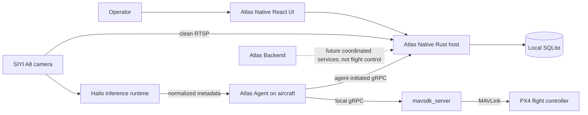

# Atlas Developer Documentation

This directory is the starting point for understanding and contributing to the
current Atlas system. It documents the code that exists at this checkpoint,
including Atlas Native, Atlas Agent, their direct transport, aircraft operations,
video and perception, and the separate Atlas Backend foundation.

The shortest correct mental model is:

Atlas is local-first. Atlas Native is the operational authority and durable
source of truth for the current flight-control path. Atlas Agent runs on the
aircraft and translates Native requests into MAVSDK, PX4, gimbal, camera, and
perception-runtime operations. The optional Backend does not sit between Native
and Agent.

## Recommended reading order

| Order | Document | What it answers |
| --- | --- | --- |
| 1 | [Architecture overview](architecture-overview.md) | What are the major components, boundaries, and invariants? |
| 2 | [Atlas Native](atlas-native.md) | How does the desktop application, Rust host, SQLite, and React UI work? |
| 3 | [Atlas Agent](atlas-agent.md) | How does the onboard runtime integrate with MAVSDK, PX4, payload hardware, and perception? |
| 4 | [Native-Agent protocol](native-agent-protocol.md) | How do registration, telemetry, commands, missions, perception, and reconnects cross the network? |
| 5 | [Aircraft operations implementation](aircraft-operations-implementation.md) | What are the command, mission, lifecycle, safety, and failure-state rules? |
| 6 | [Video and perception](video-perception.md) | How are clean video and detection metadata produced, transported, aligned, and rendered? |
| 7 | [Atlas Backend](atlas-backend.md) | What does the separate backend provide today, and what is deliberately not connected? |
| 8 | [Development guide](development-guide.md) | How do I run, test, debug, change, and validate the system? |

The [feature gap assessment](feature-gap-assessment.md) is a product-direction
document. It describes possible future work and must not be treated as shipped
architecture.

## Repository map

| Path | Responsibility | Primary entry points |
| --- | --- | --- |
| [`atlas/`](../atlas/) | Tauri v2 desktop ground station: React UI plus Rust operational host | [`src/App.tsx`](../atlas/src/App.tsx), [`src-tauri/src/lib.rs`](../atlas/src-tauri/src/lib.rs) |
| [`atlas-agent/`](../atlas-agent/) | Go onboard runtime, setup tooling, package, and services | [`cmd/atlas-agent/main.go`](../atlas-agent/cmd/atlas-agent/main.go), [`cmd/atlas-setup/main.go`](../atlas-agent/cmd/atlas-setup/main.go) |
| [`atlas-backend/`](../atlas-backend/) | Independent Go/Gin/PostgreSQL identity and coordinated-services foundation | [`cmd/atlas-backend/main.go`](../atlas-backend/cmd/atlas-backend/main.go) |
| [`proto/atlas/ground_station.proto`](../proto/atlas/ground_station.proto) | Shared Native-Agent wire contract | Generated into Rust at build time and committed as Go code |
| [`scripts/`](../scripts/) | SITL, isolated Native development, database reset, and code generation | [`start-sitl.sh`](../scripts/start-sitl.sh) |
| [`third_party/mavsdk-proto/`](../third_party/mavsdk-proto/) | Pinned MAVSDK protobuf source | Version contract in [`atlas-agent/packaging/mavsdk.env`](../atlas-agent/packaging/mavsdk.env) |

## The four boundaries to understand first

### 1. React does not directly control aircraft

The React application calls typed Tauri commands with `invoke(...)`. Rust
validates policy, writes durable intent, and routes approved work to an active
Agent session. Start at [`atlas/src/App.tsx`](../atlas/src/App.tsx) and
[`atlas/src-tauri/src/commands.rs`](../atlas/src-tauri/src/commands.rs).

### 2. Native owns operational truth

The embedded SQLite database owns registered aircraft, active and historical
links, current and historical telemetry, commands, mission definitions, immutable
plans, mission runs, and lifecycle events. In-memory routers make delivery fast,
but they do not replace the durable records. Start at
[`atlas/src-tauri/src/database/mod.rs`](../atlas/src-tauri/src/database/mod.rs)
and
[`atlas/src-tauri/src/database/migrations.rs`](../atlas/src-tauri/src/database/migrations.rs).

### 3. Agent owns hardware integration

Atlas Agent owns the outbound connection to Native, local MAVSDK clients,
telemetry subscriptions, mission execution, gimbal and camera ownership, and
the accelerator-neutral perception boundary. Start at
[`atlas-agent/cmd/atlas-agent/main.go`](../atlas-agent/cmd/atlas-agent/main.go).

### 4. Backend is not in the control loop

Atlas Backend currently provides authentication, organizations, users, sessions,
and foundations for future vehicle enrollment and coordinated services. Native
does not call it during current aircraft operations, and Agent does not connect
to it. Start at
[`atlas-backend/README.md`](../atlas-backend/README.md).

## Important current limitations

These are architectural facts at this checkpoint:

- The Native-Agent gRPC connection uses plaintext, unauthenticated transport.
  It is intentionally bound by default to the dedicated HM30 ground address
  rather than every interface, but the network is still a trust boundary.
- Atlas Native has no operator login, organization, or backend dependency.
- The current design assumes one Native authority for a directly connected
  aircraft. Multi-ground-station command arbitration is not implemented.
- Perception frames and health are held in bounded memory for live use; they are
  not persisted as a historical perception dataset.
- Native displays clean video and optional metadata overlays, but it does not
  currently provide an archival media/evidence store.
- Mission actions such as recording and perception selection are represented in
  plans, but MAVSDK Mission v1 cannot execute every semantic Atlas action. The
  Agent reports translation warnings rather than claiming unsupported behavior.
- Agent command idempotency receipts are in memory. Native command and mission
  events are durable and deduplicated, but an Agent process restart clears its
  local receipt cache.

## Terminology

| Term | Meaning |
| --- | --- |
| **Atlas Native** | The desktop Tauri application: React webview plus Rust host. |
| **Atlas Agent** | The Go runtime on the onboard computer. |
| **Atlas Backend** | The separate HTTP/PostgreSQL service, not the current flight-control transport. |
| **Drone** | The durable physical aircraft identity in Native. |
| **Vehicle Agent** | One installed Agent identity on an onboard computer. |
| **Binding** | The durable attachment between an Agent installation and a drone. |
| **Communication link** | One concrete Agent-to-Native session. Reconnects create new links. |
| **Mission definition** | Editable operator intent and template parameters. |
| **Mission plan** | An immutable generated set of waypoints and semantic actions. |
| **Mission run** | One upload/execution history for one plan on one aircraft. |
| **Payload control lease** | Short-lived ownership of gimbal/camera manual control. |
| **Perception source** | An accelerator-neutral stream of health and normalized detections for one camera source ID. |

## How to use these docs while changing code

1. Find the owning component and invariant in the architecture documents.
2. Follow the code links to the actual implementation and tests.
3. Change the smallest owning boundary rather than duplicating policy in a
   neighboring layer.
4. Update the shared protobuf and both implementations together when a
   Native-Agent message changes.
5. Add or update tests for state transitions, safety gates, validation, and
   failure behavior.
6. Update the relevant document in the same change when behavior, ownership,
   configuration, schema, or operational procedure changes.

The code is authoritative when documentation and implementation disagree. Treat
that disagreement as a documentation bug unless the implementation is itself
being corrected.

