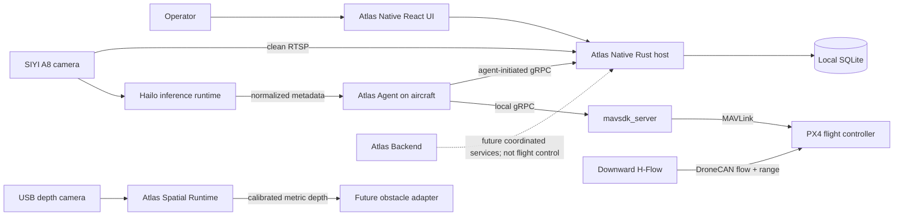

# Atlas Developer Documentation

Start here to understand or change the current Atlas system. These documents
describe the implemented components, their boundaries, and their failure
behavior. They also describe the current operational procedures.

The documentation uses the
[Atlas Technical Documentation Standard](documentation-standard.md). Use the
[controlled terminology](terminology.md) when you add or change a document.

The shortest correct mental model is:

```mermaid
flowchart LR
    Operator["Operator"] --> UI["Atlas Native React UI"]
    UI --> Host["Atlas Native Rust host"]
    Host --> SQLite[("Local SQLite")]
    Agent["Atlas Agent on aircraft"] -->|"agent-initiated gRPC"| Host
    Agent -->|"local gRPC"| MAVSDK["mavsdk_server"]
    MAVSDK -->|"MAVLink"| PX4["PX4 flight controller"]
    HFlow["Downward H-Flow"] -->|"DroneCAN flow + range"| PX4
    Camera["SIYI A8 camera"] -->|"clean RTSP"| Host
    Camera --> Inference["Hailo inference runtime"]
    Inference -->|"normalized metadata"| Agent
    DepthCamera["USB depth camera"] --> Spatial["Atlas Spatial Runtime"]
    Spatial -->|"calibrated metric depth"| FutureAvoidance["Future obstacle adapter"]
    Backend["Atlas Backend"] -. "future coordinated services; not flight control" .-> Host
```

Atlas is local-first. Atlas Native authorizes and records local operations.
Atlas Agent translates approved requests into aircraft-side operations. PX4
remains the flight-control authority. Atlas Backend is not in this control
path.

## Recommended reading order

| Order | Document | What it answers |
| --- | --- | --- |
| Start | [Design language](design-language.md) | How should the operator interface communicate authority, state, safety, and operational intent? |
| Reference | [Documentation standard](documentation-standard.md) | How must contributors write and review Atlas technical documentation? |
| Reference | [Atlas terminology](terminology.md) | Which term identifies each Atlas component, state, and control concept? |
| 1 | [Architecture overview](architecture-overview.md) | What are the major components, boundaries, and invariants? |
| 2 | [Atlas Native](atlas-native.md) | How does the desktop application, Rust host, SQLite, and React UI work? |
| 3 | [Atlas Agent](atlas-agent.md) | How does the onboard runtime integrate with MAVSDK, PX4, payload hardware, and perception? |
| 4 | [Native-Agent protocol](native-agent-protocol.md) | How do registration, telemetry, commands, missions, perception, and reconnects cross the network? |
| 5 | [Mission types and flight patterns](mission-types-and-flight-patterns.md) | How does editable mission intent become immutable waypoints, actions, terrain profiles, and runs? |
| 6 | [Incident dispatch](incident-dispatch.md) | How are incidents reviewed, assigned, safety-assessed, flown, and audited across each response mode? |
| 7 | [Inference, tracking, geolocation, and follow](inference-tracking-and-follow.md) | How do detections become tracks and coordinates, and how do camera and aircraft follow differ? |
| 8 | [Aircraft operations implementation](aircraft-operations-implementation.md) | What are the general command, lifecycle, safety, and failure-state rules? |
| 9 | [Video and perception](video-perception.md) | How are clean video and detection metadata produced, transported, aligned, rendered, and retained? |
| 10 | [Spatial camera runtime](spatial-runtime.md) | How is USB RGB-D hardware installed behind a vendor-neutral Pi boundary? |
| 11 | [H-Flow PX4 setup and verification](h-flow-px4-setup-and-verification.md) | How do we reproduce the installed PX4-owned H-Flow integration on another aircraft? |
| 12 | [Atlas Backend](atlas-backend.md) | What does the separate backend provide today, and what is deliberately not connected? |
| 13 | [Development guide](development-guide.md) | How do I run, test, debug, change, and validate the system? |

The [outdoor obstacle avoidance TODO](obstacle-avoidance-todo.md) is the
focused forward roadmap for an expiring observation contract, bounded depth
extraction, controller authority, and hardware acceptance. Avoidance remains
planned work.

## Repository map

| Path | Responsibility | Primary entry points |
| --- | --- | --- |
| [`atlas/`](../atlas/) | Tauri v2 desktop ground station: React UI plus Rust operational host | [`src/App.tsx`](../atlas/src/App.tsx), [`src-tauri/src/lib.rs`](../atlas/src-tauri/src/lib.rs) |
| [`atlas-agent/`](../atlas-agent/) | Go onboard runtime, setup tooling, package, and services | [`cmd/atlas-agent/main.go`](../atlas-agent/cmd/atlas-agent/main.go), [`cmd/atlas-setup/main.go`](../atlas-agent/cmd/atlas-setup/main.go) |
| [`atlas-spatial-runtime/`](../atlas-spatial-runtime/) | Pi-native calibrated-depth provider and local health service | [`runtime.py`](../atlas-spatial-runtime/src/atlas_spatial_runtime/runtime.py), [`depthai_provider.py`](../atlas-spatial-runtime/src/atlas_spatial_runtime/depthai_provider.py) |
| [`atlas-backend/`](../atlas-backend/) | Independent Go/Gin/PostgreSQL identity and coordinated-services foundation | [`cmd/atlas-backend/main.go`](../atlas-backend/cmd/atlas-backend/main.go) |
| [`proto/atlas/ground_station.proto`](../proto/atlas/ground_station.proto) | Shared Native-Agent wire contract | Generated into Rust at build time and committed as Go code |
| [`scripts/`](../scripts/) | SITL, isolated Native development, database reset, and code generation | [`start-sitl-interactive.sh`](../scripts/start-sitl-interactive.sh), [`start-sitl.sh`](../scripts/start-sitl.sh) |
| [`third_party/mavsdk-proto/`](../third_party/mavsdk-proto/) | Pinned MAVSDK protobuf source | Version contract in [`atlas-agent/packaging/mavsdk.env`](../atlas-agent/packaging/mavsdk.env) |

## The four boundaries to understand first

### 1. React does not directly control aircraft

The React application calls typed Tauri commands with `invoke(...)`. Rust
validates policy, writes durable intent, and routes approved work to an active
Agent session. Start at [`atlas/src/App.tsx`](../atlas/src/App.tsx) and
[`atlas/src-tauri/src/commands.rs`](../atlas/src-tauri/src/commands.rs).

### 2. Native owns operational truth

The embedded SQLite database owns registered aircraft, active and historical
links, current and historical telemetry, commands, mission definitions, immutable
plans, mission runs, and lifecycle events. In-memory routers make delivery fast,
but they do not replace the durable records. Start at
[`atlas/src-tauri/src/database/mod.rs`](../atlas/src-tauri/src/database/mod.rs)
and
[`atlas/src-tauri/src/database/migrations.rs`](../atlas/src-tauri/src/database/migrations.rs).

### 3. Agent owns hardware integration

Atlas Agent owns the outbound connection to Native, local MAVSDK clients,
telemetry subscriptions, mission execution, gimbal and camera ownership, and
the accelerator-neutral perception boundary. Start at
[`atlas-agent/cmd/atlas-agent/main.go`](../atlas-agent/cmd/atlas-agent/main.go).

### 4. Backend is not in the control loop

Atlas Backend currently provides authentication, organizations, users, sessions,
and foundations for future vehicle enrollment and coordinated services. Native
does not call it during current aircraft operations, and Agent does not connect
to it. Start at
[`atlas-backend/README.md`](../atlas-backend/README.md).

## Important current limitations

These are architectural facts at this checkpoint:

- The Native-Agent gRPC connection uses plaintext, unauthenticated transport.
  It is intentionally bound by default to the dedicated HM30 ground address
  rather than every interface, but the network is still a trust boundary.
- Atlas Native has no operator login, organization, or backend dependency.
- The current design assumes one Native authority for a directly connected
  aircraft. Multi-ground-station command arbitration is not implemented.
- Native keeps only a bounded live frame history rather than persisting every
  detection box. It does persist track/session summaries, lifecycle events,
  selections, counts, geolocation results, and explicitly captured evidence.
- Native supports local segmented recording plus verified evidence stills and
  bounded event clips with provenance and retention. Remote evidence replication
  and a complete export workflow are separate future concerns.
- Camera behavior is constrained by the physical payload and MAVSDK Mission v1.
  Perception start and stop are separately executed as durable Agent actions:
  required inference is acknowledged before arming and released during terminal
  cleanup.
- Aircraft Follow from standoff is available whenever the connected Agent
  advertises protocol support. Runtime target-quality, telemetry, battery,
  envelope, lease, watchdog, and PX4-state checks remain authoritative.
- Agent command idempotency receipts are in memory. Native command and mission
  events are durable and deduplicated, but an Agent process restart clears its
  local receipt cache.

## Terminology

The [Atlas terminology](terminology.md) document is the controlled glossary.
The most important distinction is:

- Atlas Native authorizes and records local operations.
- Atlas Agent owns the onboard hardware integration.
- PX4 owns flight control and failsafe behavior.
- Atlas Backend provides separate coordinated-service foundations.

## How to use these docs while changing code

1. Find the owning component and invariant in the architecture documents.
2. Follow the code links to the actual implementation and tests.
3. Change the smallest owning boundary rather than duplicating policy in a
   neighboring layer.
4. Update the shared protobuf and both implementations together when a
   Native-Agent message changes.
5. Add or update tests for state transitions, safety gates, validation, and
   failure behavior.
6. Update the owning document in the same change when behavior, ownership,
   configuration, schema, or an operational procedure changes.
7. Apply the review checklist in the
   [documentation standard](documentation-standard.md).

The code is authoritative when documentation and implementation disagree. Treat
that disagreement as a documentation bug unless the implementation is itself
being corrected.
