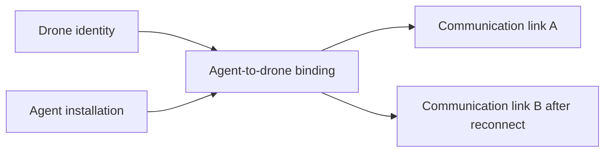
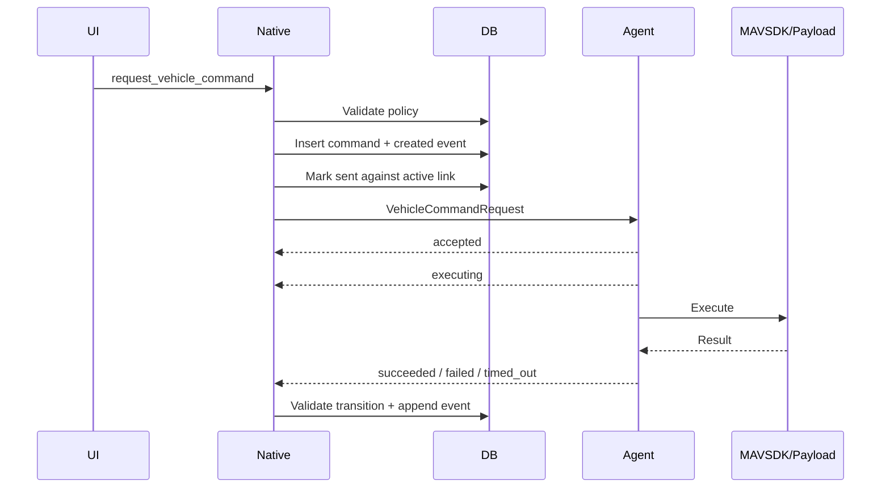
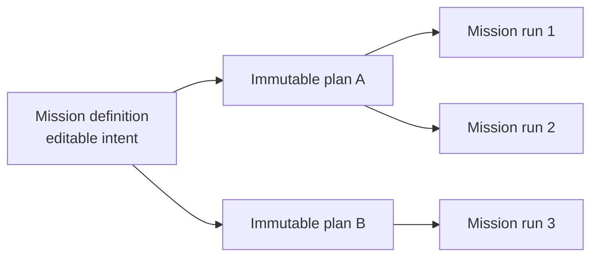
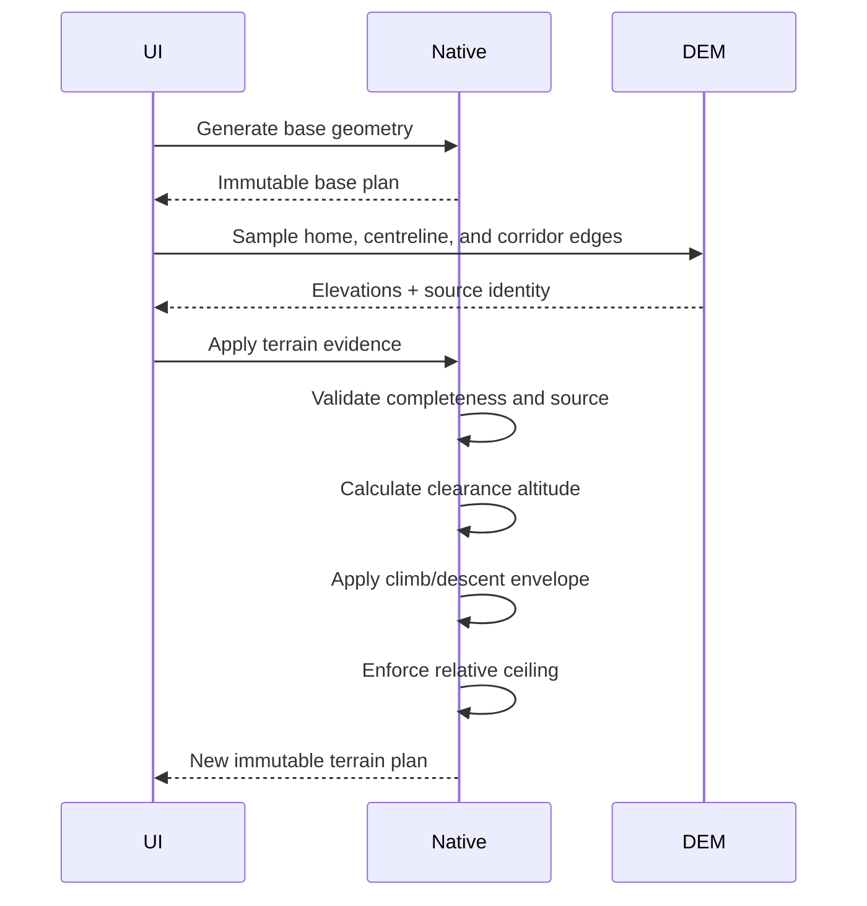

# Aircraft Operations Implementation

## Objective

This document explains the shipped aircraft-operation contracts: fleet
lifecycle, freshness, commands, mission planning and execution, payload
ownership, safety gates, state transitions, and failure handling.

For the pattern-generation algorithms and terrain model, continue with
[Mission types and flight patterns](mission-types-and-flight-patterns.md). For
the dispatch workflow and its four response modes, see
[Incident dispatch](incident-dispatch.md). Perception, camera follow, and
aircraft Follow from standoff are described end to end in
[Inference, tracking, geolocation, and follow](inference-tracking-and-follow.md).

The central rule is:

> React proposes an operation, Native authorizes and records it, Agent executes
> it through the appropriate hardware boundary, and Native records the result.

No individual layer is sufficient by itself:

- UI gating improves operator experience but is not trusted policy.
- Native policy prevents unsafe or inconsistent requests.
- Agent validation protects the hardware boundary.
- MAVSDK and PX4 return the actual vehicle result.
- Durable events explain what happened later.

## Aircraft identity and lifecycle

Native models four related concepts:

Registration upserts the same drone and Agent, reuses or replaces the binding,
and always creates a new communication link for a new session.

### Archive and restore

Archive is not deletion.

[`database/drones.rs`](../atlas/src-tauri/src/database/drones.rs) archives only
when there is no fresh connected link. The transaction:

1. Closes open communication links.
2. Ends current bindings.
3. Marks the drone `archived`.
4. Appends a lifecycle event.

Telemetry, commands, mission runs, and events remain queryable. A reconnect from
that drone is rejected and audited until an operator restores it.

Restore changes the drone to `active` and appends a lifecycle event. It does not
reopen old bindings or links; the next Agent registration establishes new ones.

## Freshness model

Atlas does not equate “a value exists in SQLite” with “safe to act on it.”

| Signal | Fresh threshold | Used for |
| --- | --- | --- |
| Agent heartbeat | 15 seconds | Link connected versus stale, command eligibility |
| Aircraft telemetry | 5 seconds | Command policy, mission start, inspection control |
| Perception stream | 3 seconds | Live perception status |

The Agent sends heartbeats every five seconds and telemetry every second by
default. These thresholds permit short jitter while detecting meaningful loss.

## Telemetry and operational history

Agent combines MAVSDK streams into one latest snapshot. Native stores:

- One current row per drone.
- Sampled historical snapshots for seven days.
- PX4 status text as bounded discrete events.
- Derived armed, disarmed, takeoff, landing, flight-mode, and landed-state
  events.

The history view asks Native for bucketed chart series, capped point counts, and
event ranges. Downsampling occurs in SQLite queries so React does not load every
raw sample for a seven-day chart.

Relevant code:

- [`atlas-agent/internal/telemetry/mavsdk/source.go`](../atlas-agent/internal/telemetry/mavsdk/source.go)
- [`atlas/src-tauri/src/database/telemetry.rs`](../atlas/src-tauri/src/database/telemetry.rs)
- [`atlas/src-tauri/src/database/history.rs`](../atlas/src-tauri/src/database/history.rs)
- [`atlas/src/history/HistoryPage.tsx`](../atlas/src/history/HistoryPage.tsx)

## Vehicle commands

### Supported set

Native currently accepts:

- `hold`
- `return_to_launch`
- `land`
- `payload_control_begin`
- `payload_control_renew`
- `payload_control_end`
- `gimbal_set_angles`
- `gimbal_set_rates`
- `gimbal_center`
- `gimbal_set_roi`
- `camera_set_zoom`

The source of truth for validation and lifecycle is
[`database/commands.rs`](../atlas/src-tauri/src/database/commands.rs).

### Creation policy

Every command requires:

- An active drone and binding.
- A connected, open link with a heartbeat in the last 15 seconds.
- Valid JSON and command-specific parameter bounds.

Flight contingency commands additionally require:

- Telemetry no older than five seconds.
- `in_air=true`.
- For RTL, home position set plus global-position and home-position health.

Inspection payload commands additionally require:

- Telemetry no older than five seconds.
- `armed=false`.
- `in_air=false`.

Mission payload override commands additionally require:

- The referenced run belongs to the target drone.
- The run is `RUNNING` or `PAUSED`.

These checks happen before the command row is inserted.

### Durable lifecycle

Native expires unfinished commands once per second. A timeout before Agent
acceptance receives `DELIVERY_DEADLINE_EXCEEDED`; a timeout after acceptance or
execution receives `COMMAND_EXECUTION_DEADLINE_EXCEEDED`.

Agent rejects a request that targets another drone, is past its deadline, or has
an unsupported type. It sends accepted and executing updates before starting
the hardware operation.

### Idempotency

Native uses:

- A unique command ID/idempotency key.
- Unique event IDs.
- Terminal-state protection.
- Explicit allowed state transitions.

Agent caches results by command ID for its process lifetime. Duplicate delivery
within the same process returns the cached receipt.

### Cancellation

Native can record and send a cancellation request, but Agent currently reports
that delivered vehicle and payload commands are not cancellable. Do not present
the cancellation API as a working emergency stop. Hold, Land, or RTL are
separate explicit commands.

## Mission model

Mission data is intentionally split:

### Definition

A definition contains:

- Template and selected pattern.
- Name and description.
- Operator parameters and map geometry.
- Camera, gimbal, zoom, detection, recording, and RTL intent.
- A pointer to the current generated plan.

Editing returns the definition to `DRAFT` and clears the current plan pointer.
Editing is blocked while any run for that definition is unfinished.

### Plan

Generating inserts a new plan, waypoints, and actions. Plans are never updated
in place.

Supported planning:

- Direct waypoint sequence.
- Polygon lawn-mower coverage.
- Route/corridor sampling.

Validation includes:

- Coordinates.
- Altitude from 2 to 120 metres for base mission geometry.
- Speed from 0.5 to 15 m/s.
- Template-specific minimum geometry.
- Gimbal pitch, yaw mode, target, and zoom.
- Terrain settings and route evidence when enabled.

### Semantic actions

Plans contain ordered actions such as:

- Takeoff.
- Set speed.
- Set camera mode.
- Set camera zoom.
- Set gimbal orientation.
- Start/stop recording.
- Start/stop perception.
- Navigate to waypoint.
- Return to Launch.

Navigation is translated to MAVSDK Mission items. Payload actions are translated
into a separate Agent payload plan. Recording maps to MAVSDK mission camera
actions where the plan shape permits it. Perception actions are executed by the
Agent's inference runtime rather than MAVSDK: required `START_PERCEPTION` claims
must produce a fresh acknowledgement before arming, and `STOP_PERCEPTION`
releases the mission claim during normal or terminal cleanup. Only semantic
actions that have no supported executor remain translation warnings.

## Terrain-aware planning

Terrain clearance is preflight profiling, not live terrain following.

Native rejects:

- Missing, duplicate, or stale evidence.
- Samples that do not match expected route stations.
- Unsupported source encoding or invalid elevations.
- Requested clearance that violates the ceiling.
- Climb/descent smoothing that requires exceeding the configured ceiling.

A terrain-aware plan records the profiled home. Upload is blocked if the
aircraft home has moved more than 30 metres.

## Mission upload

Upload is allowed only when:

- The mission has a current `READY` plan.
- The target drone is active.
- The target has no unfinished mission run.
- The target is connected.
- The first waypoint is no more than 5 km from the aircraft home position, or
  current position when home is unavailable.
- Terrain profiling is complete when requested.
- A terrain-aware plan still matches the aircraft home.

Native creates the mission run in `UPLOADING` before delivery. If Agent is not
available, the run becomes `FAILED` with `AGENT_UNAVAILABLE`.

Agent:

1. Parses and translates the immutable plan JSON.
2. Configures mission RTL behavior.
3. Uploads with MAVSDK progress.
4. Stores the payload plan in memory for the run.
5. Retains any remaining translation warnings as evidence.
6. Moves the run to `READY`.

Only one unfinished run per drone is permitted.

## Mission start and control

### Native start gate

Start requires:

- Connected link.
- Live telemetry.
- PX4 health present.
- Aircraft already armed or PX4 reports it is armable.
- Global position ready.
- Home position ready and set.
- Battery not below 15 percent when battery is reported.

The gate deliberately allows an already armed aircraft even if the current
`armable` flag is false; it blocks an unarmed aircraft that PX4 says cannot arm.

### Agent start

For a new start, Agent:

1. Verifies this run was uploaded.
2. Executes required `START_PERCEPTION` and waits for a fresh acknowledged
   inference frame.
3. Reports arming.
4. Calls MAVSDK Action Arm.
5. Reports armed.
6. Calls MAVSDK Mission Start.
7. Activates mission payload intent.
8. Starts mission-progress monitoring.

If perception fails, Agent does not arm. If Mission Start fails after arming,
Agent requests Hold and releases the mission perception claim.

Resume requires the loaded run to be `PAUSED` and calls Mission Start without
arming again.

### Other operations

| Operation | Required run state | Effect |
| --- | --- | --- |
| Pause | `RUNNING` | MAVSDK Pause; aircraft holds; run becomes `PAUSED` |
| Resume | `PAUSED` | MAVSDK Start; run becomes `RUNNING` |
| Cancel | `READY`, `RUNNING`, or `PAUSED` | Pause if necessary, clear mission, end payload plan, remain in Hold, become `CANCELLED` |
| Return to Launch | `RUNNING` or `PAUSED` | MAVSDK Action RTL, end mission/payload tracking, become `RTL` |

Progress updates contain current and total waypoints. Completion ends payload
ownership and makes the run terminal.

## Payload ownership

Mission automation and manual control must not race.

### Automatic mission intent

During upload, Agent extracts:

- Global gimbal and zoom defaults.
- Waypoint-specific gimbal and zoom changes.

When progress reaches a new waypoint, the payload controller applies the current
intent unless a manual mission override is active.

### Inspection control

Inspection is aircraft-scoped and only available while safely on the ground.
Starting it acquires primary gimbal control. Ending or lease expiry stops rates
and releases ownership.

### Mission override

Mission override is run-scoped. Starting it acquires manual control while the
mission continues or is paused. Ending or lease expiry restores the current
waypoint's mission view, not the view from when manual control began.

### UI fail-safe behavior

[`MissionPayloadControl.tsx`](../atlas/src/missions/MissionPayloadControl.tsx):

- Uses a random control-session ID.
- Requests a seven-second lease.
- Renews every three seconds.
- Stops renewal when the component unmounts or the run is no longer active.
- Attempts an explicit end on cleanup.
- Stops gimbal rates on key release and focus loss.

The Agent lease is the final fail-safe when UI cleanup or the network fails.

## Follow from standoff

The Follow workspace is a supervised dynamic-navigation workflow, separate
from missions and image-space gimbal following. Native accepts a request only
for the exact active operator selection when the latest coordinate is terrain
`CONVERGED`, motion is `FILTERED`, uncertainty/confidence fit the reviewed
limits, aircraft telemetry is fresh and flight-ready, and both physical
boresight and aircraft-follow commissioning evidence are advertised.

The operator reviews a fixed standoff, relative-altitude target and band,
groundspeed, acceleration, maximum duration, circular geographic boundary,
battery reserve, position/velocity uncertainty, confidence, and a written
reason. Native persists these values and the commissioning references before
requesting control. A unique non-ended follow session prevents two authorities
for one aircraft, and unfinished mission runs block entry.

During follow, the UI repeatedly reacquires the exact track coordinate, samples
terrain at the estimated target point, iteratively refines the same immutable
observation ray, and renews a four-second lease only after world velocity and
quality pass again. Native also runs a 250 ms watchdog. Agent runs the 10 Hz
PX4 Offboard controller and its independent onboard watchdog. Loss of the UI,
Native delivery, or the ground link therefore stops renewal; the onboard lease
causes Hold without depending on a final network message.

`REQUESTED -> VALIDATING -> ACQUIRING -> FOLLOWING` is durable. Any watchdog
can move the session to `DEGRADED_HOLD` with a reason, after which the operator
explicitly ends it. Stop sends zero velocity, stops Offboard, and requests PX4
Hold; it never implies RTL or Land. Real translation remains disabled by
default and must not be marked verified until the referenced simulation, HIL,
and controlled-flight record has actually been accepted.

## Failure modes and operator meaning

| State or event | Meaning |
| --- | --- |
| Command `rejected` | Agent refused target, deadline, or type before execution |
| Command `failed` | Agent or MAVSDK attempted but did not complete successfully |
| Command `timed_out` | Delivery or execution deadline passed without a terminal result |
| Mission `FAILED` during upload/start | The run cannot continue without a new run or corrected state |
| Failed pause/resume/cancel delivery | The run may preserve its prior healthy state; inspect the event and aircraft telemetry |
| Mission `RTL` | Atlas mission execution ended because RTL was accepted; continue monitoring PX4 and telemetry |
| `payload_restore_failed` | Manual ownership ended, but Agent could not confirm restoration of mission intent |
| Stale link or telemetry | Current data is not fresh enough for new operations, even if the last value remains displayed |
| Follow `DEGRADED_HOLD` | A lease, target, link, battery, position, altitude, geofence, duration, or PX4 Offboard watchdog stopped translation; inspect the durable exit reason |

## Where to modify behavior

| Concern | Owning implementation |
| --- | --- |
| Command parameters, safety policy, state transitions | [`database/commands.rs`](../atlas/src-tauri/src/database/commands.rs) |
| Command network delivery | [`ground_station/command_router.rs`](../atlas/src-tauri/src/ground_station/command_router.rs) |
| Action execution | [`atlas-agent/internal/vehicle/actions.go`](../atlas-agent/internal/vehicle/actions.go) |
| Mission definition and planning | [`database/missions.rs`](../atlas/src-tauri/src/database/missions.rs) |
| Upload/start gates | [`commands.rs`](../atlas/src-tauri/src/commands.rs) |
| Mission-run persistence | [`database/mission_runs.rs`](../atlas/src-tauri/src/database/mission_runs.rs) |
| MAVSDK mission execution | [`atlas-agent/internal/vehicle/missions.go`](../atlas-agent/internal/vehicle/missions.go) |
| Payload arbitration | [`atlas-agent/internal/vehicle/payload.go`](../atlas-agent/internal/vehicle/payload.go) |
| Operator mission workflows | [`atlas/src/missions/`](../atlas/src/missions/) |
| Follow persistence and policy | [`database/aircraft_follow.rs`](../atlas/src-tauri/src/database/aircraft_follow.rs) |
| Follow protocol delivery | [`ground_station/command_router.rs`](../atlas/src-tauri/src/ground_station/command_router.rs) |
| Onboard Offboard controller | [`atlas-agent/internal/vehicle/aircraft_follow.go`](../atlas-agent/internal/vehicle/aircraft_follow.go) |
| Follow operator workflow | [`atlas/src/follow/`](../atlas/src/follow/) |
