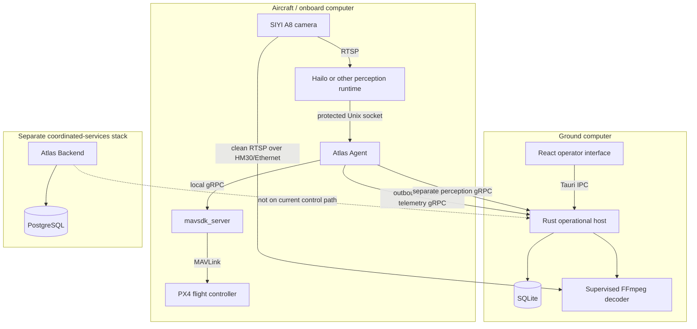
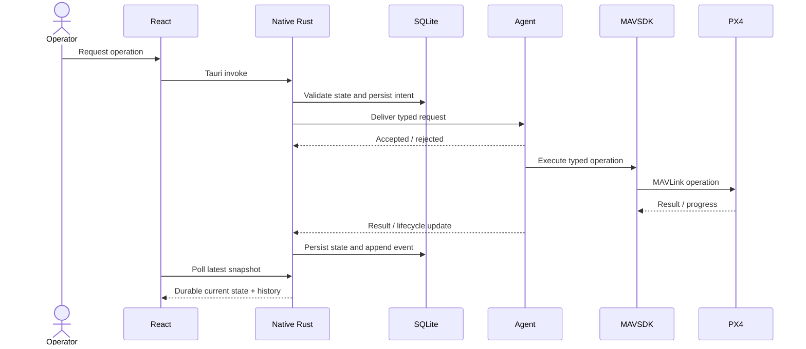

# Atlas Architecture Overview

## Purpose and system context

Atlas is a local-first drone operations system designed to keep the current
aircraft-control path available without an internet connection or central
backend. The ground computer runs Atlas Native. The onboard computer runs Atlas
Agent and `mavsdk_server`. PX4 remains the flight-control authority.

The system separates operator intent, durable operational history, transport,
hardware integration, and future coordinated services:



The shared transport contract is
[`proto/atlas/ground_station.proto`](../proto/atlas/ground_station.proto).

## Component responsibilities

| Component | Owns | Deliberately does not own |
| --- | --- | --- |
| React UI | Operator navigation, forms, map interaction, rendering, polling Native state | Network sessions, durable policy, direct MAVSDK or PX4 access |
| Rust Native host | Safety policy, Tauri commands, Agent-facing gRPC server, SQLite, command routing, mission planning records, video decoding, perception alignment | Physical flight-controller, gimbal, camera, or accelerator drivers |
| SQLite | Local operational source of truth and audit history | Multi-user tenancy or cross-ground-station synchronization |
| Atlas Agent | Stable onboard identity, outbound Native session, MAVSDK telemetry and operations, payload ownership, perception supervision | Operator workflow, mission-definition editing, local ground-station history |
| `mavsdk_server` | MAVLink connection and typed MAVSDK gRPC services | Atlas policy or durable Atlas records |
| PX4 | Vehicle state estimation, arming checks, navigation, flight modes, failsafes | Atlas operator workflow and product-level audit history |
| Perception runtime | Camera decoding for inference, accelerator-specific model execution, normalized detection/health output | Drawing the operator overlay or authorizing flight |
| Atlas Backend | Organizations, users, sessions, PostgreSQL service foundation | Current direct Agent transport and current aircraft-control authority |

## Deployment topology

The supported field topology uses a dedicated `192.168.144.0/24` HM30/Ethernet
network:

```text
SIYI A8 camera              Raspberry Pi 5               Ground computer
192.168.144.25              192.168.144.168              192.168.144.50
RTSP + SIYI UDP             Atlas Agent                  Atlas Native :7443
       \________________ HM30 air/ground Ethernet link ________________/

PX4 flight controller
    -> serial TELEM2
        -> mavsdk_server on the Raspberry Pi
            -> Atlas Agent
```

Atlas Agent initiates the session to `192.168.144.50:7443`. This direction is
important: the onboard computer reconnects whenever the local radio/Ethernet path
returns, while Native only needs a stable listener address.

Field installation and address details live in
[`atlas-agent/INSTALLATION.md`](../atlas-agent/INSTALLATION.md) and
[`atlas-agent/README.md`](../atlas-agent/README.md).

## Control flow

Aircraft-changing work follows one authority chain:



This ordering prevents the webview from becoming the source of truth. A button
click is not considered success. Success is the terminal state written after
the Agent and MAVSDK/PX4 report the outcome.

## Data flow

Atlas uses different delivery semantics for different kinds of information:

| Data | Semantics | Reason |
| --- | --- | --- |
| Heartbeats | Periodic liveness, every five seconds by default | Detect stale or ended links |
| Telemetry | Latest-only publication from Agent; current row plus sampled history in Native | Old queued telemetry is actively harmful |
| PX4 status text | Discrete events | Warnings and failsafe text must not be overwritten by the next sample |
| Vehicle commands | Durable intent plus append-only lifecycle events | Safety, retry visibility, idempotency, and auditability |
| Mission operations | Durable run plus append-only progress/lifecycle events | One execution must remain explainable after completion |
| Perception health | Continuous latest health | Operators need runtime readiness even with no live viewer |
| Perception frames | Demand-leased, latest-biased, separate gRPC stream | High-rate metadata must not delay command acknowledgements |
| Video frames | Bounded delayed buffer in Native | Match detections while avoiding a growing live backlog |

## Runtime startup

### Native

[`atlas/src-tauri/src/lib.rs`](../atlas/src-tauri/src/lib.rs) composes the
desktop host:

1. Resolve the ground-station listen address.
2. Open and migrate SQLite.
3. Create the in-memory command router and perception store.
4. Load video configuration.
5. Start the Agent-facing gRPC server.
6. Start the one-second command-expiration task.
7. Register Tauri commands and window cleanup.

### Agent

[`atlas-agent/cmd/atlas-agent/main.go`](../atlas-agent/cmd/atlas-agent/main.go)
composes the onboard process:

1. Load validated environment configuration.
2. Load or create stable installation and drone IDs.
3. Start the optional perception Unix-socket source and adapter supervision.
4. Start MAVSDK telemetry subscriptions.
5. Create the single payload controller.
6. Create action and mission executors that share that payload controller.
7. Discover gimbals and configured camera transports.
8. Run the reconnecting Native session until shutdown.

## Core invariants

These rules explain many implementation choices:

1. **Native is the current operational authority.** Agent does not invent
   missions or operator commands.
2. **PX4 is the flight authority.** Atlas may request actions but must preserve
   PX4 results and failsafe behavior.
3. **Intent is durable before or with delivery.** Command and mission histories
   survive UI navigation and process restarts on the ground computer.
4. **Registration is first.** No session payload is accepted before the Agent
   establishes its identity and drone binding.
5. **Freshness is part of safety.** A stored telemetry value is not enough;
   commands require a fresh link and fresh telemetry.
6. **Mission definitions, plans, and runs are different records.** Editable
   intent must not rewrite an already generated or flown plan.
7. **One controller owns payload setpoints.** Mission automation and manual
   gimbal/camera control cannot issue competing commands.
8. **Manual payload ownership is leased.** Lost UI, network, or process renewal
   causes a safe stop/release or mission-intent restoration.
9. **Live media is latest-biased.** Slow consumers cause old frames to be
   dropped, not accumulated.
10. **Backend availability must not determine local flight continuity.**

## Failure behavior

| Failure | Current behavior |
| --- | --- |
| HM30/network interruption | Agent session ends and reconnects with exponential backoff from 1 to 30 seconds. Native closes the communication-link record. |
| Missed heartbeats | Native presents the link as stale after 15 seconds even if the database row still says connected. |
| Old telemetry | Telemetry is presented as stale after five seconds and command safety gates reject it. |
| Native unavailable | Agent continues MAVSDK/perception runtime operation locally but cannot receive new Atlas commands; it retries the Native connection. |
| MAVSDK unavailable | The Go clients can start before the server is reachable. Telemetry subscriptions retry, while commands and mission operations fail until MAVSDK returns. Packaged services order Agent after MAVSDK, and `atlas-setup doctor` exposes connectivity failures. |
| Command result misses deadline | Native expires it to `timed_out`; the result code distinguishes delivery timeout from execution timeout. |
| Mission start fails after arm | Agent requests PX4 Hold and reports the start failure. |
| Manual payload lease expires | Inspection movement stops and ownership releases; mission override restores the current mission payload intent. |
| Perception stream fails | Agent reconnects it separately; command and telemetry traffic remain isolated. |
| Video decoder fails | Native reports video error state without changing the aircraft-control session. |
| Backend or PostgreSQL fails | Current Native-Agent aircraft operations continue because neither is in that path. |

## Trust and security boundaries

The current system has three different security postures:

- **Native-Agent:** plaintext gRPC with stable self-reported Agent identity and
  no cryptographic peer authentication. The default listener is restricted to
  `192.168.144.50:7443`, but a production-grade authenticated transport is still
  future work.
- **Native webview:** Tauri IPC with a restrictive capability file and content
  security policy. Rust remains the policy boundary.
- **Backend:** bearer-session authentication, Argon2id password hashes,
  SHA-256-only token storage, tenant-scoped PostgreSQL records, and trusted
  proxies disabled by default.

Do not infer Backend authentication protection for the current Native-Agent
session; they are separate systems today.

## Where to look for a change

| Change | Owning code |
| --- | --- |
| Add or change an operator workspace | [`atlas/src/`](../atlas/src/) |
| Add a Tauri API or Native policy gate | [`atlas/src-tauri/src/commands.rs`](../atlas/src-tauri/src/commands.rs) |
| Change local persistence or state transitions | [`atlas/src-tauri/src/database/`](../atlas/src-tauri/src/database/) |
| Change registration/session behavior | [`atlas/src-tauri/src/ground_station/`](../atlas/src-tauri/src/ground_station/) and [`atlas-agent/internal/transport/groundstation/`](../atlas-agent/internal/transport/groundstation/) |
| Add an aircraft command | Shared proto, Native command persistence/router, Agent executor, UI, and tests |
| Add a mission template or planner | [`atlas/src-tauri/src/database/missions.rs`](../atlas/src-tauri/src/database/missions.rs) and mission UI |
| Change MAVSDK integration | [`atlas-agent/internal/telemetry/mavsdk/`](../atlas-agent/internal/telemetry/mavsdk/) or [`atlas-agent/internal/vehicle/`](../atlas-agent/internal/vehicle/) |
| Change perception provider integration | [`atlas-agent/internal/perception/`](../atlas-agent/internal/perception/) plus an adapter |
| Change video rendering/alignment | [`atlas/src-tauri/src/video.rs`](../atlas/src-tauri/src/video.rs), Native perception store, and [`atlas/src/video/LiveVideo.tsx`](../atlas/src/video/LiveVideo.tsx) |
| Change backend identity/API behavior | [`atlas-backend/internal/`](../atlas-backend/internal/) and PostgreSQL migrations |
