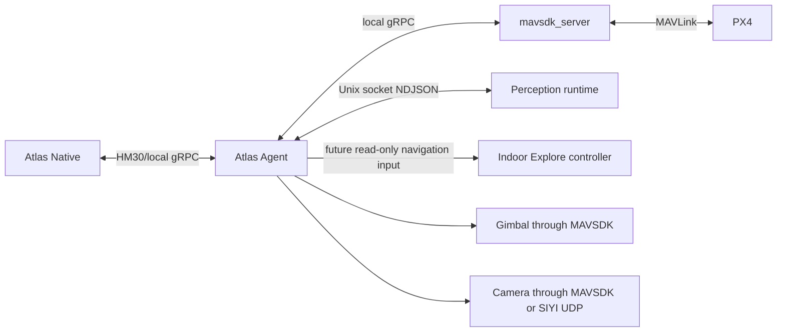

# Atlas Agent

## Role

Atlas Agent is the Go onboard runtime. It sits between Atlas Native and the
aircraft-side services:



Agent does not connect to Atlas Backend. Its main composition is
[`atlas-agent/cmd/atlas-agent/main.go`](../atlas-agent/cmd/atlas-agent/main.go).

Mission and dispatch semantics are documented in
[Mission types and flight patterns](mission-types-and-flight-patterns.md) and
[Incident dispatch](incident-dispatch.md). The complete perception-to-control
pipeline is in
[Inference, tracking, geolocation, and follow](inference-tracking-and-follow.md).

## Startup composition

The process starts in this order:

1. Load environment configuration.
2. Load or create the stable local identity.
3. If enabled, create the protected perception Unix socket and supervise or
   await the provider adapter. The adapter reports health from `READY`; it does
   not run inference until Agent grants an activation claim.
4. Connect telemetry subscriptions to `mavsdk_server`.
5. Start the local read-only PX4/H-Flow navigation-state query socket for
   diagnostics and the future Indoor Explore controller.
6. Create one shared payload controller.
7. Create the action executor and mission executor using that controller.
8. Discover gimbal and configured camera capabilities.
9. Start the reconnecting Native session.
10. On `SIGINT` or `SIGTERM`, cancel the root context and close clients.

Sharing one payload controller is an important invariant. It gives mission
automation and manual control one place to arbitrate gimbal and camera intent.

## Configuration

[`internal/config/config.go`](../atlas-agent/internal/config/config.go) parses
and validates process configuration. Core variables are:

| Variable | Default | Meaning |
| --- | --- | --- |
| `ATLAS_AGENT_STATE_DIR` | OS user config directory plus `atlas-agent` | Stable identity and local Agent state; must be absolute |
| `ATLAS_GROUND_STATION_ADDR` | `192.168.144.50:7443` | Atlas Native listener |
| `ATLAS_DRONE_NAME` | `Atlas Drone` | Display name sent during registration |
| `ATLAS_AGENT_VERSION` | Build version | Version sent during registration |
| `ATLAS_MAVSDK_GRPC_ADDR` | `127.0.0.1:50051` | Local `mavsdk_server` API |
| `ATLAS_NAVIGATION_SOCKET_PATH` | Under Agent state; packaged install uses `/run/atlas-agent/navigation.sock` | Read-only capture-time PX4/H-Flow state query socket |
| `ATLAS_TELEMETRY_INTERVAL` | `1s` | Latest snapshot publication interval |
| `ATLAS_CAMERA_TRANSPORT` | `siyi_udp` | `siyi_udp`, `mavsdk`, or `hybrid` |
| `ATLAS_SIYI_CAMERA_ADDR` | `192.168.144.25:37260` | SIYI UDP camera-control endpoint |
| `ATLAS_PERCEPTION_PROVIDER` | `disabled` | `disabled`, `external`, `hailo`, `deepstream`, `tensorrt`, or `onnx` |
| `ATLAS_PERCEPTION_SOCKET_PATH` | Under Agent state | Protected provider-to-Agent socket |
| `ATLAS_PERCEPTION_ADAPTER_MODE` | `process` | Agent-supervised process or external/systemd container |
| `ATLAS_GIMBAL_FOLLOW_UPDATE_INTERVAL` | `100ms` | Onboard image-space controller cadence (`50ms`–`500ms`) |
| `ATLAS_GIMBAL_FOLLOW_TRACK_FRESHNESS` | `350ms` | Maximum age of a confirmed observation before the controller holds |
| `ATLAS_GIMBAL_FOLLOW_HOLD_TIMEOUT` | `2s` | Maximum continuous safety hold before follow terminates |
| `ATLAS_GIMBAL_FOLLOW_MAX_PITCH_RATE` / `ATLAS_GIMBAL_FOLLOW_MAX_YAW_RATE` | `20` / `30` | Bounded commanded rates in degrees per second |
| `ATLAS_GIMBAL_FOLLOW_MIN_PITCH` / `ATLAS_GIMBAL_FOLLOW_MAX_PITCH` | `-90` / `30` | Calibrated physical pitch envelope in degrees |
| `ATLAS_GIMBAL_FOLLOW_MIN_YAW` / `ATLAS_GIMBAL_FOLLOW_MAX_YAW` | `-180` / `180` | Calibrated aircraft-relative yaw envelope in degrees |
| `ATLAS_GEOLOCATION_BORESIGHT_ALIGNMENT_REFERENCE` | empty | Physical camera/gimbal alignment acceptance record; empty remains `UNVERIFIED` |
| `ATLAS_AIRCRAFT_FOLLOW_ENABLED` | `false` | Enables aircraft translation only for a commissioned installation |
| `ATLAS_AIRCRAFT_FOLLOW_VALIDATION_REFERENCE` | empty | Accepted simulation/HIL/controlled-flight evidence reference required by the enabled controller |
| `ATLAS_FLIGHT_CONTROLLER_ENDPOINT` | `/dev/serial0` | Registration metadata for the attached controller |
| `ATLAS_FLIGHT_CONTROLLER_BAUD_RATE` | `921600` | Registration and setup metadata |

The packaged installation writes these values to
`/etc/atlas-agent/atlas-agent.env` through
[`internal/onboardsetup/install.go`](../atlas-agent/internal/onboardsetup/install.go).

## Stable identity

[`internal/identity/store.go`](../atlas-agent/internal/identity/store.go) owns
two UUID-like values:

- `installationId`: one installed Agent identity.
- `droneId`: the durable aircraft identity presented to this Native database.

They are written to `identity.json` with owner-only permissions. Reconnects reuse
the same IDs, allowing Native to create a new communication link without
inventing a new aircraft.

Deleting or replacing this state changes the identity presented to Native and
must be treated as an operational migration, not ordinary cache cleanup.

## Native session and reconnect behavior

[`internal/transport/groundstation/client.go`](../atlas-agent/internal/transport/groundstation/client.go)
maintains the main session.

The Agent:

1. Creates a plaintext gRPC client to Native.
2. Opens `OpenSession`.
3. Creates a new session ID.
4. Sends registration as the first message.
5. Waits for `RegistrationAccepted`.
6. Starts the optional perception stream tied to that session.
7. Multiplexes heartbeat, telemetry, status events, command handling, mission
   operations, and mission updates until the stream ends.

After a failure, the outer loop reconnects with exponential backoff from one
second to thirty seconds. A new session ID and communication link are created;
the stable installation and drone IDs remain unchanged.

## Telemetry adapter

[`internal/telemetry/mavsdk/source.go`](../atlas-agent/internal/telemetry/mavsdk/source.go)
adapts many MAVSDK subscriptions into one accelerator- and transport-neutral
[`telemetry.Snapshot`](../atlas-agent/internal/telemetry/snapshot.go).

Subscriptions include:

- Connection state.
- Position and altitude.
- Battery or multiple batteries.
- Flight mode, armed, in-air, and landed state.
- GPS fix, satellites, raw GPS quality, and home position.
- Heading and NED velocity.
- PX4 health and armability.
- RC state.
- PX4 status text.

Most streams retry independently after failure. The operator telemetry path
requests a best-effort 2 Hz MAVSDK update rate, combines the latest fields under
a mutex, and publishes at the configured interval only when it has a newer
snapshot.

The output channel has capacity one. If the consumer is slow, Agent removes the
old pending snapshot and publishes the latest. Status text uses a separate
buffered event channel because discrete warnings must be retained.

### Geolocation temporal foundation

[`internal/geolocation`](../atlas-agent/internal/geolocation) is a separate,
bounded onboard time-series path. It requests 30 Hz timestamped aircraft
quaternions, 10 Hz estimator position, and 20 Hz NED velocity, while retaining
navigation-field age and GPS uncertainty on every synthesized pose sample. It
also correlates the autopilot boot clock and autopilot Unix clock to companion
`CLOCK_MONOTONIC`.

The payload controller subscribes observationally to measured MAVSDK Gimbal v2
attitude, including the gimbal timestamp, forward/North quaternions, Euler
angles, and angular rates. This subscription never takes payload control.
Aircraft and per-gimbal histories are bounded and are cleared across their
respective timestamp rollbacks so interpolation cannot cross a reboot or clock
epoch.

Perception protocol v3 contributes a pre-inference PTS/companion-clock anchor.
The foundation resolves a selected track's exact frame time, interpolates
aircraft and measured gimbal state around it, and performs the bounded centred-
boresight horizontal-plane estimate. A pipeline-ingress anchor is intentionally
labelled as an estimate. Native uses that first result to sample the configured
DEM at the target coordinate and iterates against the same immutable world-NED
ray; it does not reissue the Agent command against a newer video frame. The
final terrain coordinate, ordered samples, residual, uncertainty, lifecycle,
and filtered world-space motion are durable. Arbitrary-pixel projection,
measured range, and surveyed accuracy acceptance remain outside this
implementation.

Every estimate also declares physical boresight-alignment status. Without
`ATLAS_GEOLOCATION_BORESIGHT_ALIGNMENT_REFERENCE`, evidence says `UNVERIFIED`
and explicitly does not claim that the static angular bound is field-accepted.
A commissioned installation records its test artifact/reference and configured
angular bound in every result.

## Action executor

[`internal/vehicle/actions.go`](../atlas-agent/internal/vehicle/actions.go)
implements:

- Hold.
- Return to Launch.
- Land.
- Delegation of payload commands to the payload controller.

Each command ID is cached in an in-memory receipt map. A duplicate delivery in
the same Agent process returns the recorded result instead of repeating the
physical action. This protects reconnect/delivery races within a process, but it
is not durable across Agent restarts.

The flight actions call the MAVSDK Action service and require a successful
MAVSDK result, not merely a successful gRPC call.

## Payload controller

[`internal/vehicle/payload.go`](../atlas-agent/internal/vehicle/payload.go) is
the single owner of gimbal and camera setpoints.

It manages:

- MAVSDK Gimbal v2 discovery and control.
- Optional MAVSDK Camera discovery and zoom.
- SIYI A8 UDP zoom through
  [`internal/vehicle/siyi.go`](../atlas-agent/internal/vehicle/siyi.go).
- Global and waypoint-specific mission payload intent.
- Inspection and mission-override manual sessions.
- Gimbal ownership acquisition, stop, release, and mission restoration.

### Camera transport policy

The selected transport controls discovery and execution:

- `siyi_udp`: use the SIYI SDK for zoom and do not open MAVSDK Camera streams.
- `mavsdk`: use a MAVLink/MAVSDK camera only.
- `hybrid`: enable both and permit SIYI fallback.

This matters because opening MAVSDK Camera subscriptions can cause
`mavsdk_server` to probe PX4 as if it were a camera. The default A8 path avoids
that behavior.

### Manual control leases

Two contexts exist:

- `inspection`: allowed only when no mission is active. Native also requires
  fresh, explicitly disarmed and on-ground telemetry.
- `mission_override`: tied to one `RUNNING` or `PAUSED` mission run.

Leases must be three to fifteen seconds. The UI currently requests seven
seconds and renews every three. If renewal stops:

- Inspection stops angular rates and releases gimbal ownership.
- Mission override restores the payload intent for the mission's current
  waypoint.

Mission activation is rejected while inspection control owns the payload.

### Operator-selected track following

[`internal/vehicle/gimbal_follow.go`](../atlas-agent/internal/vehicle/gimbal_follow.go)
runs the low-latency image-space gimbal loop onboard. Native starts it only for
the exact selected `(track_session_id, track_id)` under an existing manual
payload lease. The controller reads measured MAVSDK gimbal attitude, aims at
the confirmed box centre, applies deadband, rate, acceleration, configured
angle, and braking-distance limits, and sends aircraft-relative angular rates.

`TEMPORARILY_OCCLUDED` or stale input holds the current angle with zero rates.
Tentative or terminal lifecycle states, source/session replacement, lease loss,
mission end, shutdown, or a gimbal read/write fault stop the loop. The
controller never searches for or attaches to another track ID. Geolocation and
aircraft motion are not part of this loop.

### Follow from standoff navigation

[`internal/vehicle/aircraft_follow.go`](../atlas-agent/internal/vehicle/aircraft_follow.go)
is a separate PX4 Offboard authority. It never consumes bounding-box error and
does not acquire gimbal ownership. Native supplies an exact selected-track
identity, a terrain-refined world position and velocity, an immutable reviewed
envelope, and a one-to-five-second operator lease. The Agent fixes the initial
radial observation side, predicts the target over the bounded freshness window,
and commands target-velocity feed-forward plus limited position correction.

Before each setpoint the Agent checks lease, target age, maximum duration,
telemetry age, arm/in-air state, local/global position health, battery reserve,
altitude band, aircraft/target/observation-point boundary, and PX4 Offboard
activity. Velocity and acceleration are clamped to the reviewed envelope. Any
failure sends zero velocity, stops Offboard, explicitly requests PX4 Hold, and
reports a durable exit reason to Native. Ground-stream loss invokes the same
path; RC and PX4 failsafes remain independent.

The controller advertises `unverified` and refuses to start by default. It
advertises `verified` only when startup configuration contains both a follow
validation reference and a physical boresight-alignment reference. Renewals
may update only the exact target sample and lease: the Agent revalidates them
against the original envelope so authority cannot expand in flight.

## Mission executor

[`internal/vehicle/missions.go`](../atlas-agent/internal/vehicle/missions.go)
accepts immutable Native plan JSON and translates it into:

- A MAVSDK Mission plan for navigation.
- A separate Agent payload plan for gimbal and zoom intent.
- Return-to-launch-after-mission configuration.
- Translation warnings for semantic Atlas actions not executable by MAVSDK
  Mission v1.

The executor serializes mission operations with `operationMu`. It supports:

- Upload.
- Start with automatic arm.
- Pause.
- Resume.
- Cancel to Hold and clear mission.
- Return to Launch.
- Mission-progress subscription.

For incident-response plans, mission translation also retains a separate,
waypoint-triggered arrival-action chain. Agent executes `HOLD_AT_ARRIVAL`
first, then optional `POINT_GIMBAL_AT_INCIDENT`. Area Scan and Orbit add a
durable `RESUME_AFTER_ARRIVAL` action and trigger the chain after generated
waypoint zero, before their remaining pattern waypoints. One-waypoint Offset
Observe triggers at its final waypoint and completes after its acknowledged
observation chain. Hold at Staging carries a Hold-only
`waitForOperatorDecision` action at the final waypoint; after Hold succeeds,
Agent reports the run `PAUSED`, stops its progress watcher, and waits for an
explicit mission Resume, RTL, or Cancel command. Land remains an independent
immediate safety action and does not close the run by itself. Agent emits acknowledged action
states for every attempt; exhausted retries apply only the immutable plan's
explicit Return to Launch or operator-intervention policy.

On initial start, Agent first executes any required `START_PERCEPTION` action
and waits for a fresh inference frame. It then arms before requesting mission
mode. If perception fails, it does not arm. If mission start fails after arming,
Agent requests Hold and removes the mission perception claim. Resume does not
arm or start perception again; it requires the loaded run to be paused.

Mission progress updates the payload controller for the current waypoint and is
streamed back to Native. Waypoint progress alone is neither arrival nor mission
completion. Completion ends payload ownership and emits a terminal run update
only after the reviewed arrival phase has succeeded and the remaining route has
completed.

## Perception boundary

[`internal/perception/`](../atlas-agent/internal/perception/) defines an
accelerator-neutral contract. Provider-specific adapters emit newline-delimited
JSON envelopes over a Unix socket owned by Agent.

The runtime source:

- Requires an absolute socket path.
- Creates the parent directory with owner-only permissions.
- Protects the socket with mode `0600`.
- Rejects non-socket files at the configured path.
- Validates protocol version, frames, detections, boxes, model identity, and
  health.
- Owns reference-counted mission and renewable live-view activation claims.
- Sends bidirectional activation requests and waits for observed runtime state
  plus a fresh post-activation frame.
- Filters detections to the union of requested mission profiles unless an
  unfiltered live-view claim is present.
- Publishes latest-only frame and health channels.

For Hailo, [`scripts/atlas-hailort-adapter.py`](../atlas-agent/scripts/atlas-hailort-adapter.py)
keeps its GStreamer pipeline in `READY` by default. An activation request moves
it to `PLAYING`, where it opens the clean A8 RTSP stream, runs Hailo/TAPPAS
inference, extracts normalized metadata, and never draws or republishes video.
Agent socket loss returns the adapter to `READY` as a fail-safe.

Agent always forwards health, including the intentional `INACTIVE` state. It
forwards frames only while a Native consumer lease is active or a mission is
`RUNNING`/`PAUSED`. Demand state is implemented in
[`internal/transport/groundstation/frame_demand.go`](../atlas-agent/internal/transport/groundstation/frame_demand.go),
while runtime ownership is implemented in
[`internal/perception/control.go`](../atlas-agent/internal/perception/control.go).

## Packaged runtime

The supported package installs four systemd units:

```text
atlas-mavsdk.service
    -> atlas-agent.service
        -> atlas-hailo-adapter.service (container mode)

atlas-spatial-runtime.service (optional, independent camera/ROS lifecycle)
```

- MAVSDK owns the serial/MAVLink connection.
- Agent requires MAVSDK.
- The container-backed Hailo adapter is part of the Agent lifecycle and uses the
  Agent-owned runtime socket.
- The spatial runtime requires Docker but not Agent or MAVSDK. Camera/ROS
  failure therefore cannot stop flight telemetry or commands. Its current
  versioned socket exposes local RGB-D/BMI270 health, transform provenance, and
  live non-authoritative VIO state. It also publishes a bounded VIO-local
  `PointCloud2`; the next milestone is to transport that map through Agent and
  render it in Atlas Native.

See the unit files in
[`atlas-agent/packaging/systemd/`](../atlas-agent/packaging/systemd/) and the
full runbook in
[`atlas-agent/INSTALLATION.md`](../atlas-agent/INSTALLATION.md).

## Extension rules

When adding Agent behavior:

- Keep provider-specific code behind neutral Agent types.
- Keep policy that depends on operator intent or durable history in Native.
- Keep hardware-specific execution and discovery in Agent.
- Reuse the shared payload controller for any gimbal/camera action.
- Preserve latest-only semantics for high-rate state.
- Preserve discrete event semantics for warnings and lifecycle evidence.
- Add command IDs, deadlines, explicit result codes, and idempotency behavior.
- Update capabilities so Native can hide or reject unavailable operations.
