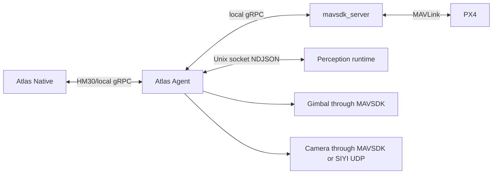

# Atlas Agent

## Role

Atlas Agent is the Go onboard runtime. It sits between Atlas Native and the
aircraft-side services:



Agent does not connect to Atlas Backend. Its main composition is
[`atlas-agent/cmd/atlas-agent/main.go`](../atlas-agent/cmd/atlas-agent/main.go).

## Startup composition

The process starts in this order:

1. Load environment configuration.
2. Load or create the stable local identity.
3. If enabled, create the protected perception Unix socket and supervise or
   await the provider adapter.
4. Connect telemetry subscriptions to `mavsdk_server`.
5. Create one shared payload controller.
6. Create the action executor and mission executor using that controller.
7. Discover gimbal and configured camera capabilities.
8. Start the reconnecting Native session.
9. On `SIGINT` or `SIGTERM`, cancel the root context and close clients.

Sharing one payload controller is an important invariant. It gives mission
automation and manual control one place to arbitrate gimbal and camera intent.

## Configuration

[`internal/config/config.go`](../atlas-agent/internal/config/config.go) parses
and validates process configuration. Core variables are:

| Variable | Default | Meaning |
| --- | --- | --- |
| `ATLAS_AGENT_STATE_DIR` | OS user config directory plus `atlas-agent` | Stable identity and local Agent state; must be absolute |
| `ATLAS_GROUND_STATION_ADDR` | `192.168.144.50:7443` | Atlas Native listener |
| `ATLAS_DRONE_NAME` | `Atlas Drone` | Display name sent during registration |
| `ATLAS_AGENT_VERSION` | Build version | Version sent during registration |
| `ATLAS_MAVSDK_GRPC_ADDR` | `127.0.0.1:50051` | Local `mavsdk_server` API |
| `ATLAS_TELEMETRY_INTERVAL` | `1s` | Latest snapshot publication interval |
| `ATLAS_CAMERA_TRANSPORT` | `siyi_udp` | `siyi_udp`, `mavsdk`, or `hybrid` |
| `ATLAS_SIYI_CAMERA_ADDR` | `192.168.144.25:37260` | SIYI UDP camera-control endpoint |
| `ATLAS_PERCEPTION_PROVIDER` | `disabled` | `disabled`, `external`, `hailo`, `deepstream`, `tensorrt`, or `onnx` |
| `ATLAS_PERCEPTION_SOCKET_PATH` | Under Agent state | Protected provider-to-Agent socket |
| `ATLAS_PERCEPTION_ADAPTER_MODE` | `process` | Agent-supervised process or external/systemd container |
| `ATLAS_FLIGHT_CONTROLLER_ENDPOINT` | `/dev/serial0` | Registration metadata for the attached controller |
| `ATLAS_FLIGHT_CONTROLLER_BAUD_RATE` | `921600` | Registration and setup metadata |

The packaged installation writes these values to
`/etc/atlas-agent/atlas-agent.env` through
[`internal/onboardsetup/install.go`](../atlas-agent/internal/onboardsetup/install.go).

## Stable identity

[`internal/identity/store.go`](../atlas-agent/internal/identity/store.go) owns
two UUID-like values:

- `installationId`: one installed Agent identity.
- `droneId`: the durable aircraft identity presented to this Native database.

They are written to `identity.json` with owner-only permissions. Reconnects reuse
the same IDs, allowing Native to create a new communication link without
inventing a new aircraft.

Deleting or replacing this state changes the identity presented to Native and
must be treated as an operational migration, not ordinary cache cleanup.

## Native session and reconnect behavior

[`internal/transport/groundstation/client.go`](../atlas-agent/internal/transport/groundstation/client.go)
maintains the main session.

The Agent:

1. Creates a plaintext gRPC client to Native.
2. Opens `OpenSession`.
3. Creates a new session ID.
4. Sends registration as the first message.
5. Waits for `RegistrationAccepted`.
6. Starts the optional perception stream tied to that session.
7. Multiplexes heartbeat, telemetry, status events, command handling, mission
   operations, and mission updates until the stream ends.

After a failure, the outer loop reconnects with exponential backoff from one
second to thirty seconds. A new session ID and communication link are created;
the stable installation and drone IDs remain unchanged.

## Telemetry adapter

[`internal/telemetry/mavsdk/source.go`](../atlas-agent/internal/telemetry/mavsdk/source.go)
adapts many MAVSDK subscriptions into one accelerator- and transport-neutral
[`telemetry.Snapshot`](../atlas-agent/internal/telemetry/snapshot.go).

Subscriptions include:

- Connection state.
- Position and altitude.
- Battery or multiple batteries.
- Flight mode, armed, in-air, and landed state.
- GPS fix, satellites, raw GPS quality, and home position.
- Heading and NED velocity.
- PX4 health and armability.
- RC state.
- PX4 status text.

Most streams retry independently after failure. The adapter requests a
best-effort 2 Hz MAVSDK update rate, combines the latest fields under a mutex,
and publishes at the configured interval only when it has a newer snapshot.

The output channel has capacity one. If the consumer is slow, Agent removes the
old pending snapshot and publishes the latest. Status text uses a separate
buffered event channel because discrete warnings must be retained.

## Action executor

[`internal/vehicle/actions.go`](../atlas-agent/internal/vehicle/actions.go)
implements:

- Hold.
- Return to Launch.
- Land.
- Delegation of payload commands to the payload controller.

Each command ID is cached in an in-memory receipt map. A duplicate delivery in
the same Agent process returns the recorded result instead of repeating the
physical action. This protects reconnect/delivery races within a process, but it
is not durable across Agent restarts.

The flight actions call the MAVSDK Action service and require a successful
MAVSDK result, not merely a successful gRPC call.

## Payload controller

[`internal/vehicle/payload.go`](../atlas-agent/internal/vehicle/payload.go) is
the single owner of gimbal and camera setpoints.

It manages:

- MAVSDK Gimbal v2 discovery and control.
- Optional MAVSDK Camera discovery and zoom.
- SIYI A8 UDP zoom through
  [`internal/vehicle/siyi.go`](../atlas-agent/internal/vehicle/siyi.go).
- Global and waypoint-specific mission payload intent.
- Inspection and mission-override manual sessions.
- Gimbal ownership acquisition, stop, release, and mission restoration.

### Camera transport policy

The selected transport controls discovery and execution:

- `siyi_udp`: use the SIYI SDK for zoom and do not open MAVSDK Camera streams.
- `mavsdk`: use a MAVLink/MAVSDK camera only.
- `hybrid`: enable both and permit SIYI fallback.

This matters because opening MAVSDK Camera subscriptions can cause
`mavsdk_server` to probe PX4 as if it were a camera. The default A8 path avoids
that behavior.

### Manual control leases

Two contexts exist:

- `inspection`: allowed only when no mission is active. Native also requires
  fresh, explicitly disarmed and on-ground telemetry.
- `mission_override`: tied to one `RUNNING` or `PAUSED` mission run.

Leases must be three to fifteen seconds. The UI currently requests seven
seconds and renews every three. If renewal stops:

- Inspection stops angular rates and releases gimbal ownership.
- Mission override restores the payload intent for the mission's current
  waypoint.

Mission activation is rejected while inspection control owns the payload.

## Mission executor

[`internal/vehicle/missions.go`](../atlas-agent/internal/vehicle/missions.go)
accepts immutable Native plan JSON and translates it into:

- A MAVSDK Mission plan for navigation.
- A separate Agent payload plan for gimbal and zoom intent.
- Return-to-launch-after-mission configuration.
- Translation warnings for semantic Atlas actions not executable by MAVSDK
  Mission v1.

The executor serializes mission operations with `operationMu`. It supports:

- Upload.
- Start with automatic arm.
- Pause.
- Resume.
- Cancel to Hold and clear mission.
- Return to Launch.
- Mission-progress subscription.

For incident-response plans, mission translation also retains a separate
arrival-action chain. Reaching the last waypoint does not complete the run.
Agent executes `HOLD_AT_ARRIVAL` first, then optional
`POINT_GIMBAL_AT_INCIDENT`, and emits acknowledged action states for each
attempt. Exhausted retries apply only the immutable plan's explicit Return to
Launch or operator-intervention policy.

On initial start, Agent arms before requesting mission mode. If mission start
fails after arming, Agent requests Hold. Resume does not arm again; it requires
the loaded run to be paused.

Mission progress updates the payload controller for the current waypoint and is
streamed back to Native. Completion ends payload ownership and emits a terminal
run update only after any reviewed arrival actions have succeeded.

## Perception boundary

[`internal/perception/`](../atlas-agent/internal/perception/) defines an
accelerator-neutral contract. Provider-specific adapters emit newline-delimited
JSON envelopes over a Unix socket owned by Agent.

The runtime source:

- Requires an absolute socket path.
- Creates the parent directory with owner-only permissions.
- Protects the socket with mode `0600`.
- Rejects non-socket files at the configured path.
- Validates protocol version, frames, detections, boxes, model identity, and
  health.
- Publishes latest-only frame and health channels.

For Hailo, [`scripts/atlas-hailort-adapter.py`](../atlas-agent/scripts/atlas-hailort-adapter.py)
opens the clean A8 RTSP stream, runs Hailo/TAPPAS inference, extracts normalized
metadata, and never draws or republishes video.

Agent always forwards health. It forwards frames only while a Native consumer
lease is active or a mission is `RUNNING`/`PAUSED`. Demand state is implemented
in [`internal/transport/groundstation/frame_demand.go`](../atlas-agent/internal/transport/groundstation/frame_demand.go).

## Packaged runtime

The supported package installs three systemd units:

```text
atlas-mavsdk.service
    -> atlas-agent.service
        -> atlas-hailo-adapter.service (container mode)
```

- MAVSDK owns the serial/MAVLink connection.
- Agent requires MAVSDK.
- The container-backed Hailo adapter is part of the Agent lifecycle and uses the
  Agent-owned runtime socket.

See the unit files in
[`atlas-agent/packaging/systemd/`](../atlas-agent/packaging/systemd/) and the
full runbook in
[`atlas-agent/INSTALLATION.md`](../atlas-agent/INSTALLATION.md).

## Extension rules

When adding Agent behavior:

- Keep provider-specific code behind neutral Agent types.
- Keep policy that depends on operator intent or durable history in Native.
- Keep hardware-specific execution and discovery in Agent.
- Reuse the shared payload controller for any gimbal/camera action.
- Preserve latest-only semantics for high-rate state.
- Preserve discrete event semantics for warnings and lifecycle evidence.
- Add command IDs, deadlines, explicit result codes, and idempotency behavior.
- Update capabilities so Native can hide or reject unavailable operations.
