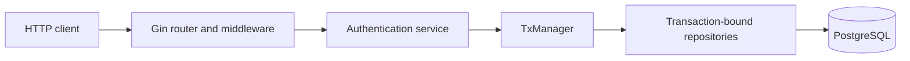
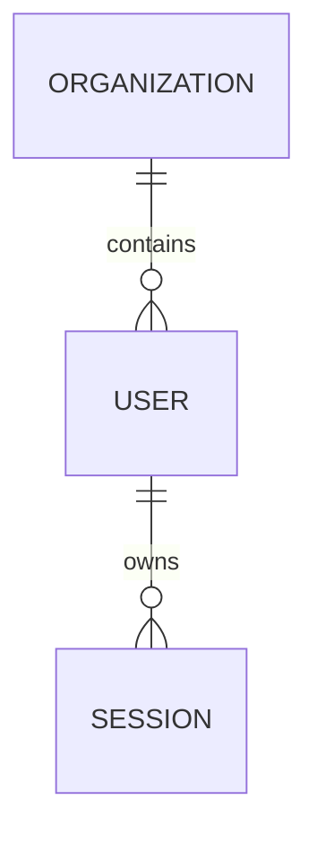
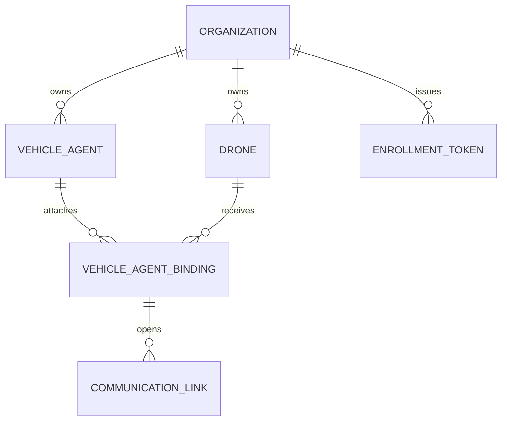

# Atlas Backend

## Current role

Atlas Backend is a separate Go/Gin/PostgreSQL service. It is a foundation for
identity, tenancy, vehicle enrollment, and future coordinated services.

It is not currently:

- Called by Atlas Native during local flight operations.
- Connected to Atlas Agent.
- A proxy for the Native-Agent gRPC session.
- The source of truth for current local commands, missions, telemetry, or
  aircraft history.

This boundary is deliberate. Backend or internet failure must not stop the
current local control loop.

## Runtime architecture



The process entry point is
[`atlas-backend/cmd/atlas-backend/main.go`](../atlas-backend/cmd/atlas-backend/main.go).
It:

1. Loads validated configuration.
2. Opens PostgreSQL with a startup timeout.
3. Creates the PostgreSQL transaction manager and repository factory.
4. Creates the authentication service.
5. Starts six-hour inactive-session cleanup.
6. Builds the Gin router.
7. Runs the HTTP server with graceful shutdown.

## HTTP API

The currently exposed routes are:

| Method | Route | Authentication | Purpose |
| --- | --- | --- | --- |
| `GET` | `/healthz` | None | Process liveness |
| `GET` | `/readyz` | None | PostgreSQL readiness |
| `GET` | `/api/v1/version` | None | Development service version |
| `POST` | `/api/v1/auth/register` | None, rate limited | Create organization, first admin, and session |
| `POST` | `/api/v1/auth/login` | None, rate limited | Create a session |
| `GET` | `/api/v1/auth/me` | Bearer session | Resolve current user and organization |
| `POST` | `/api/v1/auth/logout` | Bearer session | Revoke the current session |

Routes are defined in
[`internal/httpapi/router.go`](../atlas-backend/internal/httpapi/router.go).

Vehicle-agent service and repository code exists, but no public Agent enrollment
or transport endpoint is currently wired into the router.

## Identity and tenancy

An organization is the tenant boundary. Users belong to one organization and
have an `admin` or `operator` role.

The authentication model:

- Passwords use Argon2id with a unique salt.
- Raw bearer tokens contain 256 random bits.
- PostgreSQL stores only each token's SHA-256 digest.
- A session is invalid after its idle timeout, absolute expiry, revocation,
  disabled user, or suspended organization.
- `last_seen_at` is rate-limited so ordinary requests do not write on every hit.

The current default timeouts are:

| Setting | Default |
| --- | --- |
| Session idle timeout | 12 hours |
| Absolute session lifetime | 7 days |
| Invalid-session retention | 30 days |
| Cleanup interval | 6 hours |

The service rejects an idle timeout greater than or equal to the absolute
timeout.

## Persistence model

PostgreSQL migrations are paired up/down files under
[`atlas-backend/migrations/`](../atlas-backend/migrations/). Docker Compose runs
them with `golang-migrate` before the API starts.

### Identity tables



### Vehicle-operation foundation



Composite foreign keys include `organization_id` so PostgreSQL enforces
same-tenant relationships. Partial unique indexes enforce at most one current
binding per Agent and per drone.

The backend vehicle model is conceptually similar to Native's local model but is
not synchronized with it today. Do not assume IDs or lifecycle records move
between the databases.

## Transaction boundary

Application services receive a
[`repositories.TxManager`](../atlas-backend/internal/repositories/repositories.go),
not a pool-backed repository.

`WithinTransaction` creates one `pgx.Tx` and a collection of repositories all
bound to that transaction:

```text
service operation
    -> TxManager.WithinTransaction
        -> one pgx.Tx
            -> Repositories
                -> Auth()
                -> Drones()
                -> VehicleAgents()
                -> VehicleAgentBindings()
                -> CommunicationLinks()
                -> EnrollmentTokens()
```

This prevents one service operation from accidentally mixing transaction-bound
and pool-bound writes. The callback's error or panic causes rollback; success
commits.

External services and Native's SQLite database cannot join this transaction.
Future cross-system workflows will need idempotency, an outbox, compensating
actions, or another explicit distributed-systems pattern.

## Server and middleware

[`internal/server/server.go`](../atlas-backend/internal/server/server.go) uses:

- A five-second read-header timeout.
- Context-driven graceful shutdown.
- Configurable shutdown timeout.

The router:

- Uses Gin logging and recovery.
- Applies an explicit CORS allow-list.
- Trusts no proxies by default.
- Separates liveness from database readiness.
- Applies fixed-window rate limits to registration and login.

For non-loopback deployment, TLS must exist at the service or ingress boundary.
Database credentials should come from a secret manager rather than the local
Compose defaults.

## Docker Compose

[`atlas-backend/docker-compose.yml`](../atlas-backend/docker-compose.yml)
starts:

1. PostgreSQL.
2. A one-shot migration service.
3. The read-only backend container after PostgreSQL is healthy and migrations
   succeed.

Ports bind to loopback by default. The API container uses a temporary `/tmp`
filesystem and a read-only root filesystem.

Run:

```sh
cd atlas-backend
cp .env.example .env
docker compose up --build
```

Then verify:

```sh
curl http://127.0.0.1:8080/healthz
curl http://127.0.0.1:8080/readyz
```

## Future integration rule

The Backend may later provide:

- Authenticated users and organizations for Native.
- Agent enrollment and cryptographic identity.
- Incident ingestion and operational coordination.
- Shared fleet metadata.
- Integrations and durable cross-site services.

It must not silently become an opaque remote proxy for safety-critical local
commands. A future design should state:

- Which authority owns a command.
- How local operation behaves when Backend connectivity is lost.
- How Backend and Native IDs are reconciled.
- How conflicts and retries are made idempotent.
- Which records are local operational evidence versus synchronized product
  data.

## Where to modify behavior

| Concern | Owning code |
| --- | --- |
| Process composition | [`cmd/atlas-backend/main.go`](../atlas-backend/cmd/atlas-backend/main.go) |
| Environment and cross-field validation | [`internal/config/config.go`](../atlas-backend/internal/config/config.go) |
| HTTP routes and middleware | [`internal/httpapi/`](../atlas-backend/internal/httpapi/) |
| Authentication rules | [`internal/services/auth/`](../atlas-backend/internal/services/auth/) |
| Vehicle enrollment/service rules | [`internal/services/vehicleagents/`](../atlas-backend/internal/services/vehicleagents/) |
| Transaction management | [`internal/database/`](../atlas-backend/internal/database/) |
| Repository contracts | [`internal/repositories/`](../atlas-backend/internal/repositories/) |
| PostgreSQL implementation | [`internal/repositories/postgres/`](../atlas-backend/internal/repositories/postgres/) |
| Schema | [`migrations/`](../atlas-backend/migrations/) |

