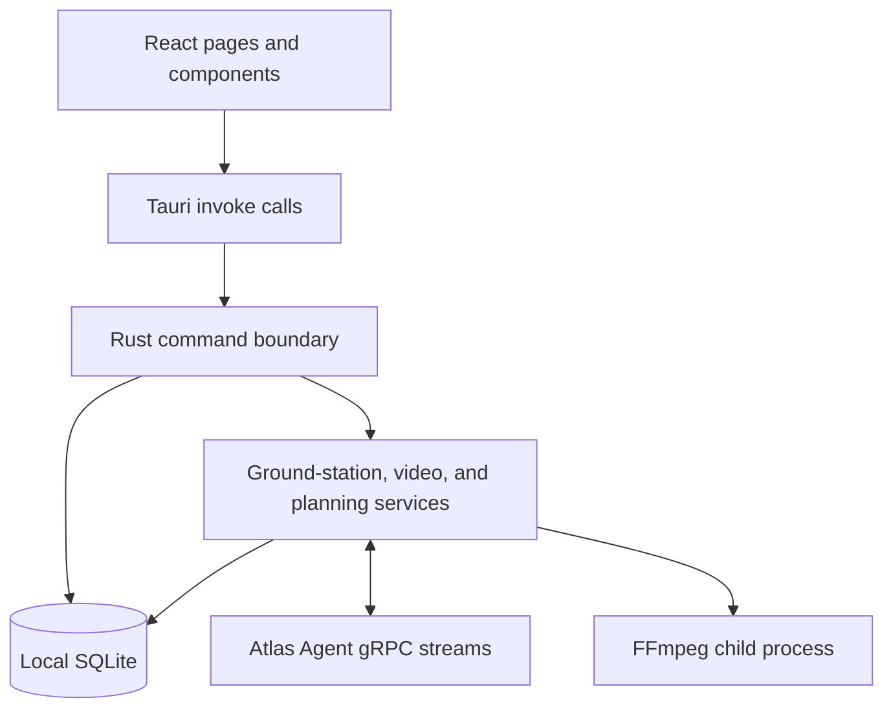

# Atlas Native

## Role

Atlas Native is the local ground-station authority. It is one Tauri v2
application with two cooperating runtimes:

- A React 19 webview renders the operator experience.
- A Rust host owns policy, persistence, Agent transport, video decoding, and
  Native services.

The main process composition is
[`atlas/src-tauri/src/lib.rs`](../atlas/src-tauri/src/lib.rs). The main UI
composition is [`atlas/src/App.tsx`](../atlas/src/App.tsx).

## Internal layers



### React presentation layer

[`atlas/src/App.tsx`](../atlas/src/App.tsx) owns top-level navigation and the
selected aircraft/mission context. The primary workspaces are:

- Evidence review and retention.
- Incident Operations and response preparation.
- Aircraft Follow from standoff.
- Fleet and aircraft detail.
- Mission planning and mission execution.
- Cross-aircraft History.

The app polls Native snapshots once per second. This is a deliberate simple
boundary at the current scale: React asks for a coherent snapshot instead of
reconstructing operational truth from many browser-side event handlers.

Important UI modules:

| Module | Responsibility |
| --- | --- |
| [`evidence/EvidencePage.tsx`](../atlas/src/evidence/EvidencePage.tsx) | Evidence still/event-clip review, annotation, verification, trash, and retention |
| [`operations/OperationsPage.tsx`](../atlas/src/operations/OperationsPage.tsx) | Incident intake, suitability, response preview, review, assignment, and dispatch |
| [`follow/FollowPage.tsx`](../atlas/src/follow/FollowPage.tsx) | Selected-target geolocation review and commissioned aircraft Follow from standoff |
| [`fleet/FleetPage.tsx`](../atlas/src/fleet/FleetPage.tsx) | Operational and archived aircraft list |
| [`missions/MissionPage.tsx`](../atlas/src/missions/MissionPage.tsx) | Mission definition, map geometry, plan generation, and terrain workflow |
| [`missions/MissionExecutionPage.tsx`](../atlas/src/missions/MissionExecutionPage.tsx) | Upload, start, progress, pause/resume, cancel, RTL, live map, and payload override |
| [`missions/MissionPayloadControl.tsx`](../atlas/src/missions/MissionPayloadControl.tsx) | Inspection and mission-scoped payload leases |
| [`history/HistoryPage.tsx`](../atlas/src/history/HistoryPage.tsx) | Seven-day local telemetry and event history |
| [`video/LiveVideo.tsx`](../atlas/src/video/LiveVideo.tsx) | Clean video canvas, optional detection canvas, perception lease, and health metrics |

TypeScript types mirror Rust response JSON using camelCase serialization. The
shared types are not generated, so any Tauri response change must update both
the Rust structure and TypeScript consumer.

### Tauri command boundary

[`atlas/src-tauri/src/commands.rs`](../atlas/src-tauri/src/commands.rs) is the
webview-to-host API. It exposes read commands, write commands, and asynchronous
delivery commands.

Read examples:

- `fleet_snapshot`
- `vehicle_operations_snapshot`
- `mission_list`
- `mission_run_detail`
- `vehicle_command_history`
- `vehicle_telemetry_chart_series`
- `perception_snapshot`
- `perception_track_geolocations`
- `incident_list` and `incident_detail`
- `incident_response_aircraft_suitability`
- `evidence_assets`
- `aircraft_follow_sessions`
- `video_stream_snapshot`

Write/delivery examples:

- `archive_drone` and `restore_drone`
- `create_mission`, `update_mission`, and `generate_mission_plan`
- `upload_mission` and `control_mission_run`
- `create_incident`, `preview_incident_response`, and
  `prepare_incident_response`
- `request_vehicle_command`
- evidence recording, still/event-clip capture, review, retention, trash, and
  restore commands
- track selection/geolocation and aircraft-follow create/renew/end commands
- perception frame-subscription start/renew/stop
- video stream start/stop

The command boundary is where UI input becomes trusted Native input. Rust
performs the authoritative validation even when React already disables an
unsafe button.

## Startup and managed state

At startup Native creates one `AppState` containing:

```text
Arc<LocalDatabase>
ground-station listen address
CommandRouter
PerceptionStore
EvidenceRecorder
VideoManager
```

The gRPC server and background watchdogs run on Tauri's async runtime. Native
refreshes operational alerts every two seconds, expires vehicle commands every
second, evaluates aircraft-follow leases every 250 ms, and applies evidence
retention hourly. The video and evidence managers own their child processes and
buffers. When the main window is destroyed, Native stops both recorder and
decoder work so FFmpeg processes are not orphaned.

The default Agent listener is `192.168.144.50:7443`. Override it with
`ATLAS_GROUND_STATION_LISTEN_ADDR`; use loopback for local development.

## Ground-station service

[`atlas/src-tauri/src/ground_station/server.rs`](../atlas/src-tauri/src/ground_station/server.rs)
hosts two bidirectional gRPC methods:

- `OpenSession` for registration, heartbeat, telemetry, PX4 events, commands,
  and mission operations.
- `OpenPerceptionStream` for health, detection frames, and frame-demand leases.

The split prevents high-rate perception metadata from delaying command
acknowledgements.

### Session processing

[`ground_station/session.rs`](../atlas/src-tauri/src/ground_station/session.rs)
enforces:

1. Registration must be first.
2. The session ID cannot change after registration.
3. Telemetry, status, command updates, and mission updates require an active
   registered session.
4. Mission updates must target the drone bound to that stream.
5. Stream termination closes the communication-link record and unregisters the
   in-memory route.

### Command router

[`ground_station/command_router.rs`](../atlas/src-tauri/src/ground_station/command_router.rs)
maps a drone ID to the active response stream. It delivers:

- Vehicle command requests.
- Command cancellation requests.
- Mission operation requests.

The router is intentionally in memory because it represents current network
reachability. SQLite remains authoritative for what was requested and what
happened. After registration, the router attempts to deliver eligible pending
commands.

### Perception store

[`ground_station/perception.rs`](../atlas/src-tauri/src/ground_station/perception.rs)
holds bounded live state per drone and source:

- Latest frame and health.
- Up to 240 recent frames, bounded to ten seconds.
- Connection and staleness state.
- The outbound channel used to start, renew, or stop frame subscriptions.

This store is bounded live state. SQLite separately persists track sessions,
lifecycle events, significant/periodic samples, counts, selections,
geolocations, and evidence provenance. Atlas does not persist every box from
every frame as an unbounded historical dataset.

## Local SQLite

[`database/mod.rs`](../atlas/src-tauri/src/database/mod.rs) opens the database,
enables foreign keys, uses `synchronous=FULL`, requires WAL mode, configures a
five-second busy timeout, validates the SQLite version, applies migrations, and
prunes expired telemetry snapshots.

The normal file is `atlas.db` in the platform application-data directory.
`ATLAS_SQLITE_PATH` accepts only an absolute path and is used by isolated
development and SITL.

Schema 21 adds durable selected-track geolocation attempts. Each row references
the vehicle command, operator selection, tracker session, and track; retains the
automatically resolved ground altitude/source/version and MVP aim-point-height
assumptions; and
ends as either a coordinate with horizontal uncertainty or an explicit
rejection code/reason. Command completion and geolocation resolution occur in
the same SQLite transaction.

Schema 22 extends successful attempts without replacing the original Agent
evidence. It retains the initial horizontal-plane coordinate, validates ordered
target-area DEM samples against the original observation ray, stores the final
iterative terrain intersection and residual, and filters successive finalized
coordinates into North/East target velocity, speed, direction, and velocity
uncertainty. A latest-per-track operational query joins coordinates to current
lifecycle, selection, annotations, and evidence-marker counts for the map.

The current schema version is 24. Its durable state is grouped as follows (the
list names the main tables rather than every index or migration-era rebuild):

| Area | Tables |
| --- | --- |
| Identity and connectivity | `drones`, `vehicle_agents`, `vehicle_agent_bindings`, `communication_links` |
| Telemetry and events | `vehicle_telemetry_current`, `vehicle_telemetry_snapshots`, `vehicle_status_events` |
| Commands | `vehicle_commands`, `vehicle_command_events` |
| Missions | `missions`, `mission_plans`, `mission_items`, `mission_actions`, `mission_runs`, `mission_run_events` |
| Aircraft lifecycle | `drone_lifecycle_events` |
| Incident dispatch | `incidents`, `incident_events`, `incident_assignments`, `mission_action_executions`, `mission_action_execution_events` |
| Operational alerts | `operational_alerts`, `operational_alert_events` |
| Recording and evidence | `evidence_recording_sessions`, `evidence_recording_segments`, `evidence_recording_events`, `evidence_gap_events`, `evidence_retention_policy`, `evidence_assets`, `evidence_asset_annotations`, `evidence_asset_events` |
| Perception and counting | `perception_track_sessions`, `perception_tracks`, `perception_track_events`, `perception_track_samples`, `perception_mission_tracks`, `perception_counting_rules`, `perception_count_events`, `perception_track_rule_counts`, `perception_track_selections`, `perception_track_selection_events`, `perception_track_annotations`, `perception_track_geolocations` |
| Aircraft follow | `aircraft_follow_sessions`, `aircraft_follow_target_updates`, `aircraft_follow_events` |

Migrations are embedded in
[`database/migrations.rs`](../atlas/src-tauri/src/database/migrations.rs). They
are forward-only at application startup. A database with a newer schema version
is rejected rather than guessed at.

### Current versus historical telemetry

Every accepted telemetry message replaces one current row. Historical snapshots
are sampled:

- On the first sample.
- Every five seconds while active.
- Every thirty seconds while idle.
- Immediately on armed, in-air, flight-mode, or landed-state transitions.

Snapshots are retained for seven days. Derived state-transition events are
stored alongside PX4 status text. This balances useful history with bounded
local storage.

### Freshness

Snapshot presentation derives freshness at read time:

- A link is stale after 15 seconds without a heartbeat.
- Telemetry is live only when the link is connected and the sample is no more
  than five seconds old.
- Perception is stale after three seconds without a message.

Database rows are not rewritten merely to mark them stale. Freshness is a
comparison between stored timestamps and the current clock.

## Incident operations

Native owns incident intake, revision/audit history, fleet suitability,
deterministic response preview, known-building assessment, atomic plan and
assignment preparation, and the mapping between mission/action acknowledgements
and response state. Preparation persists reviewed intent and reserves an
aircraft but does not send a flight command.

The Operations UI is intentionally a client of that policy. It may rank and
explain candidates, but it cannot bypass Native's revision, reservation,
capability, freshness, or geometry checks. Upload and start revalidate their own
boundaries because state can change after preview. See
[Incident dispatch](incident-dispatch.md) for the complete workflow and four
response patterns.

## Evidence recording and review

[`atlas/src-tauri/src/recording.rs`](../atlas/src-tauri/src/recording.rs)
supervises source-RTSP segmented recording and explicit still/event-clip
creation. Large media bytes live under the configured evidence root; SQLite
stores session, segment, gap, asset, association, hash, annotation, review,
trash, and retention state. Startup recovery and finalization prevent a partial
file from being reported as verified evidence.

Evidence recording is independent of the clean live decoder. This avoids making
a UI viewer the owner of archival bytes and lets a short live frame buffer remain
bounded. The detailed media pipeline is documented in
[Video and perception](video-perception.md).

## Follow supervision

Native owns the persisted aircraft-follow authorization, reviewed envelope,
exact selected-track binding, target updates, operator lease, events, and 250 ms
watchdog. The Agent owns the PX4 Offboard controller. Native never converts a
camera-follow selection directly into movement: it first requires converged
geolocation and filtered motion, then sends the reviewed authority to Agent.

Camera follow itself remains an Agent payload controller under a payload lease.
See [Inference, tracking, geolocation, and follow](inference-tracking-and-follow.md)
for both controllers and their failure behavior.

## Mission planning

Native owns mission definitions and plan generation in
[`database/missions.rs`](../atlas/src-tauri/src/database/missions.rs).

Supported template/pattern pairs are:

| Template | Pattern |
| --- | --- |
| `WAYPOINT` | `DIRECT_WAYPOINTS` |
| `AREA_SCAN` | `LAWN_MOWER` |
| `ROUTE_SCAN` | `ROUTE_FOLLOW` |

Definitions contain editable parameters. Generating a plan inserts a new
immutable plan, item, and action set, then points the definition at the new plan.
Old plans remain available to old mission runs.

Terrain clearance is a two-stage process:

1. Rust generates route geometry.
2. React samples the configured DEM along the centre and corridor edges.
3. Rust validates the evidence, climb/descent envelope, home reference, and
   ceiling before persisting a second immutable plan.

The detailed terrain evidence remains in Native. Upload sends the operational
plan while removing the bulky profile-point evidence from the wire payload.
See [Mission types and flight patterns](mission-types-and-flight-patterns.md)
for the generation algorithms, action ordering, and execution lifecycle.

## Video manager

[`atlas/src-tauri/src/video.rs`](../atlas/src-tauri/src/video.rs) supervises an
FFmpeg child process that:

1. Opens the clean RTSP stream.
2. Scales and pads to the configured dimensions.
3. Limits output frame rate.
4. Emits MJPEG frames through stdout.

Native parses the image stream into a bounded frame deque. A requested frame is
held until the configured playout delay, matched to perception metadata, then
returned as one binary `ATV1` packet containing a JSON header and clean JPEG.

The webview always receives clean pixels. Detection boxes are drawn on a second
transparent canvas and can be hidden without changing the source frame.

## Extension rules

When adding Native behavior:

- Put operator presentation in React.
- Put authoritative validation and state transitions in Rust.
- Put durable operational state in SQLite.
- Keep in-memory state for live routing, bounded media, and cache-like data only.
- Expose a coherent Tauri command rather than letting the UI coordinate several
  partially applied writes.
- Preserve append-only lifecycle events for commands, missions, incidents,
  evidence, perception selections, and follow sessions.
- Test policy and state transitions in Rust; test parsing and interaction-heavy
  rendering in TypeScript where feasible.
