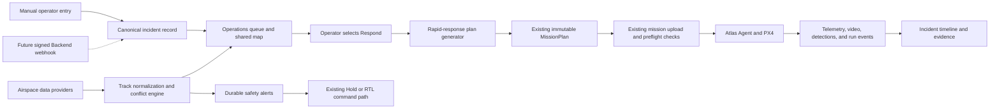
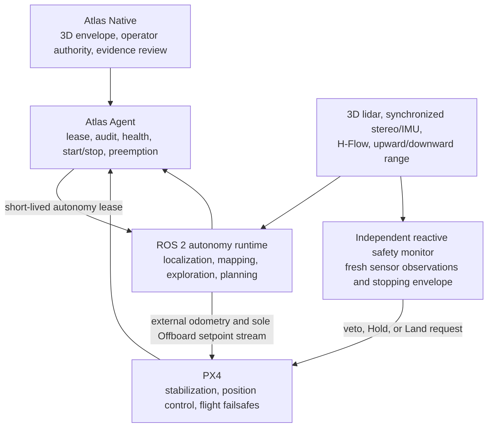

# Atlas Feature Gap Assessment

**Status:** Draft  
**Assessment date:** 16 July 2026  
**Last updated:** 17 July 2026  
**Scope:** Atlas Native, Atlas Agent, and the future coordinated-services boundary  
**Reference material:** Supplied screenshots of public-safety drone dispatch and
live-operation products, the supplied mission-execution and mission-intelligence
assessment, and the current Atlas implementation

## 1. Objective

This document assesses how the current Atlas system compares with the
incident-response and live-operation capabilities shown in the supplied product
screenshots. It identifies:

- Capabilities Atlas already provides.
- Important product and engineering gaps.
- Features that should be added now, later, or not at all.
- How the recommended features should fit into the existing Atlas architecture.
- Safety invariants that must remain true as Atlas expands.

The screenshots are treated as product references, not as verified
specifications of any vendor system. Recommendations are based on what is
visible in those screenshots and on the current Atlas implementation.

## 2. Executive Summary

Atlas is currently **aircraft-first and mission-first**:

1. An operator selects an aircraft or creates a mission.
2. Atlas validates and generates an immutable mission plan.
3. The operator uploads and starts the mission.
4. Atlas tracks execution, commands, telemetry, payload state, and history.

The reference products are primarily **incident-first**:

1. A CAD, ALPR, 911, or manually created incident appears.
2. The incident is displayed on a shared operational map.
3. The system recommends or selects an available aircraft.
4. An operator responds to the incident with a short operational workflow.
5. Map, video, aircraft, personnel, and safety context remain visible together.

Atlas already has stronger foundations than the screenshots alone reveal:

- Local-first aircraft control without a backend dependency.
- Durable command lifecycles and append-only command events.
- Immutable mission plans and separate mission-run history.
- Waypoint, route-scan, and area-scan planning.
- Terrain profiling and preflight route validation.
- Live map tracking, flight trails, and mission progress.
- Clean video with frame-aligned perception metadata.
- Gimbal angles, rates, geographic ROI, and camera zoom.
- Mission pause, cancel, Hold, Land, and Return-to-Launch behavior.

The most important gap is therefore not basic flight control. It is the
**dispatch and operational coordination layer that turns an incoming incident
into a safe, durable Atlas mission run**.

Atlas should preserve its current control and audit model while adding a thin
incident-response layer above it.

The expanded assessment also makes clear that Atlas should be understood as two
connected systems:

1. **Mission execution:** what the operator has authorized the aircraft to do,
   how Atlas validates and executes it, and what happens when an action fails.
2. **Mission intelligence:** what the camera detects, how objects remain
   associated across frames, how observations are geolocated, and how Atlas
   converts them into operator-reviewable events.

The agreed perception and selected-track direction is:

- Keep Hailo/TAPPAS responsible for onboard detector inference.
- Add a tracker abstraction after normalized Hailo detections.
- Support both BoT-SORT and ByteTrack, with only one active tracker per stream.
- Use BoT-SORT as the configurable default because drone and gimbal movement
  make camera-motion compensation valuable.
- Keep ByteTrack as the lower-compute fallback and comparison baseline.
- Start BoT-SORT with camera-motion compensation enabled and ReID disabled.
- Create persistent, session-scoped Atlas track records rather than treating a
  track ID as a permanent identity.
- Add low-latency onboard gimbal following for an operator-selected track.
- Later add operator-authorized aircraft following at a bounded standoff
  distance, after trustworthy detection geolocation exists.
- Do not implement unrestricted autonomous pursuit or aircraft movement driven
  directly from bounding-box pixels.

The agreed MVP operations and payload direction is:

- Create incidents manually in Atlas Native. Do not build CAD, ALPR, emergency
  call, sensor, webhook, or mock incident connectors for the MVP.
- Add a signed REST webhook only after Atlas Backend is ready. The Backend will
  validate and normalize external context; it will not directly command an
  aircraft.
- Approve Hold at Staging and Offset Observe as the initial arrival behaviors.
- Support operator-approved Area Scan and stepped-altitude Bounded Orbit inside
  explicit horizontal and vertical bounds.
- Record evidence to an Atlas-managed local filesystem store. Do not depend on
  the A8 MicroSD card. Preserve a storage boundary for later verified S3
  replication.
- Use OS NGD building features and OS Building Height Attribute as an MVP
  known-building warning layer, not as proof that a route is obstacle-free.
- Treat the A8 visible gimbal as the only currently installed mission payload.
  The purchased 2021 OAK-D Lite and planned downward Holybro H-Flow must remain
  disabled until installed, calibrated, and validated. The supplied OAK-D Lite
  datasheet does not list an IMU, so Atlas must assume that unit has no onboard
  IMU unless hardware discovery proves otherwise.
- Add GPS-denied indoor mapping and bounded autonomous exploration only as a
  late-stage demonstrator. The operator approves the mission envelope once;
  the onboard computer selects and executes short routes through known free
  space and enters Hold before requesting operator help when no validated route
  remains.
- Keep the indoor roadmap in two explicit stages. The agreed demonstrator is a
  fixed- or tightly bounded-altitude **2.5D** system using the planned OAK-D
  Lite and H-Flow integrations. A later funded **full 3D** system adds
  all-direction geometry sensing, an IMU-equipped stereo source, GPU-class
  companion compute, ROS 2 localization/mapping/planning, and deliberate
  climb/descent through validated free-space corridors. Neither stage is a
  current shipped capability.

## 3. Current Atlas System Context

Atlas is a local-first drone operations system:

```text
PX4 flight controller
    -> mavsdk_server
        -> Atlas Agent
            -> agent-initiated gRPC session over HM30/Ethernet
                -> Atlas Native
                    -> embedded SQLite operational history
```

The current boundaries are deliberate:

- **Atlas Native** owns operator workflow, safety policy, durable records,
  mission planning, mission execution state, video decoding, and local SQLite.
- **Atlas Agent** owns PX4/MAVSDK integration, payload control, perception
  supervision, and the outbound session to Native.
- **Atlas Backend** is not currently in the aircraft-control path. It provides a
  future boundary for identity, organizations, integrations, and coordinated
  services.

The current perception path is approximately:

```text
Camera/RTSP
    -> GStreamer and Hailo inference
        -> normalized detections and optional upstream track IDs
            -> Atlas Agent perception stream
                -> frame-aligned Native perception store
                    -> clean-video overlay
```

Atlas already preserves source video timestamps, model identity, bounding
boxes, confidence, and an optional `track_id`. It does not yet provide:

- An explicitly selected and supervised tracker stage in the Atlas pipeline.
- Persistent track lifecycle records and track-session identity.
- Aircraft roll and pitch at frame-capture time.
- Measured gimbal attitude at frame-capture time.
- Camera calibration and camera-to-gimbal mounting records.
- Detection geolocation with a reported uncertainty.
- A dynamic flight-control mode for following a selected moving track.

Relevant implementation references:

- `README.md`
- `atlas/README.md`
- `atlas/src/App.tsx`
- `atlas/src/missions/MissionPage.tsx`
- `atlas/src/missions/MissionExecutionPage.tsx`
- `atlas/src/missions/OperationalMissionMap.tsx`
- `atlas/src/missions/MissionPayloadControl.tsx`
- `atlas/src/video/LiveVideo.tsx`
- `proto/atlas/ground_station.proto`
- `atlas-agent/internal/vehicle/missions.go`
- `atlas-agent/internal/vehicle/actions.go`

## 4. Capability Comparison

| Capability area | Atlas today | Reference products | Assessment |
| --- | --- | --- | --- |
| Fleet registration and readiness | Supported | Supported | Atlas has a sound local operational model. |
| Mission planning and execution | Strong | Present, often simplified for rapid response | Atlas is stronger in plan immutability, terrain profiling, and run history. |
| Incident/CAD dispatch | Not supported | Central workflow | Highest-priority gap. |
| Shared operational map | Mission-scoped map | Fleet, incidents, personnel, units, and aircraft together | Atlas needs a dedicated Operations workspace. |
| Rapid response / fly to point | Possible through a manually created waypoint mission | One-click or short response flow | Add as a rapid mission workflow, not a raw command. |
| Live map and video | Operator switches between map and camera | Persistent split views | Add Map, Video, and Split layouts. |
| Video flight HUD | Telemetry exists outside the video | Critical telemetry overlaid on video | Add a restrained safety HUD. |
| Camera and gimbal control | Gimbal angle/rate/ROI and zoom supported | Similar, with direct media controls | Atlas is already strong; recording and still capture are gaps. |
| Perception overlay | Frame-aligned detections supported | Detection or situational overlays | Atlas has a strong technical foundation. |
| Multi-object tracking | Optional upstream `track_id`; no Atlas-selected tracker lifecycle | Persistent object tracks | Add BoT-SORT and ByteTrack behind one tracker interface; default to BoT-SORT. |
| Persistent track records | Not supported | Tracks, last-known position, counts, and events | Add session-scoped track state and persist important samples and events. |
| Gimbal track following | Manual gimbal angles, rates, ROI, and zoom | Select a target and keep it framed | Add an onboard image-space gimbal controller for a selected track. |
| Detection geolocation | Not supported | Map markers tied to observations | Add pose buffering, measured gimbal attitude, camera calibration, timestamp correlation, terrain/range intersection, and uncertainty. |
| Aircraft selected-track following | Not supported | Dynamic target observation | Add later as an explicit operator-authorized, bounded standoff mode; never navigate from pixels alone. |
| Scene events and summaries | Structured detections only | Operator-oriented alerts and scene interpretation | Add deterministic event rules first; use a ground-station VLM only as an evidence-linked summarizer. |
| Airspace awareness | Not supported | Nearby-aircraft warning and deconfliction | Required before broader BVLOS operations. |
| Terrain and obstacle routing | Terrain profile only; no obstacle avoidance | 3D buildings and pathfinder presentation | Add OS NGD and Building Height Attribute as an MVP known-building warning layer; do not claim complete obstacle clearance. |
| Evidence media | Mission recording intent exists; no archival media system | Record and still-capture controls | Add Atlas-managed local file storage with SQLite manifests; preserve a later S3 replica boundary and do not rely on A8 MicroSD. |
| Operator assignment | No current operator/user model in Native | Named pilots and shared dispatch | Needed when Atlas becomes multi-operator. |
| Authentication and organizations | Backend foundation only; not in Native control path | Multi-user operational systems | Needed for coordinated deployments, but not for local control continuity. |
| Video street/address projection | Not supported | Street labels projected into live imagery | Low priority and technically risky. |
| Thermal source switching | No thermal payload is installed | Visible in some reference interfaces | Do not expose thermal controls. The current A8 is visible-only. |
| Forward depth and obstacle sensing | A 2021 OAK-D Lite has been purchased but is not installed | Integrated local obstacle awareness | Hide the capability until installed and validated; begin in advisory mode and assume no onboard IMU unless discovery proves otherwise. |
| Optical-flow and range aiding | Holybro H-Flow is planned but not installed | Improved local navigation | Integrate through DroneCAN and PX4 first; Atlas observes estimator health after installation. |
| GPS-denied indoor mapping and navigation | Not supported | Indoor inspection and mapping | Add later as a bounded 2.5D demonstrator using PX4/H-Flow for local flight, OAK stereo depth for mapping, onboard frontier planning, and Hold-before-operator-deferral. This first stage does not deliberately climb or descend around obstacles. |
| Full 3D indoor autonomy | Not supported and outside the current hardware plan | Autonomous exploration through volumetric free space | Treat as a future funded program: GPU-class companion compute, 360-degree 3D lidar, synchronized IMU-equipped stereo, upward/downward coverage, ROS 2 autonomy runtime, 3D mapping, 3D trajectory planning, and independent reactive collision monitoring. |
| Audio/talk-down | Not supported | Visible in one reference interface | Skip unless the payload roadmap explicitly requires it. |
| Mission action policies | Durable requested/running/retrying/succeeded/failed/policy-applied execution now covers arrival Hold and optional incident gimbal pointing, with explicit RTL or operator-intervention policy | Reusable arrival and observation behavior | Extend the same runtime with configurable timeouts/backoff and the remaining reusable actions; add broader failure policies only when their acknowledgement semantics are defined. |

## 5. Product Direction

The recommended direction is:

> Evolve Atlas from a mission planner and ground station into an
> incident-to-flight operations system, while keeping Atlas Native as the
> aircraft-control authority.

This means external systems may supply operational context, but they must not
directly command aircraft.



### 5.1 Confirmed Design Decisions

#### Incident intake

The MVP has one incident source: manual operator entry in Atlas Native.

```text
source_type: MANUAL
source_system: ATLAS_NATIVE
external_id: null
```

Atlas should preserve source-neutral incident fields so a future integration
does not require a schema redesign. No mock incident connector or external
incident adapter should be included in the product runtime.

After Atlas Backend is ready, it may expose a signed REST webhook. The Backend
will authenticate, validate, deduplicate, and normalize incoming events before
synchronizing canonical incident context to Native. The webhook is not an
aircraft-command interface.

#### Arrival behaviors

Initial operational policy is:

- **Hold at Staging:** approved for the MVP.
- **Offset Observe:** the default arrival behavior.
- **Bounded Area Scan:** permitted after operator review of its polygon, route,
  altitude, and constraints.
- **Bounded Orbit:** permitted after operator review of its center, radius,
  altitude envelope, direction, transitions, and known-building warnings.
- **Direct Overhead:** exceptional rather than a default.
- **Follow from Standoff:** a later, separately authorized dynamic mode.
- **Autonomous Pursuit:** not supported.

A bounded orbit may use an explicit stepped-altitude schedule. Atlas should
complete a configured number of laps at one altitude, transition within the
approved vertical envelope, and then complete the next level:

```yaml
orbit:
  radius_m: 40
  altitude_reference: AGL_AT_ORBIT_CENTRE
  altitude_bounds_m: [40, 70]
  altitude_levels_m: [40, 55, 70]
  laps_per_level: 1
  direction: clockwise
  transition: after_complete_lap
  max_vertical_rate_mps: 1.5
```

The initial implementation should use discrete levels, normally ordered low to
high or high to low. A continuously climbing or descending helical orbit is
deferred. Route validation must cover every orbit level and the transitions
between them.

#### Evidence storage

Evidence media will be stored in an Atlas-managed local filesystem store. The
A8 MicroSD card is outside the MVP evidence architecture.

SQLite should contain manifests, relationships, checksums, states, retention,
and audit events. MP4, JPEG, and thumbnail bytes should remain outside SQLite.
Long recordings should be segmented, finalized atomically, and checked for
integrity. The evidence root, retention, quota, low-space threshold, and reserve
must be configurable.

The storage model should allow a later S3 replica without changing the evidence
asset identity:

```text
CAPTURING -> FINALIZING -> LOCAL_VERIFIED
                              -> S3_UPLOAD_QUEUED
                              -> S3_VERIFIED
```

S3 is a future verified replica. Atlas must not delete the local copy until the
remote object has been independently verified and the configured retention
policy permits deletion.

#### MVP known-building data

Atlas will use OS NGD building features for footprints and OS Building Height
Attribute for approximate heights. The resulting volumes are an operator-review
and warning layer only.

The valid product claim is:

> The proposed route is clear of the known building volumes checked from the
> identified OS dataset, subject to the displayed margins and unknowns.

Atlas must not claim that the route is obstacle-free. Missing heights are
unknowns, not zero-height buildings. The plan must retain dataset identity,
release or retrieval time, feature identifiers, height source, clearance
margins, and all unresolved features.

#### Current and planned payload

The current mission payload is the visible-light SIYI A8 gimbal. Atlas should
not expose a thermal source.

The purchased 2021 OAK-D Lite will provide near-field stereo depth, obstacle
candidates, and mapping frames to a companion-computer safety and mapping
service. Its supplied datasheet lists dual OV7251 global-shutter stereo cameras
and an IMX214 colour camera but does not list an IMU. Atlas must therefore treat
the camera as having no onboard IMU unless runtime discovery proves otherwise.

The planned downward Holybro H-Flow will provide DroneCAN optical-flow and
distance measurements to the PX4 estimator. Neither device is currently
installed, so neither may be advertised as an available capability or used in
a safety decision.

#### Late-stage indoor mapping and navigation

Atlas will target an operator-supervised **bounded autonomous indoor mapping
demonstrator**, not unrestricted indoor exploration.

The indoor roadmap has two different architectures and product claims:

1. **Agreed demonstrator architecture — 2.5D:** fixed or tightly bounded
   altitude, forward depth, downward flow/range aiding, a top-down inflated
   cost map, yaw-first forward movement, and onboard frontier selection inside
   one immutable envelope.
2. **Future funded architecture — full 3D:** volumetric localization, mapping,
   exploration, and trajectory planning with sufficient sensor coverage to
   validate upward, downward, lateral, and return paths.

Atlas does not provide either capability today. The 2.5D design is the next
late-stage demonstrator after hardware commissioning; the full 3D design is a
future reference architecture and procurement direction.

The operator authorizes one immutable local mission envelope containing the
horizontal boundary, altitude band, no-go regions, speed, clearance, duration,
battery reserve, landing area, and recovery policy. Within that envelope, an
onboard autonomy service may select frontiers, plan routes, and execute short
segments without approval for each step.

The initial demonstrator should use a fixed or tightly bounded altitude and a
2.5D cost map. PX4 and H-Flow provide the continuous local flight estimate and
height aiding. OAK stereo depth and a candidate RGB-D SLAM implementation such
as RTAB-Map provide forward obstacle observations, point-cloud construction,
map correction, and exploration state. Stereo-only odometry and SLAM may assist
mapping, but they must not become the sole flight-position authority without a
validated visual-inertial source.

If the planner cannot reach one frontier, it should try other safe candidates.
If no validated route remains or required sensor quality degrades, the aircraft
must stop, confirm Hold, preserve its map and route state, and then request
operator direction. The operator may request a rescan, choose a known-free
point, retrace a validated breadcrumb path, land, or take direct control.

In this first 2.5D stage, PX4 may make small vertical corrections needed to
hold the approved flight height, but the planner does not choose a climb or
descent to clear an obstacle. A later layered-2.5D experiment may introduce a
small number of operator-approved altitude layers, but only after Atlas can
validate the complete vertical transition column with suitable upward and
downward sensing. Arbitrary vertical routing belongs to the full 3D stage.

#### Tracker architecture

The Atlas tracking path will be:

```text
Decoded video frame
    -> Hailo detector inference
        -> normalized detections
            -> selected tracker
                -> tracked detections
                    -> persistent Atlas track state and operator events
```

The selected tracker is configured per perception stream:

```yaml
tracker:
  type: botsort
  camera_motion_compensation: sparse_optical_flow
  reid: false
```

Supported values should initially be `botsort`, `bytetrack`, and `none`.
BoT-SORT is the default; ByteTrack is the lower-compute fallback and benchmark
baseline. Atlas must run only one tracker for a stream at a time so there is one
authoritative track-ID sequence.

The tracker integration should consume normalized Hailo detections. Atlas should
not replace Hailo inference with an end-to-end Ultralytics runtime merely to gain
access to a tracker API.

#### Selected-track behavior

Atlas will distinguish two operator actions:

1. **Follow with camera:** keep an operator-selected track centered using the
   gimbal while the aircraft holds or continues an authorized flight behavior.
2. **Follow from standoff:** reposition the aircraft to maintain an authorized
   observation envelope around a geolocated moving track.

Camera following can be developed first from image-space tracking. Aircraft
following requires time-aligned world-space track estimates and must be
implemented as a separate, explicitly authorized flight mode.

#### Scene intelligence

Atlas should build scene understanding in three layers:

1. Observable model outputs such as detections, tracks, pose, segmentation, and
   estimated movement.
2. Deterministic and testable event rules.
3. Evidence-linked ground-station summaries that require operator confirmation.

A vision-language model may summarize evidence, but it must not become the
source of flight authority or silently turn an uncertain observation into a
confirmed operational fact.

## 6. Priority 0: Capabilities to Add First

### 6.1 Operations Workspace

#### Problem

Atlas currently organizes the application around Fleet, Missions, and History.
This works for deliberate mission preparation, but it does not provide one
place to answer:

- What is happening now?
- Where is it happening?
- Which aircraft can respond?
- Which aircraft are already assigned?
- What requires immediate operator attention?

#### Recommended behavior

Add an **Operations** workspace containing:

- A shared operational map.
- Open and active incident queues.
- Connected and disconnected aircraft.
- Current assignments and routes.
- Active mission state.
- Critical aircraft and airspace alerts.
- Search and filter controls.
- A selected-incident detail panel.

The map should support independently toggleable layers:

- Incidents.
- Atlas aircraft.
- Incident assignments.
- Current routes and aircraft trails.
- External responders or personnel, when integrations exist.
- Airspace tracks and warnings.
- Operator-created markers.

The map must use clustering, priority-based visibility, and zoom-dependent
labels. The reference screenshots demonstrate useful context, but also show the
risk of excessive marker density and visual competition.

#### Relationship to existing Atlas

The current Fleet workspace remains useful for aircraft administration,
registration, lifecycle state, and settings. The Operations workspace is the
real-time command surface.

### 6.2 Canonical Incident Model

#### Problem

Atlas has no incident entity. Missions are currently standalone definitions and
runs, so Atlas cannot retain why an aircraft was deployed or associate multiple
operational actions with one event.

#### Recommended behavior

Create a source-neutral incident model, but expose only manual operator entry in
the MVP. Manual incidents should be fully local and must not depend on Atlas
Backend.

Keep the source fields even though their initial values are fixed:

```text
source_type = MANUAL
source_system = ATLAS_NATIVE
external_id = null
```

CAD, ALPR, emergency-call, sensor, perception, and generic external incident
connectors are out of the current scope. A signed REST webhook becomes the first
external source only after Atlas Backend is ready.

Suggested local data model:

```text
incidents
    id
    source_type
    source_system
    external_id
    incident_type
    priority
    status
    summary
    description
    latitude
    longitude
    address
    area
    occurred_at_unix_ms
    received_at_unix_ms
    updated_at_unix_ms
    source_payload_json

incident_events
    id
    incident_id
    event_type
    state
    message
    details_json
    occurred_at_unix_ms
    received_at_unix_ms

incident_assignments
    id
    incident_id
    drone_id
    mission_id
    mission_run_id
    operator_id
    status
    assigned_at_unix_ms
    ended_at_unix_ms
```

`incident_events` should be append-only. The current state can be projected from
the event history in the same way Atlas preserves command and mission-run
evidence.

#### Integration boundary

When external intake is introduced, payloads should be authenticated and
normalized by Atlas Backend before reaching Native. Atlas should not spread
source-specific field names throughout Native, the database, or mission code.
No external incident payload may directly create or start a mission run.

### 6.3 Respond to Incident

#### Problem

Atlas can approximate “fly to point” with a waypoint mission, but the current
workflow requires deliberate mission authoring. That is too slow for
incident-response operations.

#### Recommended behavior

Selecting **Respond** should:

1. Validate that the incident has a usable location.
2. Show available aircraft ordered by operational suitability.
3. Let the operator choose arrival behavior:
   - Hold at a reviewed staging point.
   - Observe from a safe offset.
   - Search a reviewed bounded area.
   - Orbit inside reviewed horizontal and vertical bounds.
   - Execute an optional stepped-altitude orbit with explicit levels and laps.
4. Generate a rapid-response mission definition and immutable plan.
5. Show route, distance, altitude, estimated arrival time, and blockers.
6. Require operator confirmation.
7. Use the existing upload, preflight, arm, and start lifecycle.
8. Link the resulting mission and run to the incident assignment.

#### Important design decision

Do not implement this as an unaudited, transient `goto` command.

A rapid response should produce a short Atlas mission because the existing
mission path already provides:

- Immutable plan evidence.
- Distance and home-position validation.
- Terrain-profile support.
- One unfinished run per aircraft.
- Upload acknowledgements.
- Preflight checks.
- Start failure handling.
- Pause, cancel, Hold, and RTL behavior.
- Durable execution history.

The UI can make the workflow feel immediate without bypassing the underlying
safety model.

For a stepped-altitude orbit, the immutable plan must expose each altitude
level, the laps at that level, the transition path, altitude reference, maximum
vertical rate, terrain clearance, known-building warnings, and expected battery
cost. A generic minimum and maximum altitude is not sufficient evidence of the
actual path Atlas intends to fly.

### 6.4 Map, Video, and Split Views

#### Problem

The current mission execution workspace switches between map and camera. During
an active response, operators often need both simultaneously.

#### Recommended behavior

Provide three layouts:

- **Map:** Maximum map area with a compact video preview.
- **Video:** Maximum video area with a compact map.
- **Split:** Map and video side by side.

All three layouts should preserve:

- Incident identity and priority.
- Current mission/run state.
- Critical telemetry.
- Safety alerts.
- Hold, RTL, and Land access.
- Recording state.

Layout selection should not recreate subscriptions, lose mission state, or reset
the aircraft trail.

### 6.5 Restrained Video Flight HUD

#### Problem

Atlas displays stream and perception diagnostics over or below video, but
critical flight state is primarily outside the video surface.

#### Recommended behavior

Add a configurable video HUD with:

- Armed and in-air state.
- Flight mode.
- Battery.
- Relative altitude.
- Ground speed.
- Heading.
- GPS state.
- Command/control link freshness.
- Recording state.
- Active safety alert.

The HUD should not attempt to place all telemetry on the video. Detailed
diagnostics remain in the existing telemetry panels.

Rules:

- Critical states must use text and shape, not color alone.
- Stale telemetry must be visually distinct from live telemetry.
- HUD content must not cover the primary center reticle or detection target.
- Operators must be able to reduce the overlay when inspecting fine detail.

### 6.6 Operational Alert Model

#### Problem

Atlas currently records PX4 status events and command failures, but there is no
single alert model for operator attention across aircraft, incidents, video,
airspace, and system health.

#### Recommended behavior

Create a normalized alert model with:

- Severity.
- Source.
- Aircraft or incident association.
- First-seen and last-seen timestamps.
- Active, acknowledged, resolved, and expired states.
- Recommended actions.
- Evidence/details payload.

Examples:

- Telemetry stale.
- Battery below operational threshold.
- Home position lost.
- Perception unavailable.
- Video unavailable.
- Mission translation warning.
- Nearby aircraft conflict.
- Incident location changed after plan generation.

Acknowledgement must mean “the operator has seen the alert,” not “the hazard no
longer exists.” Resolution must come from system state or an explicit,
auditable operator action.

### 6.7 Reusable Mission Actions and Failure Policies

#### Problem

Atlas mission plans already contain semantic actions for speed, gimbal intent,
recording intent, perception intent, RTL, and Land. Some actions translate into
MAVSDK mission items, while others remain payload intent or structured warnings.
Atlas does not yet have one generic runtime that executes every action with a
durable action lifecycle.

That limits reusable behaviors such as:

- Hold for a duration.
- Point the gimbal at a coordinate or selected track.
- Start or stop recording with positive acknowledgement.
- Enable or disable a perception profile.
- Orbit an incident.
- Wait for operator confirmation.
- Capture and mark evidence.

#### Recommended behavior

Each executable action should define:

```text
action type
parameters
timeout
maximum retries
retry delay or backoff
failure policy
```

Initial failure policies should include:

- Continue and notify.
- Skip the remaining optional action.
- Hold and request operator input.
- Abort the mission.
- Return to launch.

Retries are appropriate for transient camera, gimbal, transport, or
acknowledgement failures. They must not override battery, geofence, airspace,
position-quality, or other safety failures.

Action state changes should be durable:

```text
PENDING -> RUNNING -> SUCCEEDED
                  -> RETRY_WAIT -> RUNNING
                  -> FAILED -> POLICY_APPLIED
```

Point observation and orbit should be reusable behaviors assembled from these
actions, not separate mission engines. A rapid incident response can then reuse
the same execution path:

```text
take off
    -> transit
        -> arrive at staging point
            -> point gimbal
                -> start perception and recording
                    -> observe, orbit, or wait for operator
```

## 7. Priority 1: Capabilities to Add Next

### 7.1 Integrated Airspace Awareness and Deconfliction

#### Problem

Atlas has no nearby-aircraft tracking or conflict warning. This becomes a major
operational gap as flights extend in range, altitude, density, or BVLOS scope.

#### Recommended behavior

Normalize supported airspace sources into a common track:

```text
airspace_track
    source
    track_id
    latitude
    longitude
    altitude
    heading
    ground_speed
    vertical_rate
    accuracy
    observed_at
```

Potential sources may include:

- ADS-B.
- Remote ID.
- UTM/USS providers.
- Local radar or acoustic systems.
- Partner-agency feeds.

A conflict engine should calculate:

- Horizontal separation.
- Vertical separation.
- Relative closure rate.
- Estimated closest point of approach.
- Time to closest approach.
- Confidence based on data age and accuracy.

The first version should provide:

- Map tracks.
- Direction and altitude.
- Escalating warning thresholds.
- Watch/focus action.
- Audio mute without hiding the alert.
- Direct access to Hold and RTL through existing durable commands.

Automatic evasive navigation should not be introduced until the detection
quality, authority model, route constraints, and failure behavior are proven.

### 7.2 Evidence Recording and Still Capture

#### Problem

Atlas mission plans can encode start/stop camera-video intent, but the current
Native video pipeline is a low-latency preview rather than an archival recorder.
There is no operator-facing still capture or incident-linked media library.

The MVP decision is to record into Atlas-managed local file storage. The A8
MicroSD card is not an evidence store or fallback in this architecture.

#### Recommended behavior

Add:

- Start recording.
- Stop recording.
- Capture still.
- Positive local-recorder state acknowledgement.
- Media manifest linked to incident, aircraft, mission run, and time.
- Operator annotation.
- Export with checksums and metadata.

The initial storage design should use:

```text
configurable local evidence root
    objects/<asset-id>.mp4
    objects/<asset-id>.jpg
    thumbnails/<asset-id>.jpg
    temporary/<asset-id>.partial

SQLite
    evidence asset metadata
    incident and mission-run relationships
    SHA-256 checksums
    capture and finalization state
    retention and deletion events
```

Record the source RTSP media rather than the MJPEG UI preview. Segment long
recordings so a crash or storage fault cannot corrupt an entire mission. Finalize
through an atomic rename, calculate a checksum, and only then mark the asset
`LOCAL_VERIFIED`.

Before exposing media controls, define:

- Evidence-root configuration and permission checks.
- Storage quota, warning threshold, critical low-water mark, and reserved space.
- Behavior when the ground link or RTSP source is interrupted.
- Retention period and local deletion policy.
- Encryption-at-rest requirements.
- Evidence export format.
- Clock and timestamp evidence.

A red button without confirmed camera state is not sufficient. The UI must
distinguish:

- Command requested.
- Local recorder accepted.
- Local file capture confirmed.
- Recording stopped.
- File finalized and checksum verified.
- Recording failed.

Ground-link loss may create a gap because the MVP does not rely on camera-local
recording. Atlas must record the exact gap in the evidence timeline rather than
represent the mission as continuously recorded.

The future S3 implementation should be a second `EvidenceReplica` for the same
asset. Upload occurs asynchronously from `LOCAL_VERIFIED`, includes integrity
verification, and does not delete the local replica unless retention policy
explicitly permits it.

### 7.3 Operator Identity and Assignment

#### Problem

Atlas Native currently has no operator authentication or ownership model. That
is acceptable for a single local ground station but insufficient for shared
dispatch.

#### Recommended behavior

When multi-operator use begins, add:

- Authenticated operator session.
- Operator role and permissions.
- Aircraft-control ownership.
- Incident assignment.
- Mission handoff.
- Read-only observers.
- Command attribution.

The future Backend identity model can coordinate users and organizations, but a
temporary backend outage must not interrupt an active local flight.

Control ownership should use a short renewable lease, similar in spirit to the
existing payload-control lease:

- One authoritative operator controls an aircraft at a time.
- Other operators can observe.
- Handoff is explicit and audited.
- Lease loss produces a defined safe state.
- Local emergency actions remain available according to policy.

### 7.4 Multi-Source Payload Architecture

#### Problem

Atlas currently assumes one configured primary video source. Reference products
show visible, thermal, forward, and gimbal-camera switching.

The only currently installed mission payload is the visible-light SIYI A8
gimbal. A 2021 OAK-D Lite has been purchased but is not installed. The downward
Holybro H-Flow is planned hardware. Neither sensor is a current Atlas
capability.

#### Recommended behavior

Introduce a generic payload-source descriptor:

```text
payload_source
    source_id
    display_name
    modality
    transport
    resolution
    frame_rate
    controllable
    recording_supported
    zoom_supported
    gimbal_association
```

Possible modalities:

- Visible.
- Thermal.
- Forward navigation camera.
- Low-light.
- Processed perception feed.

Only expose source controls that the connected Agent reports as capabilities.
Do not implement a thermal toggle until the selected payload has a real thermal
stream and verified transport behavior.

The planned hardware responsibilities are deliberately separate:

```text
SIYI A8 gimbal
    -> visible observation, detections, tracking, geolocation, and evidence

Forward OAK-D Lite
    -> near-field depth and forward obstacle candidates
    -> stereo/RGB mapping frames and colourized point clouds
    -> companion-computer navigation safety and mapping service

Downward Holybro H-Flow
    -> DroneCAN optical flow and distance
    -> PX4 estimator velocity and height aiding
```

Until installed, capability discovery must report no forward depth, no optical
flow/range module, and no thermal source. After installation, H-Flow should be
validated in PX4 independently before Atlas relies on its estimator state. The
OAK-D Lite should begin in advisory mode; automatic Hold based on depth requires
validated detection distance, latency, stopping envelope, calibration, and
health monitoring. It must not initially steer around obstacles.
The Phase 8 indoor planner may command validated routes only after the advisory
and automatic-Hold stages have passed their defined validation gates.

The supplied December 2021 OAK-D Lite datasheet does not list an onboard IMU.
Atlas must report `imu_present: false` for the navigation camera unless device
discovery demonstrates otherwise. The absence of a camera-synchronized IMU does
not prevent depth mapping or stereo visual odometry, but it prevents Atlas from
claiming that this unit provides a validated VIO source. H-Flow or PX4 IMU data
is not a drop-in replacement without clock synchronization, frame transforms,
extrinsic calibration, latency measurement, and estimator validation.

A forward-only OAK-D Lite does not provide side, rear, or upward coverage.
Automated movement must not assume omnidirectional protection. During an orbit,
the preferred geometry is for the aircraft nose and OAK-D Lite to face the
direction of travel while the A8 gimbal looks inward at the observation target.

### 7.5 Onboard Multi-Object Tracking

#### Problem

YOLO detections are frame-local observations. Repeated detections do not by
themselves establish that the same person or vehicle remains visible across
frames. Atlas currently transports an optional upstream `track_id`, but does not
select, configure, supervise, or report the lifecycle of the tracker that
created it.

#### Recommended behavior

Add a common onboard tracker interface after Hailo detection:

```text
update(frame, detections, capture_time) -> tracked detections
```

Provide two implementations:

- **BoT-SORT:** the default because camera-motion compensation is relevant to
  moving aircraft and gimbals.
- **ByteTrack:** a lower-compute fallback and a stable baseline for evaluating
  whether BoT-SORT provides enough operational benefit.

Initial BoT-SORT configuration should:

- Enable camera-motion compensation.
- Disable ReID.
- Report when camera-motion compensation is unavailable or degraded.

ReID should be enabled only after representative footage demonstrates that
occlusion and look-alike targets create unacceptable ID switches. It adds model,
compute, memory, privacy, and lifecycle complexity.

The tracker must be reset after:

- A stream epoch or camera source changes.
- A model or class-map change invalidates associations.
- A timestamp discontinuity.
- A tracker process restart.
- A gap longer than the configured track-retention threshold.

The perception stream should eventually report:

```text
track_id
track_session_id
tracker_type
track_state
track_age_frames
observed_at
```

Track IDs must be scoped to aircraft, camera source, stream epoch, and tracker
session. They are anonymous temporary associations, not personal identities.

#### Validation

Both trackers should be evaluated on the target companion computer and
representative aerial footage using:

- ID switches.
- Track fragmentation.
- Time to confirm a new track.
- Recovery after short occlusion.
- Behavior during rapid gimbal and aircraft motion.
- CPU and memory use.
- Added latency and dropped frames.

BoT-SORT remains the product default only while it meets the required
performance envelope. The operator-facing product behavior must not depend on a
specific tracker implementation.

### 7.6 Persistent Tracks, Counts, and Gimbal Following

#### Persistent track state

High-frequency boxes should remain in bounded onboard memory. Atlas should
persist:

- Track creation and closure.
- Latest confirmed state.
- Important state changes.
- Periodic geolocated samples.
- Operator selections and annotations.
- Evidence image or clip references.
- Generated events.

A track lifecycle should distinguish:

```text
TENTATIVE -> ACTIVE -> TEMPORARILY_OCCLUDED -> LOST -> CLOSED
```

Atlas must separately display:

- Last observed position.
- Short-lived predicted position.
- Current confirmed position.

Prediction confidence must decay with time and stop after a bounded threshold.

#### Counting

Tracking enables:

- Current visible-object count.
- Unique tracks observed during a mission.
- Configured line or polygon crossing counts.

Counts must retain tracker-session context because an ID switch can otherwise
produce double counting. Accuracy should be reported as a measured tracker and
rule outcome, not assumed from the number of IDs.

#### Operator-selected gimbal following

The operator should be able to choose a visible track and request **Follow with
camera**. An onboard controller compares the track target point with the image
center and commands bounded gimbal rates.

This controller should:

- Run onboard for low latency and link-loss continuity.
- Use a confirmed track and reject stale detections.
- Limit pitch/yaw rate and acceleration.
- Respect gimbal limits and the existing payload-control ownership model.
- Stop or hold the last safe angle when the track is lost.
- Require explicit operator selection before reacquiring a materially different
  track.
- End immediately on operator request, lease loss, camera-source change, or
  payload fault.

Gimbal following does not require the target to be geolocated and should be
delivered before aircraft following.

### 7.7 Detection Geolocation and Movement Estimation

#### Problem

A detection provides a pixel-space location. Responders and aircraft navigation
need a world-space estimate with an honest statement of uncertainty.

The geolocation calculation is:

```text
target pixel
    -> distortion-corrected camera ray
        -> camera-to-gimbal transform
            -> gimbal-to-aircraft transform
                -> aircraft-to-world transform
                    -> terrain, ground-plane, or measured-range intersection
```

#### Required foundation

Atlas should add:

1. **High-rate onboard pose buffer.** Store timestamped aircraft latitude,
   longitude, altitude, roll, pitch, yaw, velocity, and quality. Interpolate the
   samples around the frame-capture time.
2. **Measured gimbal-attitude telemetry.** Use actual gimbal yaw, pitch, and roll
   rather than the last commanded values.
3. **Versioned camera calibration.** Store camera intrinsics, distortion,
   calibrated image size, zoom/crop state, and the camera-to-gimbal mounting
   transform.
4. **Timestamp correlation.** Relate video PTS, companion-computer monotonic
   time, autopilot time, and gimbal time. Detection completion or UI receipt
   time must not replace image-capture time.
5. **Uncertainty model.** Account for aircraft position, attitude, gimbal angle,
   calibration, timestamp, detection contact point, terrain, target-height, and
   range uncertainty.

For a standing ground target, the first estimate may use the bottom center of
the bounding box as the ground-contact pixel. That assumption must be recorded
because it fails for rooftops, bridges, upper floors, and partially occluded
objects.

Geolocation accuracy degrades sharply near the horizon. At 60 metres altitude,
one degree of angular error produces roughly 2 metres of ground-range error at
a 45-degree depression angle, but roughly 35 metres at a 10-degree depression
angle before GPS and terrain errors are added.

The output should include:

```text
track_id
track_session_id
latitude
longitude
altitude or ground assumption
observed_at
method
horizontal_error_radius_m or error ellipse
observed_or_predicted
```

Movement direction and speed must be calculated from filtered world-space
positions. Pixel movement alone cannot distinguish target motion from aircraft
or gimbal motion.

### 7.8 MVP Known-Building Route Assessment

#### Scope

Atlas does not currently have a pre-surveyed operating area, an approved
corridor, or installed onboard obstacle sensors. The MVP may still provide a
useful static-building assessment using:

- OS NGD building features for footprints and structure identity.
- OS Building Height Attribute for approximate heights.
- Atlas terrain elevation for the building base and route profile.

This is a known-building intersection check, not complete obstacle-aware route
validation.

#### Route-volume calculation

For every known building, Atlas should:

1. Resolve the building footprint and height source.
2. Convert the building base to the route's altitude datum.
3. Expand the footprint by a configured horizontal clearance margin.
4. Add a configured vertical clearance margin to the building top.
5. Check the transit route, every orbit level, and all climb/descent transitions
   against the resulting volume.

```text
known_building_top_amsl
    = terrain_or_building_base_amsl
    + supplied_building_height
    + vertical_clearance_margin
```

Unknown height must remain `HEIGHT_UNKNOWN`; Atlas must not substitute zero. An
unknown building that affects a proposed automated route should block approval
until the route is moved or the operator records an explicit override with its
reason.

#### Operator presentation

Allowed statements include:

- Clear of known building volumes checked from the identified dataset.
- Route intersects a known building clearance volume.
- Building height unavailable; route assessment incomplete.
- Temporary and unmapped obstacles are not covered.

Atlas must not display **obstacle-free**, **safe route**, or equivalent language.
The immutable mission-plan evidence should preserve OS product identity,
release or retrieval time, feature IDs, height source, clearance margins,
unknowns, warnings, and overrides.

The MVP does not perform in-flight obstacle avoidance or automatic replanning.
The future OAK-D Lite and H-Flow integrations do not change this claim until
they are installed and separately validated.

## 8. Priority 2: Advanced Capabilities

### 8.1 Obstacle-Aware Urban Path Planning

#### Problem

Atlas terrain profiling accounts for ground elevation but explicitly does not
provide live terrain following or obstacle avoidance. Building extrusions in a
3D map can create false confidence if they are not backed by complete and
validated obstacle data.

The Priority 1 known-building assessment is only a precursor. Full
obstacle-aware planning remains advanced work because OS building data does not
cover wires, temporary cranes, all vegetation, moving objects, or every
structure.

#### Recommended behavior

Implement obstacle-aware planning only when Atlas can obtain trustworthy:

- Building footprints and heights.
- Tower, mast, crane, and powerline data.
- Geofences and restricted volumes.
- Dataset age and provenance.
- Required horizontal and vertical clearance.

Path generation should:

1. Construct a 3D constrained flight volume.
2. Apply aircraft and regulatory limits.
3. Calculate a route with clearance margins.
4. Validate climb and descent performance.
5. Preserve the obstacle dataset identity and version.
6. Present route evidence to the operator.
7. Fail closed when required obstacle data is missing.

3D rendering may be useful for review, but the route validator—not the visual
extrusion—is the safety feature.

### 8.2 Collaborative Remote Operations

Add cloud-backed sharing only after local incident operations are stable:

- Shared incident state.
- Remote observers.
- Multi-site fleet awareness.
- Role-based access.
- Operator handoff.
- Cross-ground-station audit.

The backend should synchronize operational context and evidence. It should not
be required for the active aircraft-control loop.

### 8.3 Detection-to-Incident Workflow

Atlas already receives structured perception detections. A later version can:

- Promote selected detections to operator markers.
- Associate detections with an incident.
- Create reviewable perception events.
- Track a selected object across frames.
- Trigger an operator-confirmed follow-up mission or payload action.

Detections must not automatically command aircraft until false-positive rates,
location estimation, authority, and failure behavior are understood.

### 8.4 Operator-Authorized Aircraft Track Following

#### Decision

Atlas should support an operator requesting that the aircraft follow a specific
track. The product should describe this as **Follow from standoff** or
**Maintain observation**, not unrestricted pursuit.

Operator authorization changes who initiates the behavior; it does not remove
the flight-control and safety complexity. This capability must not be built by
steering the aircraft toward the center of a bounding box.

#### Required behavior

The operator flow should be:

```text
select confirmed track
    -> request follow envelope
        -> validate track geolocation and flight constraints
            -> acquire stable target state
                -> enter bounded following
                    -> hold, end, or return on degradation
```

Atlas should use two coordinated onboard loops:

- A fast gimbal loop keeps the target framed.
- A navigation loop uses the filtered target position and velocity to update a
  moving observation point.

The aircraft should maintain an observation envelope rather than chase the
target position directly. Configurable constraints should include:

- Minimum and maximum standoff distance.
- Altitude band.
- Maximum groundspeed and acceleration.
- Geographic boundary and geofence.
- Maximum follow duration.
- Battery return reserve.
- Airspace and obstacle restrictions.
- Minimum track confidence and maximum geolocation uncertainty.

The control state should be explicit and durable:

```text
REQUESTED -> VALIDATING -> ACQUIRING -> FOLLOWING
                                      -> DEGRADED_HOLD
                                      -> ENDED
```

Atlas Native should authorize the selected track, envelope, and mode. The Atlas
Agent should run the latency-sensitive control loop and stream setpoints to PX4
using a supported dynamic-control mechanism such as Offboard or a validated
Follow Me integration. This requires a new supervised flight-control path; the
existing static mission translation is not sufficient.

The behavior must:

- Stop aircraft translation and enter Hold when track confidence, pose
  freshness, or geolocation quality crosses a configured threshold.
- Avoid silently attaching to a different track after loss.
- Provide an immediate operator Stop Follow action.
- Define behavior for operator lease loss, Agent restart, ground-link loss,
  position loss, geofence conflict, low battery, and PX4 offboard loss.
- Retain the physical RC and PX4 failsafes as independent recovery paths.
- Record every authorization, state transition, constraint change, and exit
  reason.

This capability should be delivered only after geolocation has been validated
against known ground truth and after the airspace, command-ownership, and
degradation behaviors have been exercised in simulation and controlled flight.

### 8.5 Scene Events and Ground-Station Summaries

Atlas should turn tracks into reviewable operational information without
claiming unsupported conclusions.

Initial deterministic events may include:

- Track entered or exited a configured zone.
- Track became stationary for a configured duration.
- Track was lost at a last-known location.
- Vehicle or debris obstructs a configured road region.
- Operator-selected evidence marker created.

Event wording should describe observable facts. For example, Atlas may raise
**Person stationary — review required**, but should not assert that the person
is injured.

Pose estimation and segmentation can later contribute additional evidence.
They should be introduced as task-specific perception profiles rather than one
generic model expected to understand every public-safety scenario.

A ground-station vision-language model may receive selected frames, a short
clip, structured tracks, event facts, and mission context. Its output should be
schema-constrained, cite the supporting track and evidence IDs, state
uncertainties, and require operator confirmation. It should not continuously
process the full live frame rate and must never directly command the aircraft.

### 8.6 Bounded Autonomous Indoor Mapping Demonstrator

#### Decision and product claim

Atlas should add a late-stage **bounded autonomous indoor mapping
demonstrator**. It is intended to demonstrate a credible path toward future
indoor autonomy with improved hardware, not to claim unrestricted autonomous
exploration of arbitrary buildings.

The valid initial product claim is:

> Atlas can autonomously explore and map a bounded, controlled indoor
> environment without GPS, selecting routes onboard and requesting operator
> assistance when no validated route is available.

The operator approves the mission once, including its local safety envelope.
The onboard computer then chooses frontiers, plans paths, executes short route
segments, and replans without requesting approval for every movement. The
operator retains immediate Hold, Land, and manual takeover authority.

This section describes a **planned architecture**, not software or flight
capability present in Atlas today. In this document:

- **2.5D mapping** means Atlas retains 3D sensor observations and can render a
  3D point cloud, but navigation is planned primarily in X and Y at one
  approved flight height or within a very narrow control band.
- **2.5D route planning** means obstacle geometry intersecting the flight slab
  is projected into a top-down cost map and inflated by aircraft radius,
  stopping distance, localization uncertainty, and a configured margin.
- **Full 3D planning** means the planner deliberately selects X, Y, and Z and
  may climb or descend through a verified volumetric corridor. That is not part
  of the initial demonstrator.

#### Initial operating envelope

The first demonstrator should use 2.5D navigation:

- One fixed altitude or a tightly bounded altitude band.
- A local horizontal boundary and explicit no-go regions.
- A static, well-lit, textured environment.
- Conservative speed, acceleration, stopping distance, and clearance.
- Propeller guards and an independent safety pilot with direct RC authority.
- No people, glass, mirrors, stairs, hanging wires, smoke, moving obstacles, or
  unsupported multi-floor behavior inside the test envelope.

The 3D point cloud may represent floors, walls, furniture, and ceilings, but
the initial route planner should project the relevant obstacle volumes into an
inflated horizontal cost map. Full free-flight planning through arbitrary 3D
volumes is deferred.

PX4 may continuously correct height to maintain the selected flight level.
Those estimator/controller corrections are not autonomous obstacle-clearing
climbs or descents. If a cabinet, doorway, hanging object, or other obstruction
blocks the current flight slab, the initial planner must route around it in X/Y
or reject that route and try another frontier.

#### Hardware and control responsibilities

```text
SIYI A8 + Hailo
    -> visible operator observation, semantic detections, and evidence
        -> not indoor free-space, position, or collision authority

Downward H-Flow
    -> DroneCAN optical flow and range
        -> PX4 EKF local velocity, height, and continuous odometry

Forward OAK-D Lite
    -> stereo depth, RGB, and optional stereo visual odometry
        -> onboard mapping and autonomy service
            -> occupancy map, point cloud, frontiers, and candidate routes

Atlas Native
    -> define, validate, review, and lock the immutable envelope
    -> start/stop, Hold, Land, evidence, and operator authority
        -> Atlas Agent bounded-autonomy lease and audit boundary
            -> onboard 2.5D autonomy service
                -> one local setpoint owner
                    -> PX4 position control, stabilization, and failsafes
```

PX4 remains responsible for stabilization, local position control, and
failsafes. H-Flow/PX4 odometry is the initial continuous flight-control frame.
The OAK mapping stack may improve mapping and loop closure, but stereo-only
odometry from the purchased no-IMU-assumed unit is not the sole flight-position
authority.

The supported Atlas onboard profile is currently Raspberry Pi 5 with a Hailo
AI HAT. The initial 2.5D service should target and benchmark that profile before
requiring a compute migration. Mapping, depth, point-cloud generation, planning,
Atlas Agent, video transport, and Hailo inference must be load-tested together.
If the Pi cannot maintain the required sensor, map, watchdog, and setpoint
deadlines, Atlas must upgrade the companion compute or reduce the declared
operating envelope; it must not relax safety timeouts to make the demo appear
functional. Hailo remains responsible for semantic inference and is not the
source of free-space or flight-position truth.

H-Flow supplies downward optical flow and range aiding, not a complete indoor
pose solution. The 2.5D gate must also validate PX4 attitude/yaw behavior,
horizontal drift, height stability, innovation checks, and local-position
freshness in the intended room. Poor magnetic conditions, weak floor texture,
invalid range, or excessive yaw/position drift block autonomous translation.

The mapping and planning loop must run on the companion computer. Ground-link
latency or loss must not be part of obstacle response, route following, or the
transition to Hold. Atlas Agent retains the exclusive command boundary and
grants the autonomy service a short, supervised lease inside the approved
envelope.

The 2.5D autonomy service should be a distinct onboard component rather than a
collection of implicit behaviors inside perception or mission translation. It
owns the following latency-sensitive functions while its lease is valid:

- Capture-time sensor and pose correlation.
- Local map updates and obstacle inflation.
- Frontier extraction, candidate scoring, and route generation.
- Short-segment execution and replanning.
- Immediate route cancellation when a stopping-envelope observation changes.
- Planner, localization, map, and sensor watchdogs.

Atlas Agent remains responsible for authorization, mutually exclusive command
ownership, mode transitions, health reporting, evidence events, and revoking
the autonomy lease. The active autonomy service is the only component allowed
to publish navigation setpoints while that lease is active. Hold, Land, and
manual takeover remain preemptive safety operations and must terminate or
revoke setpoint publication as part of the transition.

The present Agent generates MAVSDK clients for static mission and vehicle
operations but does not include an Offboard client or another implemented
high-rate local-setpoint controller. Phase 8 therefore requires a new,
explicitly supervised dynamic-control adapter plus watchdog and authority
tests. The 2.5D architecture must not be represented as a small change to the
existing MAVSDK Mission v1 translator.

#### Coordinate frames and map correction

The implementation must separate:

- `map`: the SLAM-corrected indoor frame used for exploration and display.
- `odom`: the continuous PX4 local frame used for flight control.
- `body`: the aircraft frame used for depth and motion transforms.

Atlas should maintain a timestamped `map -> odom -> body` transform chain.
SLAM loop closure may adjust `map -> odom`, but it must never discontinuously
move an active PX4 setpoint. Paths selected in `map` must be transformed into
the continuous `odom` frame before execution. Excessive map-to-odometry
disagreement, transform age, or uncertainty must stop translation and trigger
Hold or relocalization rather than a setpoint jump.

Depth frames, PX4 pose, camera calibration, and transform updates require
capture-time correlation. Receipt time at Atlas Native is not sufficient for
point-cloud registration or local navigation.

#### 2.5D map construction and safety model

The planned mapping path is:

```text
OAK stereo depth + RGB
    -> camera calibration and camera-to-body transform
        -> capture-time PX4 odometry correlation
            -> local 3D observations and colourized point cloud
                -> flight-slab filter
                    -> top-down free/occupied/unknown cost map
                        -> aircraft, uncertainty, and stopping-distance inflation
```

The flight slab includes the aircraft body and propeller volume around the
approved height, not merely a mathematical horizontal plane. An obstacle is
relevant when its measured or uncertainty-expanded volume intersects that
slab. Floor and ceiling observations remain useful for visualization, map
quality, and height sanity checks even though the initial route planner does
not navigate vertically.

The map should retain both the source observations and the derived 2.5D cost
map so an operator can understand why a route was accepted or rejected. Stale,
invalid, unobserved, or out-of-field-of-view space remains unknown. A
forward-only camera cannot certify side, rear, or overhead clearance.

#### Onboard exploration and route planning

The onboard map should classify space as:

- **Known free:** observed with sufficient confidence and clearance.
- **Known occupied:** measured obstacle volume plus aircraft and safety-margin
  inflation.
- **Unknown:** unobserved, stale, or invalid depth; never silently treated as
  free space.

The initial planner should:

1. Perform a slow initial yaw scan to populate nearby free and occupied space.
2. Extract frontiers between known free and unknown space.
3. Generate observation poses reachable through known free space.
4. Reject candidates outside the envelope, inside no-go space, too close to an
   obstacle, or unsupported by current localization quality.
5. Score the remaining candidates by expected information gain, route length,
   obstacle proximity, localization uncertainty, and battery cost.
6. Plan a route through the inflated known-free cost map using a deterministic
   grid planner such as A* or D* Lite.
7. Rotate to observe the direction of travel before translating.
8. Execute only a bounded short segment, continuously validate live depth, and
   replan as the map changes.
9. Repeat until the approved area is sufficiently mapped, battery reserve is
   reached, or no validated frontier remains.

A forward-only OAK does not provide omnidirectional protection. The initial
planner should prefer yaw-then-forward motion and prohibit autonomous blind
lateral or backward translation. A new obstacle in the stopping envelope must
cancel the active segment and request Hold before route replanning.

The initial demonstrator should not change altitude to bypass an obstacle. A
possible intermediate **layered 2.5D** experiment may use two or three explicit
operator-approved flight levels, but every level must have its own inflated
cost map and every climb/descent must have a fully observed vertical transition
column. Because the planned forward OAK-D Lite does not provide reliable
overhead coverage, layered 2.5D is disabled until additional upward/downward
geometry sensing and vertical-transition validation are installed and tested.

The immutable mission artifact is the approved envelope and policy, not a
precomputed exact route. Every dynamically generated route must have a version,
inputs, clearance result, execution outcome, and replan reason in the mission
run history.

The control state should be explicit and durable:

```text
REQUESTED -> PREFLIGHT -> LOCALIZING -> INITIAL_SCAN -> EXPLORING -> COMPLETE
                       \-> REJECTED        \-> DEGRADED_HOLD
                                               -> OPERATOR_REQUIRED
```

#### Immutable-envelope operator experience

Atlas Native should present the 2.5D safety envelope as a four-stage workflow:

1. **Define:** set the local origin, horizontal boundary, fixed flight height
   or narrow altitude band, no-go areas, home/landing area, speed, acceleration,
   clearance, duration, battery reserve, and recovery policy.
2. **Validate:** reject inconsistent bounds, insufficient stopping margins,
   unavailable sensors, invalid PX4 local position, and policies that cannot be
   executed with the connected hardware.
3. **Review:** show a top-down map plus a 3D preview of the floor, ceiling,
   flight slab, no-go volumes, starting pose, and sensor blind regions.
4. **Lock and Start:** hash and persist the approved envelope, issue the
   bounded-autonomy lease, and begin localization and the initial scan.

After start, the envelope is immutable for that mission run. The operator may
Hold, Land, End Autonomy, or take manual control, but may not drag a boundary or
raise the altitude limit while the aircraft is moving. A material change
requires confirmed Hold, termination of the current run or autonomy lease, and
approval of a new version. Routes remain dynamic inside the fixed envelope and
are displayed with their version, selected frontier, clearance result, and
replan reason.

#### Autonomous fallback and operator deferral

Failure to route to one frontier is not immediately an operator problem. Atlas
should mark that candidate unreachable under the current map and test other
valid candidates. It should defer only after safe alternatives are exhausted or
a required sensor/control condition fails.

The deferral sequence is:

```text
cancel active translation
    -> command and confirm PX4 Hold
        -> freeze route selection
            -> preserve map, pose, and planner evidence
                -> report OPERATOR_REQUIRED with a concrete reason
```

Reasons include:

- No reachable frontier remains.
- Every route intersects occupied or unknown space.
- H-Flow quality, range, or PX4 local position is invalid or stale.
- OAK depth or map updates are invalid or stale.
- Map and odometry disagree beyond the configured threshold.
- The aircraft cannot relocalize or validate a breadcrumb return path.
- The operator lease or configured ground-link watchdog expires.
- Battery reserve, duration, or mission boundary has been reached.

After confirmed Hold, the operator may request an in-place rescan, select a
known-free point, try another frontier, retrace a validated breadcrumb path,
land, or take direct manual control. Ordinary GPS RTL is not an indoor recovery
behavior. Any autonomous return must follow a currently validated local
free-space or breadcrumb route.

#### Point-cloud presentation and evidence

Atlas Native should provide a dedicated indoor workspace with:

- Forward RGB and depth views.
- A downsampled live 3D point cloud.
- A top-down free, occupied, and unknown map.
- Aircraft trajectory, active route, selected frontier, and mission envelope.
- Flow, range, depth, map, transform, planner, and PX4 local-position health.
- Hold, Land, End Autonomy, and manual-takeover actions.

The companion computer should downsample or tile live map updates rather than
send an unrestricted dense cloud over HM30. It may spool full-resolution map
artifacts onboard during flight, then transfer them with checksums into the
Atlas-managed local evidence root. Evidence should include the point-cloud
export, mapping database, trajectory, calibrations, transform history, sensor
health, envelope, route versions, planner decisions, failure reasons, and any
operator intervention.

#### Required validation progression

Delivery should progress through:

1. Bench sensor discovery, calibration, and health reporting.
2. Hand-carried mapping and timestamp/transform validation.
3. PX4/H-Flow GPS-denied position-hold testing without autonomous movement.
4. Operator-flown indoor mapping with point-cloud export.
5. Offline planner replay against recorded maps.
6. Simulation and hardware-in-the-loop failure injection.
7. Tethered or protected short-segment autonomous tests.
8. Controlled-room frontier exploration with a safety pilot.

No later stage may be enabled because an earlier demonstration merely looked
correct. It requires measured drift, stopping distance, map consistency,
transform quality, failure behavior, and repeatability inside the declared
operating envelope.

### 8.7 Future Full 3D Indoor Autonomy Reference Architecture

#### Scope and product boundary

Full indoor autonomy is a future funded program, not an extension toggle for
the 2.5D planner. It requires a different sensor, compute, localization,
mapping, planning, and validation envelope.

The intended claim remains bounded:

> Atlas can autonomously explore and map an operator-approved 3D indoor volume,
> selecting horizontal and vertical trajectories onboard, while failing closed
> when geometry, localization, control, or recovery confidence is insufficient.

“Full 3D” does not mean unbounded operation in any unknown building. The
operator still approves a maximum 3D volume, no-go volumes, vehicle dynamics,
clearance, battery reserve, landing areas, link-loss policy, and recovery
policy. The difference is that the planner may deliberately change altitude
inside those constraints.

#### Reference hardware direction

The future reference stack should include:

| Layer | Reference direction | Responsibility |
| --- | --- | --- |
| Flight controller | PX4-compatible controller with reliable external-odometry and Offboard support | Stabilization, attitude/position control, motor output, and independent flight failsafes. |
| Companion compute | Jetson Orin NX 16 GB class, NVMe, active cooling, isolated power, and measured power/thermal margins | ROS 2 autonomy, GPU mapping, perception, planning, evidence spooling, and Atlas Agent. |
| Surrounding geometry | Compact 360-degree 3D lidar such as Livox Mid-360 or a validated equivalent | Lidar-inertial odometry and surrounding obstacle geometry. A 360-degree horizontal field does not by itself provide complete upward/downward coverage. |
| Vision | Synchronized global-shutter stereo with an onboard IMU and preferably active illumination, such as an OAK4-D Pro-class device or a lower-power validated equivalent | Visual-inertial odometry, close-range depth, loop-closure features, colour, and difficult/low-texture scene support. |
| Vertical/near-field sensing | Downward H-Flow/range retained, plus upward and any additional downward/side range or depth required by the lidar mounting geometry | Floor/ceiling clearance, low-altitude aiding, blind-region coverage, and vertical-transition validation. |
| Optional prepared-site aids | AprilTags or UWB anchors | Independent validation, relocalization, or recovery in known facilities; not the sole primary localization source. |

The exact products remain procurement candidates rather than commitments. The
combined mass, average and peak power, cooling, electromagnetic compatibility,
USB/Ethernet topology, clock synchronization, and airframe endurance must be
benchmarked on the intended aircraft before selection. The current OAK-D Lite
may remain a development or secondary sensor, but it is not the primary sensor
for this full 3D architecture. Hailo may remain useful for semantic detection;
it is not the mapping or navigation authority.

Published candidate specifications illustrate why this is an aircraft and
power-system redesign rather than a camera swap: Livox lists the Mid-360 at
approximately 265 g and 6.5 W, while Luxonis lists OAK4-D Pro average power in
the 10–15 W range with higher peaks. Jetson carrier, cooling, storage, radios,
and power conversion add further mass and load. Atlas should establish an
aircraft-level mass, centre-of-gravity, endurance, sustained-power, peak-power,
and thermal budget before committing to these particular devices.

Candidate primary references include the official
[OAK4-D Pro documentation](https://docs.luxonis.com/hardware/products/OAK%204%20D%20Pro),
[Livox Mid-360 specifications](https://www.livoxtech.com/mid-360), and
[Jetson platform overview](https://docs.nvidia.com/learning/physical-ai/getting-started-with-isaac-sim/latest/leveraging-ros-2-and-hil-in-isaac-sim/02-nvidia-jetson-platform-overview.html).

#### Software and authority boundaries

The future onboard architecture should be:



Atlas Agent should continue to own product authorization and durable state. A
dedicated ROS 2 process should own the high-rate robotics loops and communicate
with Agent through a narrow local API, such as loopback gRPC or a Unix-domain
socket. ROS 2 should integrate with PX4 through a pinned, tested PX4/uXRCE-DDS
version set. The integration must provide time synchronization and external
odometry and must enforce one navigation-setpoint publisher.

Sensor drivers are part of the supported runtime and require the same pinning,
health reporting, restart behavior, and load testing as the planner. For
example, the official
[Livox ROS Driver 2 repository](https://github.com/Livox-SDK/livox_ros_driver2)
describes the driver as a debugging tool rather than a production-optimized
component. Atlas would need to review and harden the chosen lidar integration
instead of treating successful topic publication as production readiness.

The existing MAVSDK Mission v1 path remains appropriate for immutable outdoor
waypoint missions but is not the full 3D indoor trajectory engine. While the
ROS 2 autonomy lease is active, Atlas Agent's normal mission executor must not
publish competing navigation targets. Emergency preemption must stop the
Offboard stream as part of transferring PX4 to the approved Hold or Land mode.

Official integration references are
[PX4 uXRCE-DDS](https://docs.px4.io/main/en/middleware/uxrce_dds),
[PX4 Offboard mode](https://docs.px4.io/main/en/flight_modes/offboard), and
[PX4 external visual odometry](https://docs.px4.io/main/en/computer_vision/visual_inertial_odometry).

#### Localization and transform model

The preferred estimator structure is:

1. Lidar-inertial odometry provides a continuous, high-rate local odometry
   estimate with timestamps, covariance, and health.
2. Stereo visual-inertial odometry provides complementary constraints and an
   independent degradation signal. Initial integration should avoid blindly
   double-fusing correlated IMU measurements.
3. PX4 EKF2 consumes one validated external-odometry product for flight control
   while retaining its onboard attitude and failsafe responsibilities.
4. H-Flow/range remains useful for near-floor aiding and degraded-state
   detection but is not a six-degree-of-freedom SLAM solution.
5. Loop closure and global map correction update `map -> odom`; they never jump
   the continuous `odom -> body` control estimate.

The autonomy runtime must expose estimator source, innovation/consistency
checks, covariance, transform age, clock offset, relocalization state, and the
reason for any source switch. An unexplained source switch or transform jump
must stop translation.

#### Volumetric mapping and dynamic obstacles

The full 3D map should maintain:

- A surface representation such as a TSDF for reconstruction and evidence.
- An ESDF or equivalent distance field for fast clearance queries.
- Explicit free, occupied, and unknown voxel state.
- A short-lived dynamic-obstacle layer separate from permanent structure.
- Sensor provenance, update time, confidence, and invalidation rules.

On Jetson, NVIDIA Isaac ROS nvblox is a candidate for GPU TSDF/ESDF mapping
from depth and 3D lidar; OctoMap is a possible lower-compute occupancy
alternative. These are candidates that require flight-specific performance and
failure testing, not preselected dependencies. See the official
[nvblox overview](https://nvidia-isaac-ros.github.io/concepts/scene_reconstruction/nvblox/index.html).

An independent reactive safety monitor should consume the freshest lidar/depth
observations and aircraft velocity directly. It must be able to veto a planned
trajectory and request Hold without waiting for global map integration or a
new route. The accumulated map supports planning; it is not the only
last-resort collision detector.

#### Full 3D exploration, planning, and control

The planning pipeline should:

1. Extract candidate 3D frontiers and observation viewpoints.
2. Reject candidates outside the immutable volume or unsupported by sensor and
   localization quality.
3. Score information gain, route length, clearance, uncertainty, return cost,
   battery reserve, and expected sensor visibility.
4. Generate a global route through known-free voxels using a deterministic 3D
   search such as A* or D* Lite.
5. Convert the route into a dynamically feasible local trajectory respecting
   speed, acceleration, jerk, tilt, and braking limits.
6. Check the complete uncertainty-inflated aircraft swept volume, including
   propellers, through every horizontal and vertical transition.
7. Execute a bounded trajectory horizon, monitor fresh geometry and estimator
   health, and continuously replan.
8. Preserve a validated map-based or breadcrumb return route and landing
   reserve; ordinary GPS RTL is not the indoor recovery mechanism.

A climb or descent is permitted only when the complete vertical corridor is
observed and free after vehicle, localization, braking, and sensor uncertainty
inflation. Missing overhead or floor coverage blocks the transition rather
than allowing the planner to infer clearance.

#### Full 3D operator experience and evidence

Atlas Native should extend the immutable-envelope workflow into a true 3D
editor and review surface:

- Define floor and ceiling limits, nested no-go volumes, home and alternate
  landing volumes, vehicle dynamics, clearance, duration, battery, and recovery
  policy.
- Show sensor coverage and blind regions, not only a decorative building mesh.
- Validate that the launch pose, return path assumptions, and landing volumes
  are consistent with the connected hardware.
- Lock and hash the 3D envelope before takeoff or autonomy activation.
- Display the live point cloud/mesh, ESDF clearance, active trajectory,
  predicted swept volume, frontiers, return route, estimator health, and safety
  monitor state.
- Require confirmed Hold and a new envelope version for any material in-flight
  boundary or altitude-limit change.

The local evidence bundle should retain raw or policy-selected sensor segments,
map/mesh exports, odometry and transform histories, estimator health, the
approved envelope, every route and trajectory version, collision-monitor
events, authority transitions, and operator interventions. Large artifacts may
spool onboard and transfer with checksums to the Atlas-managed local evidence
root after flight.

#### Migration from the 2.5D demonstrator

Full 3D work should not begin by replacing the successful 2.5D safety model.
It should progress through these gates:

1. Complete the 2.5D controlled-room demonstrator and quantify drift, map
   consistency, stopping distance, blind regions, and operator recovery.
2. Bench and hand-carry the candidate lidar, stereo/IMU, Jetson, and clock
   synchronization stack; measure power, thermal behavior, latency, and map
   quality.
3. Validate lidar-inertial and visual-inertial odometry independently against
   ground truth before supplying external odometry to PX4.
4. Build volumetric maps and replay 3D planning offline before flight.
5. Add tethered vertical transitions in a prepared volume with an independent
   safety pilot and conservative margins.
6. Add bounded 3D frontier exploration, map-based return, and injected failure
   testing only after the preceding gates pass repeatedly.
7. Expand environment classes only through measured validation; do not infer
   readiness for people, smoke, glass, wires, stairs, darkness, or arbitrary
   multi-floor buildings from a controlled-room result.

## 9. Features to Defer or Skip

### 9.1 Full CAD Replacement

**Decision: Skip.**

Atlas should ingest and act on relevant CAD events. It should not attempt to
replace dispatch, records management, call taking, evidence management, or
agency-wide emergency communications.

Building a complete CAD product would move Atlas away from its strongest domain:
safe drone operations.

### 9.2 Street and Address Labels Projected into Live Video

**Decision: Defer.**

Accurate augmented-reality labels require:

- Camera calibration and intrinsics.
- Lens-distortion correction.
- Precise aircraft attitude.
- Precise gimbal pose.
- Video and telemetry timestamp alignment.
- Elevation and building models.
- Occlusion handling.

Incorrect labels may be more dangerous than no labels. A synchronized map and
video split provides most of the operational benefit with lower risk.

### 9.3 Virtual Joystick Flight Control

**Decision: Skip for the current product direction.**

Atlas should remain mission/action driven:

- Planned navigation.
- Hold.
- Pause/resume.
- RTL.
- Land.
- Payload override.

A software joystick introduces a high-rate control path, latency sensitivity,
additional safety authority, and greater operator workload. The physical RC
should remain the manual flight fallback unless a future certified control
requirement changes this decision.

This does not prohibit an onboard, bounded selected-track controller. In that
case the operator authorizes a constrained behavior and the Agent closes the
control loop locally; the ground station is not transmitting continuous manual
stick inputs.

### 9.4 Audio/Talk-Down

**Decision: Skip unless required by the hardware and customer roadmap.**

Audio requires a separate:

- Microphone and speaker hardware model.
- Low-latency bidirectional transport.
- Audio ownership and feedback prevention system.
- Privacy and recording policy.
- Permissions and audit model.

It should not be added solely because it appears in another product interface.

### 9.5 Viewer Counts and Presence Indicators

**Decision: Skip until remote multi-user viewing exists.**

Viewer counts do not improve the current single-station flight workflow.

### 9.6 Weather in the Core Live HUD

**Decision: Defer.**

Weather belongs in planning and preflight first. It should become a live alert
only when Atlas has a reliable source, operational thresholds, and clear
behavior for stale data.

### 9.7 Decorative 3D City View

**Decision: Skip without a safety function.**

Three-dimensional buildings are valuable only when they improve route
validation, target understanding, or operator orientation. Visual spectacle
alone does not justify the data, rendering, and maintenance cost.

### 9.8 Unrestricted Autonomous Pursuit

**Decision: Skip.**

Atlas may support explicit operator-authorized selected-track observation with
defined standoff, speed, altitude, duration, and geographic constraints. It
should not autonomously choose a target and begin pursuing it, continue through
unbounded track loss, or navigate directly from image-space error.

### 9.9 Replacing Hailo Inference for Tracker Convenience

**Decision: Skip.**

ByteTrack and BoT-SORT do not require Atlas to move detector inference into an
end-to-end Ultralytics runtime. Preserve the Hailo/TAPPAS inference path and
adapt its normalized detections into the selected tracker.

### 9.10 Continuous Full-Rate VLM Processing

**Decision: Skip.**

A ground-station VLM should analyze event-triggered clips and representative
frames. Continuously sending every live frame through a large multimodal model
adds substantial compute and latency without providing a trustworthy control
signal.

## 10. Safety and Architecture Invariants

The following invariants should remain true:

1. **Atlas Native remains the aircraft-control authority.** CAD, backend, and
   external integrations provide context but do not directly command the Agent.
   Native may authorize a bounded onboard controller, but the controller must
   not expand its own target, envelope, or authority.
2. **Rapid response uses the mission lifecycle.** It does not bypass immutable
   plans, upload, preflight, or durable run history.
3. **One aircraft has at most one unfinished run.**
4. **Stale state fails closed.** Stale aircraft telemetry, stale incident
   location, missing home position, or invalid map data must block affected
   actions.
5. **Alerts and commands are separate.** Acknowledging an alert does not
   resolve the underlying hazard.
6. **Safety actions remain durable.** Hold, RTL, and Land continue through the
   existing acknowledged command boundary.
7. **External-source loss does not endanger active flight.** Loss of CAD,
   backend, map tiles, or remote observers must not break the local control path.
8. **Data provenance is retained.** Incident, map, terrain, obstacle, airspace,
   and media evidence retains source and time information.
9. **Operator ownership is explicit.** Multi-operator control requires a lease
   or equivalent authority model.
10. **Visualizations never claim more certainty than the data provides.**
11. **Recording state is confirmed.** Requested recording is not presented as
    active until the Atlas local recorder has acknowledged the request and
    confirmed that file capture has started.
12. **Automated perception does not silently become flight authority.**
13. **One tracker is authoritative per stream.** BoT-SORT and ByteTrack may
    both be available, but Atlas does not merge competing live track-ID spaces.
14. **Track IDs are temporary and anonymous.** They are scoped to an aircraft,
    camera source, stream epoch, and tracker session and are not treated as a
    person's identity.
15. **Gimbal following and aircraft following are separate authorities.** A
    camera-follow request never implicitly authorizes aircraft translation.
16. **Aircraft following requires world-space quality.** Pixel-space error is
    insufficient for navigation; pose freshness, geolocation uncertainty, and
    follow-envelope validation must pass continuously.
17. **Track loss fails to Hold, not to guess.** Atlas may show a bounded,
    decaying prediction, but the aircraft must stop translation when selected
    track quality falls below the configured threshold.
18. **Geolocation never claims false precision.** Every projected observation
    retains method, observation time, and uncertainty.
19. **Latency-sensitive loops remain onboard.** Tracking, gimbal following, and
    selected-track setpoint generation must remain safe during ground-station
    delay or loss and terminate through defined watchdogs.
20. **Scene summaries remain advisory.** A VLM output cannot confirm an
    incident fact, select a target, or command the aircraft without an explicit
    policy and operator action.
21. **Manual incidents are the only MVP incident source.** Future Backend
    webhooks provide normalized context and never directly start a mission.
22. **Orbit bounds are not an implicit path.** A stepped-altitude orbit must
    preserve every explicit level, lap, and transition in the immutable plan.
23. **Evidence bytes remain outside SQLite.** Atlas records source media to the
    configured local evidence root, verifies finalized files, and records any
    capture gaps. A8 MicroSD is not an evidence replica.
24. **Known-building clearance is not obstacle clearance.** OS-derived checks
    retain source, age, unknowns, margins, and overrides and use language that
    does not imply complete route safety.
25. **Uninstalled hardware is not a current capability.** OAK-D Lite, H-Flow,
    and thermal functions remain unavailable until the corresponding hardware
    is installed, discovered, calibrated, and validated.
26. **Indoor autonomy cannot expand its envelope.** The onboard planner may
    choose routes only inside the immutable boundary, altitude band, no-go
    volumes, speed, clearance, duration, battery, and recovery policy approved
    by the operator.
27. **Unknown indoor space is not free space.** Autonomous route segments must
    remain inside currently validated known-free space after obstacle inflation.
28. **Indoor deferral begins with Hold.** When no safe route remains or required
    sensor quality fails, Atlas stops translation and confirms PX4 Hold before
    asking the operator for direction.
29. **SLAM corrections do not jump flight setpoints.** The corrected `map`
    frame remains separate from the continuous PX4 `odom` control frame. A
    loop-closure update may change their transform but cannot discontinuously
    move an active setpoint.
30. **The purchased OAK-D Lite is not assumed to provide VIO.** Its supplied
    2021 datasheet does not list an IMU. Stereo odometry may assist mapping, but
    the camera is not a validated visual-inertial flight-position source unless
    hardware discovery and flight testing establish that capability.
31. **Indoor recovery does not use ordinary GPS RTL.** Autonomous return must
    follow a currently validated local free-space or breadcrumb path; otherwise
    Atlas Holds and applies the approved indoor landing or operator-deferral
    policy.
32. **Dynamic indoor routes remain auditable.** The immutable mission defines
    the authorized envelope. Every onboard route version retains its map input,
    selected frontier, clearance result, execution outcome, and replan reason.
33. **One navigation-setpoint writer is active.** Atlas may support its static
    mission executor, a 2.5D autonomy service, and a future ROS 2 3D runtime,
    but authority transfer must leave exactly one publisher controlling PX4
    navigation targets.
34. **Full 3D remains bounded autonomy.** Vertical planning does not authorize
    the onboard system to expand the approved volume, dynamics, duration,
    battery reserve, landing set, or recovery policy.
35. **Vertical movement requires volumetric proof.** A planned climb or descent
    is blocked unless the uncertainty-inflated aircraft swept volume and the
    entire transition corridor are currently observed as free.
36. **Reactive collision protection does not depend only on the map.** The
    future full 3D safety monitor consumes fresh geometry and can veto a route
    or request Hold independently of global map integration and planning.
37. **A robotics sidecar cannot bypass Atlas authority.** A future ROS 2
    runtime receives a short-lived Agent lease, reports health and decisions,
    and stops setpoint publication when that lease is revoked or degraded.

## 11. Recommended Delivery Sequence

### Phase 1: Mission and Incident Foundation

- Canonical incident and incident-event schema.
- Manual incident creation as the only runtime incident source.
- Source-neutral fields for a future signed Backend webhook, without building
  the webhook or a mock connector.
- Operations workspace.
- Shared fleet and incident map.
- Search, filters, clustering, and layer controls.
- Selected-incident detail panel.
- Incident-to-mission association.
- Generic action lifecycle with timeout, retry, and failure policy.
- Point-observation and orbit behaviors.
- Mission timeline and evidence-marker events.

### Phase 2: Rapid Response

- Respond workflow.
- Aircraft suitability and blocker display.
- Hold at Staging and default Offset Observe arrival patterns.
- Operator-reviewed Bounded Area Scan.
- Operator-reviewed Bounded Orbit with explicit altitude bounds, levels, laps,
  and transitions.
- Automatic rapid mission generation.
- Existing upload/preflight/start integration.
- OS NGD and Building Height Attribute known-building warnings for transit,
  orbit levels, and altitude transitions.
- Map, Video, and Split layouts.
- Restrained video flight HUD.
- Source-RTSP recording into a configurable local evidence root.
- Segmented files, atomic finalization, checksums, disk-space guardrails, SQLite
  manifests, recorder-state acknowledgement, and evidence-gap events.

### Phase 3: Tracking and Camera Follow

- Normalize detector outputs after Hailo inference.
- Add the Atlas tracker abstraction.
- Add BoT-SORT as the configurable default with camera-motion compensation and
  ReID disabled.
- Add ByteTrack as the lower-compute fallback and benchmark baseline.
- Add tracker health, configuration, and reset behavior.
- Add persistent, session-scoped track records.
- Add current and configured zone-crossing counts.
- Add last-observed and bounded predicted track states.
- Add operator-selected onboard gimbal following.

### Phase 4: Operational Safety

- Normalized alert model.
- Airspace provider abstraction.
- Nearby-aircraft tracks.
- Conflict prediction and alerting.
- Watch, audio mute, Hold, and RTL actions.
- Alert and action history.

### Phase 5: Geolocation and Selected-Track Flight

- High-rate onboard aircraft-pose buffer.
- Measured gimbal-attitude telemetry.
- Versioned camera and mounting calibration.
- Video, autopilot, Agent, and gimbal timestamp correlation.
- Terrain, ground-plane, and optional measured-range projection.
- Geolocation uncertainty and validation against known ground truth.
- World-space target position, speed, and direction.
- Operator-authorized Follow from Standoff state machine.
- Onboard dynamic navigation controller with watchdogs.
- Track-loss, offboard-loss, link-loss, and operator-stop handling.
- Simulation, hardware-in-the-loop, and controlled-flight validation.

### Phase 6: Evidence Expansion and Scene Intelligence

- Still capture, thumbnails, operator annotation, and evidence export.
- Configurable retention and local deletion workflow.
- Optional verified S3 replication behind the evidence-storage boundary.
- Deterministic track and scene-event rules.
- Pose or segmentation profiles for selected operational problems.
- Event-triggered evidence clips.
- Schema-constrained ground-station VLM summaries.
- Operator confirm and dismiss workflow.

### Phase 7: Collaboration and Advanced Navigation

- Operator authentication and assignment.
- Control ownership and handoff.
- Remote read-only viewing.
- Obstacle-data provider abstraction.
- 3D flight-volume validation.
- Obstacle-aware route planning.
- Dataset provenance and route evidence.
- Optional 3D route-review interface.
- Install and validate H-Flow through DroneCAN and the PX4 estimator.
- Install, calibrate, and evaluate OAK-D Lite in advisory mode before allowing
  automatic Hold decisions.

### Phase 8: Bounded Indoor Mapping Demonstrator

- Add OAK and H-Flow capability discovery with explicit no-IMU handling for the
  purchased OAK-D Lite.
- Add high-rate PX4 local odometry, flow, range, transform, and sensor-quality
  telemetry on the companion computer.
- Add an onboard indoor mapping and autonomy service with a supervised Atlas
  Agent lease.
- Add stereo depth, point-cloud generation, candidate RGB-D SLAM, and the
  timestamped `map -> odom -> body` transform chain.
- Add an immutable local mission envelope with horizontal boundary, altitude
  band, no-go regions, clearance, speed, duration, battery, landing, and
  recovery constraints.
- Add known-free, occupied, and unknown map state with obstacle inflation.
- Add frontier extraction, candidate scoring, deterministic route planning,
  yaw-first motion, bounded segment execution, and continuous replanning.
- Add an explicitly supervised local dynamic-setpoint adapter—MAVSDK Offboard
  if adopted and generated, or an equivalent PX4 integration—with watchdogs
  and automatic Hold on stale or degraded state.
- Add alternate-frontier selection followed by confirmed Hold and
  `OPERATOR_REQUIRED` when no safe route remains.
- Add an indoor RGB/depth, point-cloud, top-down occupancy, trajectory, route,
  envelope, and health workspace.
- Add verified map, point-cloud, trajectory, calibration, transform, planner,
  and intervention evidence artifacts.
- Validate through hand-carried mapping, H-Flow position hold, operator-flown
  mapping, offline replay, simulation, protected short segments, and a
  controlled-room autonomous demonstration.

### Phase 9: Funded Full 3D Indoor Autonomy Program

- Select and flight-budget a GPU-class companion computer, 360-degree 3D lidar,
  synchronized IMU-equipped stereo source, and supplemental upward/downward
  coverage.
- Add a pinned ROS 2/PX4 uXRCE-DDS integration and a narrow local authority API
  between Atlas Agent and the autonomy runtime.
- Add lidar-inertial odometry, visual-inertial cross-checking, PX4 external
  odometry, estimator-quality gates, and time/transform diagnostics.
- Add TSDF/ESDF or equivalent volumetric mapping with explicit unknown state
  and a separate dynamic-obstacle layer.
- Add 3D frontier selection, global voxel routing, dynamically feasible local
  trajectories, swept-volume checking, and map-based return.
- Add an independent raw-sensor collision monitor with authority to veto
  trajectories and trigger the approved Hold or Land transition.
- Extend the immutable-envelope UX, live operations workspace, and evidence
  bundle to 3D volumes, trajectories, sensor coverage, estimator state, and
  safety-monitor events.
- Validate power, thermal limits, calibration, synchronization, estimator
  degradation, vertical transitions, recovery, and fault injection before
  bounded 3D exploration flight.

## 12. Initial Success Metrics

The first release should be evaluated using operational outcomes rather than
feature count.

Suggested metrics:

- Median time from incident receipt to response-plan review.
- Median time from operator approval to mission upload.
- Percentage of response attempts blocked for a valid safety reason.
- Percentage of incidents with a linked mission run.
- Percentage of active runs with complete event history.
- Number of stale-location deployments prevented.
- Number of conflicting active assignments prevented.
- Operator time spent switching between map and video.
- Alert acknowledgement and resolution time.
- Recording commands with confirmed final state.
- Percentage of local evidence files atomically finalized with a verified
  checksum.
- Evidence capture gaps with recorded start, end, and cause.
- Recording attempts blocked before exhausting the configured disk reserve.
- Percentage of stepped-altitude orbit plans with all levels and transitions
  represented in plan evidence.
- Known-building intersections, unknown heights, and operator overrides recorded
  before mission approval.
- Tracker ID switches and fragmentation on representative aerial footage.
- Tracker CPU, memory, added latency, and dropped-frame rate.
- Percentage of selected tracks that remain stable through short occlusions.
- Gimbal-follow centering error and time to reacquire the same confirmed track.
- Detection-geolocation horizontal error against surveyed ground truth, grouped
  by range and camera depression angle.
- Percentage of geolocation results that include valid method, timestamp, and
  uncertainty.
- Number of aircraft-follow requests correctly rejected for stale, uncertain,
  or out-of-envelope target state.
- Time from selected-track degradation to aircraft Hold.
- Number of aircraft-follow sessions ending with a recorded and explainable exit
  reason.
- Indoor PX4 local-position drift and Hold accuracy over the declared demo
  duration and area.
- Percentage of indoor route segments whose complete swept volume remained in
  validated known-free space at execution time.
- Frontier coverage, map completeness, and repeated-run point-cloud consistency
  in the controlled demonstration environment.
- Obstacle-detection-to-Hold latency, stopping distance, and minimum achieved
  clearance.
- Map-to-odometry disagreement, transform age, and number of route segments
  rejected for localization uncertainty.
- Number of unreachable frontiers skipped automatically before a correct
  no-route operator deferral.
- Percentage of indoor autonomy exits with a confirmed Hold and recorded reason
  before operator intervention.
- Percentage of indoor map artifacts transferred and verified with trajectory,
  calibration, transform, and planner evidence.
- Full 3D localization drift and covariance consistency against independent
  ground truth, separated by estimator source and environment type.
- Percentage of planned vertical transitions rejected correctly because their
  complete uncertainty-inflated corridor was not observed as free.
- Minimum measured swept-volume clearance during horizontal and vertical
  trajectories.
- Time from raw-sensor hazard observation to trajectory veto and confirmed
  safe-state transition.
- Percentage of full 3D runs retaining a validated return or landing option at
  every executed trajectory horizon.
- Companion-compute average/peak power, thermal throttling, dropped sensor
  frames, map-update latency, and trajectory-replan latency under flight load.

Guardrails:

- No increase in unaudited aircraft commands.
- No external integration may directly bypass Native safety validation.
- No regression in local operation during backend or internet loss.
- No reduction in command, mission, or payload-control evidence.
- No live stream may expose competing authoritative tracker-ID sequences.
- No track ID may be represented as a personal identity.
- No aircraft translation may be initiated by a camera-follow request alone.
- No selected-track flight may continue after geolocation or track quality falls
  below its configured threshold.
- No VLM summary may directly initiate a flight or payload command.
- No incident may enter the MVP except through manual operator creation.
- No A8 MicroSD recording may be represented as an Atlas evidence replica.
- No OS-derived assessment may be labeled obstacle-free or safe-route
  validation.
- No OAK-D Lite, H-Flow, or thermal capability may appear before hardware
  discovery and validation.
- No indoor autonomous translation may begin outside an operator-approved
  immutable envelope or without valid PX4 local position, H-Flow/range, depth,
  transform, and planner health.
- No indoor planner may classify unknown, stale, or invalid depth as free space.
- No SLAM loop-closure correction may be applied as a discontinuous PX4
  setpoint change.
- No indoor autonomy failure may defer to the operator while translation
  continues; Hold must be requested and confirmed first.
- No ordinary GPS RTL may be presented as the indoor recovery path.
- No controlled-room demonstrator may be described as unrestricted or
  production-ready indoor autonomy.
- No future 3D runtime may publish navigation setpoints concurrently with the
  Atlas static mission executor or 2.5D autonomy service.
- No climb or descent may be planned through unknown, stale, blind, or
  uncertainty-inflated occupied volume.
- No global-map delay or failure may disable the independent immediate
  collision monitor.

## 13. Product Decisions

### 13.1 Confirmed

1. Manual operator entry is the only MVP incident source.
2. No mock incident connector will be built.
3. A signed REST webhook may be added after Atlas Backend is ready; it supplies
   normalized incident context and never commands aircraft directly.
4. Hold at Staging and Offset Observe are approved initial arrival behaviors.
5. Bounded Area Scan and Bounded Orbit require operator review.
6. Bounded Orbit supports explicit stepped-altitude levels inside approved
   bounds. Continuous helical orbit is deferred.
7. Evidence is recorded to Atlas-managed local file storage, with metadata in
   SQLite and no A8 MicroSD dependency.
8. S3 is a future verified replica behind the same evidence-storage boundary.
9. OS NGD building features and OS Building Height Attribute form the MVP
   known-building warning layer. They do not provide complete obstacle-aware
   route validation.
10. The SIYI A8 visible gimbal is the current mission payload. No thermal source
    is installed.
11. A 2021 OAK-D Lite has been purchased but is not installed; its supplied
    datasheet does not list an IMU, so Atlas assumes no onboard IMU until device
    discovery proves otherwise. The downward Holybro H-Flow is planned and not
    installed. Both remain unavailable until discovered, calibrated, and
    validated.
12. Indoor navigation is a late-stage bounded autonomous mapping demonstrator,
    not an immediate MVP feature or a claim of unrestricted indoor autonomy.
13. The operator approves one immutable indoor mission envelope. The onboard
    computer may then choose frontiers, plan routes, and execute short segments
    without approval for each step.
14. The first indoor demonstrator uses fixed or tightly bounded altitude, a
    2.5D inflated cost map, yaw-first forward movement, and routes contained in
    validated known-free space.
15. The planner tries alternative safe frontiers when one route fails. If no
    validated route remains or required sensor quality fails, Atlas stops,
    confirms Hold, and then requests operator direction.
16. PX4/H-Flow odometry is the initial continuous flight-control frame. The
    SLAM-corrected map remains a separate frame, and loop closure cannot jump an
    active flight setpoint.
17. The initial 2.5D planner does not deliberately climb or descend to clear an
    obstacle. PX4 may make small vertical corrections to hold the approved
    level; blocked routes are rerouted in X/Y or rejected.
18. Layered 2.5D is a possible intermediate experiment only after additional
    vertical geometry sensing can validate each complete transition column.
19. Future full 3D indoor autonomy is a separate funded architecture built
    around PX4, GPU-class companion compute, ROS 2, surrounding 3D geometry,
    synchronized IMU-equipped vision, volumetric mapping, 3D planning, and an
    independent reactive collision monitor.
20. Full 3D autonomy remains inside an operator-approved immutable 3D envelope
    and preserves Atlas Agent authorization, audit, and single-writer control.

### 13.2 Remaining Open Decisions

1. Is Atlas targeting public-safety DFR operations, industrial response, or a
   shared incident model that supports both?
2. Is Atlas expected to support one operator and one aircraft initially, or
   multi-operator fleet dispatch from the first release?
3. What is the required maximum response distance?
4. Which airspace data sources are available in the target deployment region?
5. What authentication and offline-access behavior is required?
6. What local evidence-root capacity, retention period, encryption policy, and
   disk reserve are required?
7. Which additional terrain, vegetation, wire, mast, crane, temporary-obstacle,
   or local-survey sources will be required beyond the MVP known-building check?
8. Which maintained and license-compatible ByteTrack and BoT-SORT
   implementations should Atlas embed or depend on?
9. What maximum tracker CPU, memory, and latency budget is acceptable on each
   supported companion-computer profile?
10. How will each supported camera, zoom state, and physical mounting be
    calibrated and versioned?
11. Which terrain or elevation source is authoritative enough for initial
    ground-intersection geolocation?
12. What maximum geolocation uncertainty permits selected-track aircraft
    following?
13. Which standoff, altitude, speed, duration, boundary, loss, and recovery
    policies are operationally approved for Follow from Standoff?
14. Which default orbit altitude levels, vertical rates, laps, and clearance
    margins should each deployment profile use?
15. What exact room size, lighting, surface texture, fixed altitude, speed,
    acceleration, stopping distance, clearance, duration, and battery reserve
    define the controlled indoor demonstration envelope?
16. What measured H-Flow/PX4 drift, map-to-odometry disagreement, transform age,
    depth coverage, and SLAM quality thresholds permit indoor translation?
17. Which maintained mapping, point-cloud, frontier, and route-planning
    implementations should Atlas use, and can they meet the Raspberry Pi 5 CPU,
    memory, USB, thermal, and power budget alongside Hailo perception?
18. What indoor map-completeness condition ends exploration successfully?
19. Which side, rear, upward, low-light, or active-depth sensors are required
    before moving beyond the controlled single-level demonstrator?
20. Which indoor Hold, rescan, breadcrumb return, land-in-place, and manual
    takeover policies are approved for each failure class?
21. Which companion computer, carrier, storage, cooling, power supply, lidar,
    stereo/IMU camera, and supplemental vertical sensors meet the full 3D
    aircraft's mass, endurance, thermal, EMI, and field-of-view budgets?
22. Which exact PX4, ROS 2, uXRCE-DDS, sensor-driver, and message versions form
    the pinned and supported full 3D runtime?
23. Which lidar-inertial and visual-inertial estimators meet the required drift,
    covariance, relocalization, and degraded-state behavior on representative
    indoor environments?
24. Which volumetric mapper, 3D frontier implementation, route search, and
    trajectory generator meet the required update rate and deterministic
    failure behavior under flight-compute load?
25. What measured sensor coverage, vertical-corridor observation, clearance,
    estimator quality, and return-route thresholds permit deliberate climb or
    descent?

## 14. Recommended Immediate Scope

Two parallel slices provide the smallest coherent path toward the agreed
product:

### Incident operations slice

1. Add a local incident model and manual incident creation.
   Do not add a mock or external runtime connector.
2. Add an Operations workspace with incident and aircraft map layers.
3. Add Respond to Incident using Hold at Staging or Offset Observe by default.
4. Add operator-reviewed Bounded Area Scan and stepped-altitude Bounded Orbit
   with explicit levels, laps, and transitions.
5. Add OS NGD and Building Height Attribute checks that report known-building
   intersections, unknown heights, and dataset provenance without claiming an
   obstacle-free route.
6. Link the resulting mission run and events back to the incident.
7. Add a map/video Split layout and critical video HUD.
8. Introduce durable action timeout, retry, and failure-policy state for the
   first reusable arrival actions.
9. Add local source-RTSP recording with segmented files, atomic finalization,
   checksums, disk guardrails, manifests, and evidence-gap events.

### Tracking foundation slice

1. Insert an Atlas-owned tracker stage after normalized Hailo detections.
2. Implement BoT-SORT and ByteTrack behind one interface.
3. Configure BoT-SORT as the default with camera-motion compensation enabled
   and ReID disabled.
4. Add tracker health, reset behavior, stream/session identity, and performance
   measurements.
5. Add bounded persistent track state and operator selection.
6. Prototype gimbal-only Follow with Camera under the existing payload-control
   ownership model.

These slices can progress independently but converge in the mission timeline:
the incident explains why the aircraft is deployed, while persistent tracks and
evidence explain what it observed.

Detection geolocation and aircraft Follow from Standoff should begin as a
separate engineering program after the tracker foundation. They require new
telemetry, calibration, time-correlation, uncertainty, and dynamic-control
boundaries and should not be hidden inside the first tracker implementation.

The OAK-D Lite and H-Flow integrations start only after the physical hardware is
installed. Their future presence must not be assumed by the MVP route planner,
known-building assessment, orbit generator, or Follow from Standoff design.

The bounded indoor mapping demonstrator is also outside the immediate scope. It
begins only after independent OAK depth and H-Flow/PX4 commissioning and follows
the Phase 8 validation progression. Its design should not delay the incident
operations or tracking foundation slices.

The Phase 9 full 3D reference stack is a future funding and architecture plan,
not a dependency of the 2.5D demonstrator. The 2.5D work should preserve the
`map -> odom -> body` transform, explicit unknown-space handling, immutable
envelope, auditable dynamic routes, and single-setpoint-owner boundaries so
those safety concepts transfer cleanly without forcing the current Raspberry
Pi/OAK-D Lite/H-Flow hardware to impersonate the future 3D system.
