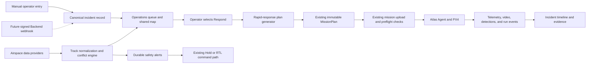

# Atlas Feature Gap Assessment

**Status:** Living roadmap and gap assessment; not the shipped-behavior reference
**Assessment date:** 16 July 2026  
**Last updated:** 21 July 2026

**Scope:** Atlas Native, Atlas Agent, and the future coordinated-services boundary  
**Reference material:** Supplied screenshots of public-safety drone dispatch and
live-operation products, the supplied mission-execution and mission-intelligence
assessment, and the current Atlas implementation

For shipped behavior, use the [developer documentation index](README.md),
[mission guide](mission-types-and-flight-patterns.md),
[incident-dispatch guide](incident-dispatch.md), and
[perception/tracking/follow guide](inference-tracking-and-follow.md). This file
mixes implemented status with remaining product direction and must not be used
as an execution contract.

## 1. Objective

This document assesses how the current Atlas system compares with the
incident-response and live-operation capabilities shown in the supplied product
screenshots. It identifies:

- Capabilities Atlas already provides.
- Important product and engineering gaps.
- Features that should be added now, later, or not at all.
- How the recommended features should fit into the existing Atlas architecture.
- Safety invariants that must remain true as Atlas expands.

The screenshots are treated as product references, not as verified
specifications of any vendor system. Recommendations are based on what is
visible in those screenshots and on the current Atlas implementation.

### 1.1 Confirmed Deployment Scope

The initial operating countries are the **United Kingdom and Nigeria**, and the
initial target market is **public-safety deployment**. Atlas must therefore
support jurisdiction-specific airspace adapters rather than assuming that one
provider, licence, update mechanism, or coverage claim applies in both
countries.

Public-safety use does not make unofficial or community-sourced airspace data
authoritative. Each imported restriction, NOTAM, or traffic track must retain
its country, issuing authority, provider, effective interval, observed or
retrieved time, source version, and licence or access basis. Loss or staleness
of an external source must be visible to the operator and must not silently be
treated as “no restriction”.

## 2. Executive Summary

Atlas's execution core is **aircraft-first and mission-first**:

1. An operator selects an aircraft or creates a mission.
2. Atlas validates and generates an immutable mission plan.
3. The operator uploads and starts the mission.
4. Atlas tracks execution, commands, telemetry, payload state, and history.

Atlas now layers an **incident-first** Operations workflow over that execution
core, matching the basic shape used by the reference products:

1. A CAD, ALPR, 911, or manually created incident appears.
2. The incident is displayed on a shared operational map.
3. The system recommends or selects an available aircraft.
4. An operator responds to the incident with a short operational workflow.
5. Map, video, aircraft, personnel, and safety context remain visible together.

Atlas already has stronger foundations than the screenshots alone reveal:

- Local-first aircraft control without a backend dependency.
- Durable command lifecycles and append-only command events.
- Immutable mission plans and separate mission-run history.
- Waypoint, route-scan, and area-scan planning.
- Terrain profiling and preflight route validation.
- Live map tracking, flight trails, and mission progress.
- Clean video with frame-aligned perception metadata.
- Gimbal angles, rates, geographic ROI, and camera zoom.
- Mission pause, cancel, Hold, Land, and Return-to-Launch behavior.
- Durable, deduplicated operational alerts with independent acknowledgement and
  source-driven resolution.
- Persistent Map, Video, and Split response layouts with shared routes, durable
  aircraft trails, response identity, safety controls, and a restrained flight
  HUD.
- A Native-owned dispatch suitability assessment that excludes reserved or
  busy aircraft, applies current readiness and capability gates, ranks eligible
  aircraft by estimated arrival and battery, and explains every blocker or
  recommendation.
- A distinct Hold at Staging lifecycle: acknowledged Hold leaves the mission
  run paused and the assignment `STAGED`, without incident gimbal targeting or
  an `ON_SCENE` claim.
- Zoom-dependent incident and aircraft labels that prioritise the selected
  response, critical incidents, and live aircraft before progressively
  revealing lower-priority context.

The local dispatch and operational-coordination layer is now implemented for
manual incidents and four reviewed response patterns. The most important
remaining coordination gaps are authenticated external incident intake,
multi-operator/cross-ground-station authority, authoritative airspace sources,
and remote evidence/coordinated-service workflows. Those additions must
preserve the existing local control and audit model.

The expanded assessment also makes clear that Atlas should be understood as two
connected systems:

1. **Mission execution:** what the operator has authorized the aircraft to do,
   how Atlas validates and executes it, and what happens when an action fails.
2. **Mission intelligence:** what the camera detects, how objects remain
   associated across frames, how observations are geolocated, and how Atlas
   converts them into operator-reviewable events.

The agreed perception and selected-track direction has produced the current
implementation:

- Keep Hailo/TAPPAS responsible for onboard detector inference.
- Use a tracker abstraction after normalized Hailo detections.
- Support plain ByteTrack and ByteTrack CMC, with only one active tracker per stream.
- Use plain ByteTrack as the production default and comparison baseline.
- Retain ByteTrack CMC as the aerial candidate because drone and gimbal
  movement make camera-motion compensation valuable.
- Keep ReID disabled until representative evidence justifies its cost.
- Persist session-scoped Atlas track records rather than treating a
  track ID as a permanent identity.
- Provide low-latency onboard gimbal following for an operator-selected track.
- Keep operator-authorized aircraft following at a bounded standoff fail-closed:
  the software path is implemented, while each installation remains
  `UNVERIFIED` until geolocation, HIL, and controlled-flight evidence is accepted.
- Do not implement unrestricted autonomous pursuit or aircraft movement driven
  directly from bounding-box pixels.

The agreed MVP operations and payload direction is:

- Create incidents manually in Atlas Native. Do not build CAD, ALPR, emergency
  call, sensor, webhook, or mock incident connectors for the MVP.
- Add a signed REST webhook only after Atlas Backend is ready. The Backend will
  validate and normalize external context; it will not directly command an
  aircraft.
- Approve Hold at Staging and Offset Observe as the initial arrival behaviors.
- Support operator-approved Area Scan and single-level Bounded Orbit inside
  explicit horizontal and vertical bounds. Stepped/multi-level orbit remains
  future work.
- Record evidence to an Atlas-managed local filesystem store. Do not depend on
  the A8 MicroSD card. Preserve a storage boundary for later verified S3
  replication.
- Use OS NGD building features and OS Building Height Attribute as an MVP
  known-building warning layer, not as proof that a route is obstacle-free.
- Treat the A8 visible gimbal as the installed mission payload, the forward
  OAK-D Lite as the RGB-D/IMU/VIO source, and H-Flow as PX4's optical-flow/range
  source. Indoor product scope belongs in the
  [Indoor Operations Plan](indoor-ops-plan.md), not in this assessment.

## 3. Current Atlas System Context

Atlas is a local-first drone operations system:

```text
PX4 flight controller
    -> mavsdk_server
        -> Atlas Agent
            -> agent-initiated gRPC session over HM30/Ethernet
                -> Atlas Native
                    -> embedded SQLite operational history
```

The current boundaries are deliberate:

- **Atlas Native** owns operator workflow, safety policy, durable records,
  mission planning, mission execution state, video decoding, and local SQLite.
- **Atlas Agent** owns PX4/MAVSDK integration, payload control, perception
  supervision, and the outbound session to Native.
- **Atlas Backend** is not currently in the aircraft-control path. It provides a
  future boundary for identity, organizations, integrations, and coordinated
  services.

The current perception path is approximately:

```text
Camera/RTSP
    -> GStreamer and Hailo inference
        -> normalized detections
            -> Atlas-owned ByteTrack or ByteTrack CMC stage
                -> revisioned lifecycle updates and tracked frames
                    -> Atlas Agent perception stream
                        -> durable Native track store and frame-aligned overlay
```

Atlas preserves source video timestamps, model identity, bounding boxes,
confidence, Atlas-owned `track_id`, revisioned lifecycle state, track-session
identity, durable lifecycle events, session/mission counts, counting-rule
events, exact operator selection, and durable selected-track boresight
coordinates/rejections. Native also performs target-area DEM refinement and
world-space motion filtering, and the default-disabled Follow-from-standoff
software path consumes only a converged, filtered exact selection. It does not
yet provide:

- A measured-range provider or survey-accepted physical boresight model;
  configured DEM elevation currently supplies ground-height context and is
  refined iteratively at the target estimate.
- Surveyed accuracy validation for boresight geolocation.
- HIL and controlled-flight acceptance for Follow from standoff; real movement
  remains disabled and `UNVERIFIED` by default.

Relevant implementation references:

- `README.md`
- `atlas/README.md`
- `atlas/src/App.tsx`
- `atlas/src/missions/MissionPage.tsx`
- `atlas/src/missions/MissionExecutionPage.tsx`
- `atlas/src/missions/OperationalMissionMap.tsx`
- `atlas/src/missions/MissionPayloadControl.tsx`
- `atlas/src/video/LiveVideo.tsx`
- `proto/atlas/ground_station.proto`
- `atlas-agent/internal/vehicle/missions.go`
- `atlas-agent/internal/vehicle/actions.go`

## 4. Capability Comparison

| Capability area | Atlas today | Reference products | Assessment |
| --- | --- | --- | --- |
| Fleet registration and readiness | Supported | Supported | Atlas has a sound local operational model. |
| Mission planning and execution | Strong | Present, often simplified for rapid response | Atlas is stronger in plan immutability, terrain profiling, and run history. |
| Incident/CAD dispatch | Manual incident intake, durable incident events and assignments, and an incident-first response workflow are implemented; external CAD and sensor connectors remain intentionally absent | Central workflow | The local public-safety workflow is implemented. A future signed Backend webhook remains the integration boundary. |
| Aircraft suitability | Native excludes lifecycle-inactive, reserved, busy, disconnected, stale, unhealthy, undercharged, positionless, or capability-incompatible aircraft; it ranks the eligible set by ETA and battery and exposes reasons to the operator | Ranked dispatch recommendation with availability reasons | Implemented for local fleet evidence. Upload/start checks remain authoritative because conditions can change after recommendation. Payload-specific ranking can be extended as verified payload inventory is added. |
| Shared operational map | A dedicated local Operations workspace combines manual incidents, aircraft, track-target coordinates and uncertainty, clustering, selection, response routes, durable trails, search/status/priority filters, independently toggleable local layers, and zoom-dependent labels for selected, critical, and live context | Fleet, incidents, personnel, units, and aircraft together | Local aircraft, incident, and latest-per-track target markers are implemented. Target popups retain lifecycle, observation time, terrain refinement, motion uncertainty, selection, and evidence counts. Responder/unit markers remain deferred until an authoritative partner feed exists; operator markers remain deferred until Native has authenticated operator/location state. |
| Rapid response / fly to point | Native transactionally previews and prepares operator-reviewed Hold at Staging, Offset Observe, Bounded Area Scan, and single-level Bounded Orbit plans with their incident and aircraft assignment; operators can confirm into the existing upload/start path or auditably abandon an unstarted preparation | One-click or short response flow | The initial expanded shapes are implemented without bypassing mission safety gates. Hold at Staging pauses in a durable `STAGED` state awaiting an explicit operator decision; Offset Observe Holds and points at the incident. Serial PX4 SITL acceptance now covers Staging, the full generated Area Scan, and the 25-waypoint single-level Orbit with continuous RTSP pulls and RTL isolation. Stepped-altitude transitions remain separate, intentionally missing feature work. |
| Live map and video | Operations and incident-response execution provide persistent Map, Video, and Split layouts without remounting map, video, or perception surfaces | Persistent split views | Implemented for local response operations; preserve this mount boundary as additional media sources are added. |
| Video flight HUD | A reducible HUD presents armed/in-air state, mode, battery, altitude, speed, heading, GPS/link freshness, acknowledged local-recorder state, and the highest related alert | Critical telemetry overlaid on video | Implemented for existing telemetry, alerts, and local evidence recording. |
| Camera and gimbal control | Gimbal angle/rate/ROI and zoom plus local source-RTSP recording and clean-frame still capture controls | Similar, with direct media controls | Recording and still capture are implemented without relying on A8 storage. |
| Perception overlay | Frame-aligned detections supported | Detection or situational overlays | Atlas has a strong technical foundation. |
| Multi-object tracking | The pinned MIT-licensed FoundationVision ByteTrack C++ worker is the production default; an Atlas extension applies sparse-optical-flow CMC before association in `byte_track_cmc`; both share Atlas session resets, IDs, health, and disabled ReID | Persistent object tracks | Compare both modes on annotated aerial footage and the target companion computer. |
| Persistent track records | Native schema 23 persists session-scoped summaries, append-only lifecycle and selection events, bounded periodic/important samples, session/mission counts, line/polygon events, operator annotations, recording evidence markers, track-linked stills/event clips, initial/refined track geolocations, terrain provenance, and filtered target motion; Agent owns confirmation, bounded high-frequency history, prediction decay, loss, closure, and rule evaluation | Tracks, last-known position, counts, events, and linked media | Lifecycle, count/history, operator selection, track-linked evidence media, terrain-refined geolocation, map presentation, and motion filtering are implemented. Annotated-footage and surveyed geolocation accuracy acceptance remain. |
| Operator track selection | Live video selects an exact `(track_session_id, track_id)`, retains it through bounded occlusion, exposes explicit terminal results, and supports clear, note, and active-recording evidence-marker actions | Select and inspect a target without identity drift | Implemented. LOST/CLOSED selections freeze their snapshot and never silently attach to a revived or new ID. |
| Gimbal track following | Operator-selected onboard image-space gimbal following with bounded rate, acceleration, limits, temporary-loss hold, and explicit terminal states | Select a target and keep it framed | Implemented; target-computer and real payload acceptance remain. |
| Detection geolocation | Native authorizes the exact active operator selection, resolves an initial plane, Agent estimates from the track's retained frame timing and measured pose/gimbal histories, and Native validates iterative target-area DEM samples against the same observation ray; schema 22 stores the final coordinate/error radius, explicit rejection, and motion state | Map markers tied to observations | Iterative DEM refinement, operational markers, lifecycle/evidence/observation/uncertainty linkage, and world-space speed/direction filtering are implemented. Measured range remains an explicit future `range_source`; target-computer/payload validation, physical boresight commissioning, and surveyed accuracy testing remain acceptance work. |
| Aircraft selected-track following | Native persists an operator-reviewed envelope and durable lifecycle; Agent runs a short-lease MAVSDK Offboard controller with world-state, battery, link, position, altitude, geofence, duration, and Offboard watchdogs plus explicit Hold reasons | Dynamic target observation | Software path implemented and simulation-tested. Real translation is disabled and visibly `UNVERIFIED` until physical boresight, HIL, and controlled-flight acceptance references are configured. It never navigates from pixels alone. |
| Scene events and summaries | Structured detections only | Operator-oriented alerts and scene interpretation | Add deterministic event rules first; use a ground-station VLM only as an evidence-linked summarizer. |
| Operational alerts | Native persists normalized alert episodes and append-only events for telemetry freshness, battery, global/home position, Agent, video, perception, incident-revision, arrival-action, and mission-translation conditions. A centralized drawer shows current conditions and retained history. | Cross-system operator warnings with acknowledgement and recovery | The durable foundation is implemented. Add airspace conflicts, audio escalation/mute, filtering, and context-specific presentation as their source models become authoritative. |
| Airspace awareness | Not integrated. UK official products can be viewed or downloaded, but Atlas has not confirmed a documented, supported production API and operational reuse contract. No equivalent open machine-readable Nigerian feed has been confirmed | Nearby-aircraft warning and deconfliction | Deferred under the automated-source-only decision. Do not scrape briefing pages or imply clear airspace. Reconsider when NATS provides an approved machine interface, a licensed provider is contracted, or NAMA access is agreed. |
| Terrain and obstacle routing | Terrain profiling plus an offline, provenance-bound OS NGD / Building Height Attribute known-building assessment reports intersections, unknown heights, incomplete coverage, and operator overrides for incident-response routes | 3D buildings and pathfinder presentation | The warning layer is implemented, but it is deliberately not obstacle avoidance and never claims a safe or obstacle-free route. Add broader obstacle providers and 3D flight-volume validation later. |
| Evidence media | Native records segmented source RTSP and schema-23 still/event-clip assets into a configurable local root with atomic publication, thumbnails, local SHA-256 integrity, disk guardrails, durable gaps, track/context linkage, append-only review/annotation history, and recoverable policy deletion | Record, still capture, event clips, browser, and review controls | The offline evidence workflow is implemented through retention and recoverable deletion. Export packages/manifests, encryption policy, and later verified replicas remain. |
| Operator assignment | No authenticated operator/user or live personnel-location model in Native | Named pilots and shared dispatch | Operator markers are intentionally deferred. Add them only with authenticated sessions, explicit location consent, freshness, and an offline authority model. |
| Authentication and organizations | Backend foundation only; not in Native control path | Multi-user operational systems | Needed for coordinated deployments, but not for local control continuity. |
| Video street/address projection | Not supported | Street labels projected into live imagery | Low priority and technically risky. |
| Thermal source switching | No thermal payload is installed | Visible in some reference interfaces | Do not expose thermal controls. The current A8 is visible-only. |
| Indoor operations | OAK RGB-D/IMU/VIO and PX4/H-Flow data are available; the end-to-end indoor mission is not implemented. | Live mapping and autonomous indoor movement | Scope and implementation order are maintained in the [Indoor Operations Plan](indoor-ops-plan.md). |
| Audio/talk-down | Not supported | Visible in one reference interface | Skip unless the payload roadmap explicitly requires it. |
| Mission action policies | Durable requested/running/retrying/succeeded/failed/policy-applied execution covers arrival Hold, optional incident gimbal pointing, and post-arrival mission Resume. Every chain carries an immutable waypoint trigger; Area Scan and Orbit execute the chain after their first generated waypoint and resume only after acknowledgement. One-waypoint Offset Observe completes after Hold and incident targeting, while Hold at Staging uses a Hold-only chain that pauses the run and preserves a `STAGED` assignment until an explicit mission Resume, RTL, or Cancel decision. Land remains an independent immediate safety command and does not by itself close the mission run. Immutable per-action timeout and exponential retry timing, durable deadlines/next-attempt timestamps, explicit RTL/operator-intervention/optional-skip policy, and Native-to-Agent restart reconciliation are implemented. | Reusable arrival and observation behavior | Serial Native-to-Agent PX4 SITL acceptance passed on 19 July 2026 for `PAUSED` / `STAGED`, Area Scan Hold → Resume → cumulative route completion, Orbit Hold → ROI → Resume → cumulative route completion, continuous RTSP pulls, and RTL between cases. Physical A8 gimbal acceptance remains; extend the catalogue only when each acknowledgement and failure-policy contract is defined. |

## 5. Product Direction

The recommended direction is:

> Evolve Atlas from a mission planner and ground station into an
> incident-to-flight operations system, while keeping Atlas Native as the
> aircraft-control authority.

This means external systems may supply operational context, but they must not
directly command aircraft.



### 5.1 Confirmed Design Decisions

#### Incident intake

The MVP has one incident source: manual operator entry in Atlas Native.

```text
source_type: MANUAL
source_system: ATLAS_NATIVE
external_id: null
```

Atlas should preserve source-neutral incident fields so a future integration
does not require a schema redesign. No mock incident connector or external
incident adapter should be included in the product runtime.

After Atlas Backend is ready, it may expose a signed REST webhook. The Backend
will authenticate, validate, deduplicate, and normalize incoming events before
synchronizing canonical incident context to Native. The webhook is not an
aircraft-command interface.

#### Arrival behaviors

Initial operational policy is:

- **Hold at Staging:** approved for the MVP.
- **Offset Observe:** the default arrival behavior.
- **Bounded Area Scan:** permitted after operator review of its polygon, route,
  altitude, and constraints.
- **Bounded Orbit:** currently permitted at one reviewed altitude after review
  of its center, radius, direction, laps, and known-building warnings.
- **Direct Overhead:** exceptional rather than a default.
- **Follow from Standoff:** a separately authorized dynamic mode whose software
  path is implemented but whose real-aircraft use remains commissioning-gated.
- **Autonomous Pursuit:** not supported.

A future multi-level bounded orbit may use an explicit stepped-altitude
schedule. It would complete a configured number of laps at one altitude,
transition within the approved vertical envelope, and then complete the next
level:

```yaml
orbit:
  radius_m: 40
  altitude_reference: AGL_AT_ORBIT_CENTRE
  altitude_bounds_m: [40, 70]
  altitude_levels_m: [40, 55, 70]
  laps_per_level: 1
  direction: clockwise
  transition: after_complete_lap
  max_vertical_rate_mps: 1.5
```

That future extension should use discrete levels, normally ordered low to high
or high to low. A continuously climbing or descending helical orbit is deferred.
Route validation must cover every orbit level and the transitions between them.
The current implementation intentionally rejects more than one level.

#### Current expanded-response implementation

The current implementation provides four reviewed response geometries through one Native
preview/prepare boundary:

- **Hold at Staging** stores a reviewed staging point and a Hold-only arrival
  chain. After PX4 acknowledges Hold, Agent reports the run `PAUSED` and Native
  preserves the assignment as `STAGED`; it does not target the incident or
  populate `on_scene_at`. A later mission Resume, RTL, or Cancel is an explicit
  operator decision. Land remains available as an independent safety command
  but does not by itself close the paused mission run.
- **Offset Observe** stores the operator-placed observation point, home-relative
  altitude, speed, required arrival Hold, and acknowledged incident gimbal
  action. Gimbal-action exhaustion is recorded under its optional-skip failure
  policy rather than silently changing the flight action.
- **Bounded Area Scan** reuses the existing lawn-mower planner and stores the
  complete reviewed polygon, spacing, sweep angle, altitude, expected route
  distance, immutable plan, run linkage, and incident assignment. Its explicit
  arrival phase runs Hold after generated waypoint zero, then durably resumes
  the remaining lawn-mower route.
- **Bounded Orbit** stores the centre, radius, one explicit altitude level, lap
  count, direction, vertical-rate limit, and an explicit zero-transition
  schedule. It expands that envelope to deterministic direct waypoints and
  keeps the incident as the gimbal target. Its explicit arrival phase runs
  Hold and incident gimbal pointing after generated waypoint zero, then
  durably resumes the remaining orbit.

Stepped-altitude orbit input is intentionally rejected in this batch. Live
single-level geometry and action acceptance has now passed, but stepped levels
still need an explicit transition planner, implementation, and their own
acceptance; every future level and transition must receive the same
known-building assessment.

Preview and transactional preparation both revalidate the incident revision,
aircraft, generated route, and known-building evidence. Preparation persists
the exact reviewed geometry and assessment inside the immutable plan before it
creates the linked assignment. No flight command is sent until the operator
continues through the existing upload/start safety gates.

The known-building assessment also persists the aircraft route start and home
altitude datum used during review. A one-waypoint plan is checked as a route
point even when departure telemetry was unavailable. Upload requires fresh
telemetry and rejects an expanded response if its current departure moved more
than 30 metres horizontally, changed more than 5 metres vertically, or changed
home-altitude datum; the operator must then prepare a new response.

Known-building input is an Atlas-configured local GeoJSON snapshot derived from
OS NGD Building data and, where applicable, joined Building Height Attribute
fields. Each snapshot must include explicit provider, product, dataset ID,
schema version, release, retrieval time, and coverage bounding box provenance.
Atlas reports checked intersections, missing height or altitude-datum evidence,
coverage limits, and the source height fields. A `CLEAR_OF_CHECKED_VOLUMES`
result means only that no intersection was found in that declared snapshot and
clearance envelope; it is never presented as obstacle-free or safe.

#### Evidence storage

Evidence media is stored in an Atlas-managed local filesystem store. The
A8 MicroSD card is outside the MVP evidence architecture.

SQLite contains manifests, relationships, checksums, states, retention, and
audit events. MP4, JPEG, and thumbnail bytes remain outside SQLite. Long
recordings are segmented, finalized atomically, and checked for integrity. The
evidence root, retention policy, segment duration, low-space warning, and stop
reserve are configurable.

The storage model should allow a later S3 replica without changing the evidence
asset identity:

```text
CAPTURING -> FINALIZING -> LOCAL_VERIFIED
                              -> S3_UPLOAD_QUEUED
                              -> S3_VERIFIED
```

S3 is a future verified replica. Atlas must not delete the local copy until the
remote object has been independently verified and the configured retention
policy permits deletion.

#### MVP known-building data

Atlas can load provenance-bound OS NGD building features for footprints and OS
Building Height Attribute fields for approximate heights. The resulting volumes
are an operator-review and warning layer only.

The valid product claim is:

> The proposed route is clear of the known building volumes checked from the
> identified OS dataset, subject to the displayed margins and unknowns.

Atlas must not claim that the route is obstacle-free. Missing heights are
unknowns, not zero-height buildings. The plan must retain dataset identity,
release or retrieval time, feature identifiers, height source, clearance
margins, and all unresolved features.

#### Current and planned payload

The current mission payload is the visible-light SIYI A8 gimbal. Atlas should
not expose a thermal source.

The purchased 2021 OAK-D Lite provides synchronized near-field stereo depth,
color, calibration, and BMI270 IMU to the independent spatial runtime. Release
`0.1.16` accepted a patched Basalt reference; the current standard-package
candidate moves live non-authoritative RGB-D inertial odometry into a separate
RTAB-Map process and guards Madgwick with an Atlas-owned monotonic raw-IMU
boundary. DepthAI remains unmodified. Atlas records those facts without
treating the unit as a validated flight-position source. The runtime builds a
bounded live point cloud for visualization, not a loop-closing SLAM or
autonomy framework.

The downward Holybro H-Flow is installed and configured through QGroundControl
to provide DroneCAN optical-flow and distance measurements to the PX4
estimator. That closes physical installation and initial parameter setup, not
flight acceptance. The exact PX4 1.17.0 identity and corrected complete
parameter-export hash are now retained. Atlas still needs the H-Flow firmware
identity, physically verified offsets and motion-axis signs, durable live
flow/range and estimator evidence beyond the retained disarmed ULog, measured
GPS-denied drift/height behavior, and failure-response acceptance before using
it in a safety decision. The installed OAK may advertise its validated
RGB-D/IMU health and live non-authoritative VIO; it is not yet an
obstacle-response or navigation authority.

The indoor mission is now defined only in the
[Indoor Operations Plan](indoor-ops-plan.md). This feature-gap assessment does
not maintain a second indoor roadmap.

#### Tracker architecture

The current Atlas tracking path is:

```text
Decoded video frame
    -> Hailo detector inference
        -> normalized detections
            -> selected tracker
                -> tracked detections
                    -> persistent Atlas track state and operator events
```

The selected tracker is configured per perception stream:

```yaml
tracker:
  type: byte_track_cmc
  camera_motion_compensation: sparse_optical_flow
  reid: false
```

Supported values are `byte_track`, `byte_track_cmc`, and `disabled`.
ByteTrack is the production default; ByteTrack CMC is the moving-camera aerial
candidate. Atlas runs only one tracker for a stream at a time so there is one
authoritative track-ID sequence.

The tracker integration consumes normalized Hailo detections. Atlas does not
replace Hailo inference with an end-to-end Ultralytics runtime merely to gain
access to a tracker API.

#### Selected-track behavior

Atlas distinguishes two operator actions:

1. **Follow with camera:** keep an operator-selected track centered using the
   gimbal while the aircraft holds or continues an authorized flight behavior.
2. **Follow from standoff:** reposition the aircraft to maintain an authorized
   observation envelope around a geolocated moving track.

Camera following is implemented from image-space tracking. Aircraft following
requires time-aligned world-space track estimates and remains a separate,
explicitly authorized and default-disabled flight mode.

#### Scene intelligence

Atlas should build scene understanding in three layers:

1. Observable model outputs such as detections, tracks, pose, segmentation, and
   estimated movement.
2. Deterministic and testable event rules.
3. Evidence-linked ground-station summaries that require operator confirmation.

A vision-language model may summarize evidence, but it must not become the
source of flight authority or silently turn an uncertain observation into a
confirmed operational fact.

## 6. Priority 0 foundation: current implementation and remaining gaps

### 6.1 Operations Workspace

#### Problem

Before the Operations workspace, Atlas organized the application primarily
around Fleet, Missions, and History. That structure did not provide one place
to answer:

- What is happening now?
- Where is it happening?
- Which aircraft can respond?
- Which aircraft are already assigned?
- What requires immediate operator attention?

#### Recommended behavior

The implemented **Operations** workspace contains:

- A shared operational map.
- Open and active incident queues.
- Connected and disconnected aircraft.
- Current assignments and routes.
- Active mission state.
- Critical aircraft alerts. Airspace alerts remain absent while the source is
  unavailable.
- Search and filter controls.
- A selected-incident detail panel.

The map should support independently toggleable layers:

- Incidents.
- Atlas aircraft.
- Incident assignments.
- Current routes and aircraft trails.
- External responders or personnel only when authoritative integrations exist.
- Airspace tracks and warnings only when a source is integrated and healthy.
- Operator-created markers.

The map uses clustering, priority-based visibility, and zoom-dependent labels.
At low zoom it retains selected context; as zoom increases it adds critical and
high-priority incidents, live aircraft, and finally the broader local set. This
keeps operational identity visible without presenting responder, operator, or
airspace markers for which Atlas has no source.

#### Relationship to existing Atlas

The current Fleet workspace remains useful for aircraft administration,
registration, lifecycle state, and settings. The Operations workspace is the
real-time command surface.

### 6.2 Canonical Incident Model

#### Problem

Atlas now has revisioned `incidents`, append-only `incident_events`, and
aircraft-reserving `incident_assignments`. The remaining model gap is trusted
external intake and authenticated operator ownership, not the local incident
entity itself.

#### Recommended behavior

The implemented source-neutral model exposes only manual operator entry in the
MVP. Manual incidents are fully local and do not depend on Atlas Backend.

Keep the source fields even though their initial values are fixed:

```text
source_type = MANUAL
source_system = ATLAS_NATIVE
external_id = null
```

CAD, ALPR, emergency-call, sensor, perception, and generic external incident
connectors are out of the current scope. A signed REST webhook becomes the first
external source only after Atlas Backend is ready.

Suggested local data model:

```text
incidents
    id
    source_type
    source_system
    external_id
    incident_type
    priority
    status
    summary
    description
    latitude
    longitude
    address
    area
    occurred_at_unix_ms
    received_at_unix_ms
    created_at_unix_ms
    updated_at_unix_ms
    revision
    location_revision
    source_payload_json

incident_events
    id
    incident_id
    event_type
    state
    message
    details_json
    occurred_at_unix_ms
    received_at_unix_ms

incident_assignments
    id
    incident_id
    drone_id
    mission_id
    mission_run_id
    operator_id
    status
    assigned_at_unix_ms
    on_scene_at_unix_ms
    ended_at_unix_ms
```

`incident_events` should be append-only. The current state can be projected from
the event history in the same way Atlas preserves command and mission-run
evidence.

#### Integration boundary

When external intake is introduced, payloads should be authenticated and
normalized by Atlas Backend before reaching Native. Atlas should not spread
source-specific field names throughout Native, the database, or mission code.
No external incident payload may directly create or start a mission run.

### 6.3 Respond to Incident

#### Problem

Atlas previously required deliberate standalone mission authoring to approximate
“fly to point.” The implemented response workflow now prepares a normal Atlas
mission and assignment from the incident review without bypassing mission
safety or audit history.

#### Recommended behavior

Selecting **Respond** should:

1. Validate that the incident has a usable location.
2. Show available aircraft ordered by operational suitability.
3. Let the operator choose arrival behavior:
   - Hold at a reviewed staging point.
   - Observe from a safe offset.
   - Search a reviewed bounded area.
   - Orbit at one reviewed altitude inside explicit horizontal and vertical
     bounds.
4. Generate a rapid-response mission definition and immutable plan.
5. Show route, distance, altitude, estimated arrival time, and blockers.
6. Require operator confirmation.
7. Use the existing upload, preflight, arm, and start lifecycle.
8. Link the resulting mission and run to the incident assignment.

#### Important design decision

Do not implement this as an unaudited, transient `goto` command.

A rapid response should produce a short Atlas mission because the existing
mission path already provides:

- Immutable plan evidence.
- Distance and home-position validation.
- Terrain-profile support.
- One unfinished run per aircraft.
- Upload acknowledgements.
- Preflight checks.
- Start failure handling.
- Pause, cancel, Hold, and RTL behavior.
- Durable execution history.

The UI can make the workflow feel immediate without bypassing the underlying
safety model.

Stepped-altitude orbit is not implemented. Before adding it, the immutable plan
must expose each altitude level, the laps at that level, the transition path,
altitude reference, maximum vertical rate, terrain clearance, known-building
warnings, and expected battery cost. A generic minimum and maximum altitude is
not sufficient evidence of the actual path Atlas intends to fly.

### 6.4 Map, Video, and Split Views

#### Problem

The current mission execution workspace switches between map and camera. During
an active response, operators often need both simultaneously.

#### Recommended behavior

Provide three layouts:

- **Map:** A dedicated full map surface. Keep video ownership mounted, but do
  not leave the video visually present as a compact preview.
- **Video:** A dedicated full video surface. Keep map ownership mounted, but do
  not leave the map visually present as a compact preview.
- **Split:** Map and video side by side.

All three layouts should preserve:

- Incident identity and priority.
- Current mission/run state.
- Critical telemetry.
- Safety alerts.
- Hold, RTL, and Land access.
- Recording state.

Layout selection should not recreate subscriptions, lose mission state, or reset
the aircraft trail.

This is now implemented in both the Operations response surface and incident
mission execution. Map and video remain mounted while CSS changes their
presentation, so stream/perception leases, detection alignment, map state, and
trail state survive layout changes. In Operations, Map and Video are dedicated
single-surface presentations: the inactive sibling is visually and
accessibility-hidden without being unmounted. Split presents both at equal
prominence. Tablet widths preserve the same ownership boundary.

### 6.5 Restrained Video Flight HUD

#### Problem

Atlas displays stream and perception diagnostics over or below video, but
critical flight state is primarily outside the video surface.

#### Recommended behavior

Add a configurable video HUD with:

- Armed and in-air state.
- Flight mode.
- Battery.
- Relative altitude.
- Ground speed.
- Heading.
- GPS state.
- Command/control link freshness.
- Recording state.
- Active safety alert.

The HUD should not attempt to place all telemetry on the video. Detailed
diagnostics remain in the existing telemetry panels.

Rules:

- Critical states must use text and shape, not color alone.
- Stale telemetry must be visually distinct from live telemetry.
- HUD content must not cover the primary center reticle or detection target.
- Operators must be able to reduce the overlay when inspecting fine detail.

The initial HUD is implemented from the existing local fleet telemetry, durable
alert projection, and acknowledged local recorder lifecycle. Stale telemetry
uses an explicit dashed boundary and warning text; critical alerts use severity
text and a triangular mark in addition to color. Recording state comes from the
requested/running/succeeded/failed recorder state machine rather than mission
intent alone.

### 6.6 Operational Alert Model

#### Problem

Atlas previously recorded PX4 status events and command failures without one
alert model for operator attention across aircraft, incidents, video, airspace,
and system health.

#### Recommended behavior

Create a normalized alert model with:

- Severity.
- Source.
- Aircraft or incident association.
- First-seen and last-seen timestamps.
- Active, acknowledged, resolved, and expired states.
- Recommended actions.
- Evidence/details payload.

Examples:

- Telemetry stale.
- Battery below operational threshold.
- Home position lost.
- Perception unavailable.
- Video unavailable.
- Mission translation warning.
- Nearby aircraft conflict.
- Incident location changed after plan generation.

Acknowledgement must mean “the operator has seen the alert,” not “the hazard no
longer exists.” Resolution must come from system state or an explicit,
auditable operator action.

#### Current implementation

The durable foundation is implemented in Atlas Native using SQLite alert and
append-only alert-event records. One partial unique index permits only one
unresolved episode for a deduplication key, so repeated observations update the
same alert's last-seen time, evidence, and observation count instead of creating
alert spam. Resolution is a separate source-driven transition; acknowledgement
does not resolve the condition. If an acknowledged condition increases in
severity, the same alert returns to active/unseen so the escalation requires a
new acknowledgement.

Initial integrated sources are:

- Stale and lost telemetry.
- Battery below warning and critical thresholds, with recovery hysteresis.
- Global position and home position unavailable.
- Agent disconnected.
- Requested video unavailable.
- Advertised perception capability unavailable or unhealthy.
- Incident revision changed after response planning.
- Arrival action retrying, failed, or awaiting operator intervention.
- Mission translation warnings reported by the Agent.

Alerts retain aircraft, incident, and mission-run associations where available,
recommended operator action, supporting evidence, first/last-seen timestamps,
and active, acknowledged, resolved, or expired state. Resolved history is kept
for 30 days before being marked expired rather than deleted, and both alert and
event history survive Native restart. The application header now opens one
central alert drawer; warnings have deliberately not been scattered through
individual screens before this shared model exists.

Remaining work in this capability area includes nearby-aircraft conflicts,
audio escalation and mute behavior, richer filtering, role/ownership semantics
for multi-operator deployments, and context-specific warning placement.

### 6.7 Reusable Mission Actions and Failure Policies

#### Problem

Atlas mission plans contain semantic actions for speed, gimbal intent,
recording intent, perception intent, RTL, and Land. Some translate into MAVSDK
mission items, while others execute through Agent payload or perception
controllers. Incident arrival actions now have a durable runtime with
acknowledgements, retry timing, and failure policy. Atlas still does not expose
one arbitrary generic runtime for every possible semantic action.

That limits reusable behaviors such as:

- Hold for a duration.
- Point the gimbal at a coordinate or selected track.
- Start or stop recording with positive acknowledgement.
- Enable or disable a perception profile.
- Orbit an incident.
- Wait for operator confirmation.
- Capture and mark evidence.

#### Recommended behavior

Each executable action should define:

```text
action type
parameters
timeout
maximum retries
retry delay or backoff
failure policy
```

Initial failure policies should include:

- Continue and notify.
- Skip the remaining optional action.
- Hold and request operator input.
- Abort the mission.
- Return to launch.

Retries are appropriate for transient camera, gimbal, transport, or
acknowledgement failures. They must not override battery, geofence, airspace,
position-quality, or other safety failures.

Action state changes should be durable:

```text
REQUESTED -> RUNNING -> SUCCEEDED
                    -> RETRYING -> RUNNING
                    -> FAILED -> POLICY_APPLIED
```

Point observation and orbit should be reusable behaviors assembled from these
actions, not separate mission engines. A rapid incident response can then reuse
the same execution path:

```text
take off
    -> transit
        -> arrive at reviewed point
            -> Hold at Staging: Hold -> PAUSED/STAGED -> wait for operator
            -> Offset Observe: Hold -> point gimbal -> observe
            -> bounded pattern: Hold -> optional gimbal -> Resume
```

## 7. Priority 1: Capabilities to Add Next

### 7.1 Integrated Airspace Awareness and Deconfliction

#### Problem

Atlas has no nearby-aircraft tracking or conflict warning. This becomes a major
operational gap as flights extend in range, altitude, density, or BVLOS scope.

#### Recommended behavior

Normalize supported airspace sources into a common track:

```text
airspace_track
    source
    track_id
    latitude
    longitude
    altitude
    heading
    ground_speed
    vertical_rate
    accuracy
    observed_at
```

Potential sources may include:

- ADS-B.
- Remote ID.
- UTM/USS providers.
- Local radar or acoustic systems.
- Partner-agency feeds.

#### Confirmed operating countries and source access

Atlas initially targets public-safety operations in the United Kingdom and
Nigeria. “Open” must be evaluated in three separate ways:

1. **Human access:** an operator can view or download the information.
2. **Machine access:** Atlas can retrieve a stable, documented data format or
   API without scraping an interactive briefing page.
3. **Operational reuse:** the provider permits Atlas to process, cache, display,
   and redistribute the data in a safety-related product.

A source is not integration-ready merely because human access is free.

| Country and information | Authoritative source | Access assessment as of 19 July 2026 | Atlas decision |
| --- | --- | --- | --- |
| UK permanent and UAS restrictions | UK CAA identifies NATS AIS as the primary source. NATS publishes the UK AIP, a UAS Flight Restrictions dataset, and a UK ICAO AIP dataset | **Human/download access exists, but Atlas has not confirmed a stable documented machine endpoint or an operational reuse contract.** AIRAC publication cadence does not by itself define safe automated retrieval, redistribution, or outage behavior | **Deferred.** Do not scrape or ship a manual-import substitute. Reconsider when NATS approves a documented automated interface and the required caching, display, redistribution, freshness, and outage terms |
| UK temporary restrictions and NOTAM | NATS AIS Internet Briefing System and its Pre-Flight Information Bulletins | **Human access is available but production integration is unresolved.** Briefing is available to registered users; no public, documented production NOTAM API has been confirmed for Atlas, and account-backed page access must not be scraped | Keep NOTAM coverage marked unavailable until NATS supplies or approves a machine interface, or Atlas contracts a licensed aeronautical-data provider. Operators must continue using the official briefing workflow in the interim |
| Nigeria permanent and restricted airspace | Nigerian Airspace Management Agency (NAMA) Aeronautical Information Services; NCAA is the regulator | **Formal access required.** NCAA identifies NAMA as the authority for aeronautical charts, AIP, AIC, and NOTAM. No official open machine-readable Nigerian AIP dataset or public API has been confirmed | **Deferred.** Do not build from unofficial chart copies. Reconsider after NAMA access or a licensed provider with explicit Nigerian coverage is available |
| Nigeria temporary restrictions and NOTAM | NAMA International NOTAM Office and AIS | **Formal access required.** No official public production API has been confirmed | **Deferred.** Until approved access exists, Atlas must treat Nigerian NOTAM coverage as unavailable, never clear |

Authoritative starting points:

- [UK CAA airspace-restriction guidance](https://www.caa.co.uk/drones/open-category/moving-on-to-more-advanced-flying/airspace/airspace-restrictions/)
- [NATS statement of freely available aeronautical products](https://www.aurora.nats.co.uk/htmlAIP/Publications/2025-02-06/html/eAIC/EG-eAIC-2025-015-W-en-GB.html)
- [NATS digital datasets](https://nats-uk.ead-it.com/cms-nats/opencms/en/Publications/digital-datasets/)
- [NATS AIS briefing service and registration](https://nats-uk.ead-it.com/cms-nats/opencms/en/home/)
- [NATS aeronautical-product terms](https://nats-uk.ead-it.com/cms-nats/opencms/en/agb/)
- [NCAA statement identifying NAMA as Nigeria's authoritative AIS/AIM provider](https://ncaa.gov.ng/media/vbxd4jwx/reg-27.pdf)
- [Current Nigerian AIS requirements in Nig.CARs Part 14](https://ncaa.gov.ng/media/dmbmncbg/nigcars-part-14-subpart-4.pdf)
- [NCAA report on Nigeria's AIXM/eAIP transition work](https://ncaa.gov.ng/media/news/nigeria-hosts-icao-aim-rbis-workshop-as-dgca-capt-chris-najomo-declares-open-aixm-eaiptod-training-in-abuja/)
- [ICAO directory entry for Nigerian AIP and NOTAM services](https://www.icao.int/APAC/Meetings/2023%20AAITF18/Flimsy%2001%20Doc7383%20Aeronautical%20Information%20Services%20Provided%20by%20States.pdf)

The first airspace milestone should cover **published restrictions and source
health**, not nearby-aircraft deconfliction. Live cooperative traffic still
needs a separate ADS-B, Remote ID, UTM, radar, or partner feed, and none of
those sources alone can prove that the surrounding airspace is clear.

No airspace adapter is implemented in this review. That is deliberate: the
requested preference is the most automated supported option, and no approved,
documented national machine interface has yet been confirmed. Atlas therefore
does not download, scrape, cache, or render either country's restrictions, and
must not display an implicit “clear” state.

A conflict engine should calculate:

- Horizontal separation.
- Vertical separation.
- Relative closure rate.
- Estimated closest point of approach.
- Time to closest approach.
- Confidence based on data age and accuracy.

The first version should provide:

- Map tracks.
- Direction and altitude.
- Escalating warning thresholds.
- Watch/focus action.
- Audio mute without hiding the alert.
- Direct access to Hold and RTL through existing durable commands.

Automatic evasive navigation should not be introduced until the detection
quality, authority model, route constraints, and failure behavior are proven.

### 7.2 Evidence Recording and Still Capture

#### Problem

Atlas mission plans can encode start/stop camera-video intent. Batch 9 added an
archival source-RTSP recorder alongside the low-latency preview. Schema 23 now
adds still capture, thumbnails, marker-linked clips, annotation, review, and
policy-driven recoverable deletion. Export packaging remains intentionally
deferred.

The MVP decision is to record into Atlas-managed local file storage. The A8
MicroSD card is not an evidence store or fallback in this architecture.

#### Batch 9 implementation

Native now owns one recorder for the configured primary source. Its durable
lifecycle is:

```text
operator request -> REQUESTED SQLite session
    -> FFmpeg creates non-empty source-RTSP temporary bytes
    -> RUNNING acknowledgement
    -> FFmpeg closes a segment and appends its source timeline range
    -> SHA-256 + FINALIZING manifest
    -> atomic same-filesystem rename into objects/
    -> checksum revalidation + LOCAL_VERIFIED
    -> graceful stop -> SUCCEEDED
       process/source/storage fault -> evidence gap + FAILED + visible alert
```

Schema 17 persists recording sessions, segment manifests, append-only recorder
events, and evidence-gap events. Sessions retain aircraft and optional incident,
mission, and run associations; linked associations are inferred and revalidated
from the reviewed mission assignment. The configurable evidence root is local,
requires a writable absolute path when overridden, and uses warning and stop
free-space thresholds. Reaching the stop reserve closes the recorder safely,
retains every already verified segment, and raises both storage and gap evidence.

Every failure after the durable `REQUESTED` insert, including per-session
directory creation and recorder-monitor thread startup, is converted to a
durable `FAILED` session with gap evidence so the one-active-source constraint
cannot be stranded. At shutdown, final manifest processing errors are terminal,
and the SQLite success transition independently refuses `SUCCEEDED` while any
segment remains `FINALIZING`.

On restart, Native recovers closed segments from the FFmpeg segment list and
reconciles any `FINALIZING` manifest. An open `.partial.mp4` remains temporary,
is not exposed as a valid segment, and produces a `RECORDER_RESTART` gap. The
operator workspace distinguishes requested, running, stopped/verified, and
failed/gap state and provides basic Start Evidence and Stop + Verify controls.

Schema 23 adds first-class `STILL` and `EVENT_CLIP` assets. Stills use the latest
clean Native-decoded JPEG and retain the current session-scoped track identity
when selected. An evidence marker queues a bounded pre/post-roll clip; the clip
stays `PENDING` until locally verified recording segments cover the window.
FFmpeg assembles the clip and thumbnail under temporary storage, Atlas checks
both files, atomically publishes the asset directory, and changes the asset to
`READY`. The Evidence workspace supports review states, append-only notes/tags
and lifecycle events, legal hold, and `READY -> TRASHED -> PURGED` retention.
Purge is allowed only after the recorded grace deadline.

#### Recommended behavior

Add:

- Start recording. **Implemented for the configured source RTSP recorder.**
- Stop recording. **Implemented as a graceful finalize-and-verify request.**
- Capture still. **Implemented from the latest clean Native frame, optionally
  linked to the selected track.**
- Positive local-recorder state acknowledgement. **Implemented through the
  requested/running/succeeded/failed session lifecycle.**
- Media metadata linked to incident, aircraft, mission run, recording, track,
  marker, and observation time. **Implemented.**
- Operator asset annotation and review. **Implemented as append-only history.**
- Export with checksums and metadata. **Deferred from this slice.**

The initial storage design should use:

```text
configurable local evidence root
    objects/<recording-session>/<segment>.mp4
    assets/<asset-id>/original.{jpg,mp4}
    assets/<asset-id>/thumbnail.jpg
    trash/<asset-id>/...
    temporary/assets/<asset-id>/...

SQLite
    evidence asset metadata
    incident and mission-run relationships
    SHA-256 checksums
    capture and finalization state
    retention and deletion events
```

Record the source RTSP media rather than the MJPEG UI preview. Segment long
recordings so a crash or storage fault cannot corrupt an entire mission. Finalize
through an atomic rename, calculate a checksum, and only then mark the asset
`LOCAL_VERIFIED`.

The remaining policy decisions before external evidence exchange are:

- Evidence-root configuration and permission checks.
- Storage quota, warning threshold, critical low-water mark, and reserved space.
- Behavior when the ground link or RTSP source is interrupted.
- Retention period and local deletion policy. **Implemented with editable
  standard/extended intervals, legal hold, and a trash grace period.**
- Encryption-at-rest requirements.
- Evidence export format.
- Clock and timestamp evidence.

A red button without confirmed camera state is not sufficient. The UI must
distinguish:

- Command requested.
- Local recorder accepted.
- Local file capture confirmed.
- Recording stopped.
- File finalized and checksum verified.
- Recording failed.

Ground-link loss may create a gap because the MVP does not rely on camera-local
recording. Atlas must record the exact gap in the evidence timeline rather than
represent the mission as continuously recorded.

The future S3 implementation should be a second `EvidenceReplica` for the same
asset. Upload occurs asynchronously from `LOCAL_VERIFIED`, includes integrity
verification, and does not delete the local replica unless retention policy
explicitly permits it.

### 7.3 Operator Identity and Assignment

#### Problem

Atlas Native currently has no operator authentication or ownership model. That
is acceptable for a single local ground station but insufficient for shared
dispatch.

#### Recommended behavior

When multi-operator use begins, add:

- Authenticated operator session.
- Operator role and permissions.
- Aircraft-control ownership.
- Incident assignment.
- Mission handoff.
- Read-only observers.
- Command attribution.

The future Backend identity model can coordinate users and organizations, but a
temporary backend outage must not interrupt an active local flight.

Control ownership should use a short renewable lease, similar in spirit to the
existing payload-control lease:

- One authoritative operator controls an aircraft at a time.
- Other operators can observe.
- Handoff is explicit and audited.
- Lease loss produces a defined safe state.
- Local emergency actions remain available according to policy.

### 7.4 Multi-Source Payload Architecture

#### Problem

Atlas currently assumes one configured primary video source. Reference products
show visible, thermal, forward, and gimbal-camera switching.

The only currently installed mission payload is the visible-light SIYI A8
gimbal. The 2021 OAK-D Lite is installed as an independent spatial sensor and
its RGB-D/IMU health, live non-authoritative VIO, and bounded live point cloud
are active. The downward Holybro H-Flow is installed and PX4-configured. Atlas
also ingests the PX4 local position, odometry, flow, range, and estimator health
needed to validate indoor position hold. Native point-cloud transport and
GPS-denied flight acceptance remain open; neither sensor currently authorizes
indoor movement.

#### Recommended behavior

Introduce a generic payload-source descriptor:

```text
payload_source
    source_id
    display_name
    modality
    transport
    resolution
    frame_rate
    controllable
    recording_supported
    zoom_supported
    gimbal_association
```

Possible modalities:

- Visible.
- Thermal.
- Forward navigation camera.
- Low-light.
- Processed perception feed.

Only expose source controls that the connected Agent reports as capabilities.
Do not implement a thermal toggle until the selected payload has a real thermal
stream and verified transport behavior.

The installed payload facts remain simple: the SIYI A8 supplies visible video,
detections, and tracking; the forward OAK-D Lite supplies aligned depth,
BMI270, and live VIO; and the downward H-Flow supplies PX4 with optical flow and
range. Indoor behavior built from those sources is defined in the
[Indoor Operations Plan](indoor-ops-plan.md).

### 7.5 Onboard Multi-Object Tracking

#### Problem

YOLO detections are frame-local observations. Repeated detections do not by
themselves establish that the same person or vehicle remains visible across
frames. Atlas now owns tracker selection, session IDs, discontinuity resets,
health, and authoritative `track_id` assignment. The original MIT-licensed
FoundationVision ByteTrack C++ deployment core is the production default. The
same worker can apply Atlas camera-motion compensation as `byte_track_cmc`.
Agent and Native now provide bounded, revisioned persistent track lifecycle
records, session/mission counts, configured crossing rules, and exact operator
selection. Remaining work is annotated representative-footage and
target-computer acceptance plus gimbal following.

#### Recommended behavior

Add a common onboard tracker interface after Hailo detection:

```text
update(frame, detections, capture_time) -> tracked detections
```

Provide two modes of the same supervised worker:

- **ByteTrack:** the production default and stable comparison baseline.
- **ByteTrack CMC:** the aerial candidate, applying confidence-gated global
  camera motion after Kalman prediction and before IoU association.

Initial ByteTrack CMC configuration should:

- Enable camera-motion compensation.
- Disable ReID.
- Report when camera-motion compensation is unavailable or degraded.

ReID should be enabled only after representative footage demonstrates that
occlusion and look-alike targets create unacceptable ID switches. It adds model,
compute, memory, privacy, and lifecycle complexity.

The tracker must be reset after:

- A stream epoch or camera source changes.
- A model or class-map change invalidates associations.
- A timestamp discontinuity.
- A tracker process restart.
- A gap longer than the configured track-retention threshold.

The perception stream now reports:

```text
track_id
track_session_id
tracker_type
track_state
track_age_frames
observed_at
```

Track IDs must be scoped to aircraft, camera source, stream epoch, and tracker
session. They are anonymous temporary associations, not personal identities.

#### Validation

Both modes should be evaluated on the target companion computer and
representative aerial footage using:

- ID switches.
- Track fragmentation.
- Time to confirm a new track.
- Recovery after short occlusion.
- Behavior during rapid gimbal and aircraft motion.
- CPU and memory use.
- Added latency and dropped frames.

ByteTrack CMC should be promoted over the plain default only if it improves
association accuracy while meeting the required performance envelope. The
operator-facing product behavior must not depend on a specific tracker mode.

### 7.6 Persistent Tracks, Counts, and Gimbal Following

#### Persistent track state

High-frequency boxes should remain in bounded onboard memory. Atlas should
persist:

- Track creation and closure. **Implemented.**
- Latest confirmed state. **Implemented.**
- Important state changes. **Implemented as append-only lifecycle events.**
- Periodic image-space samples. **Implemented; geolocation remains Phase 5.**
- Operator selections and annotations. **Implemented.**
- Evidence recording markers. **Implemented; track-linked stills and clips remain.**
- Generated events.

A track lifecycle should distinguish:

```text
TENTATIVE -> ACTIVE -> TEMPORARILY_OCCLUDED -> LOST -> CLOSED
```

Atlas must separately display:

- Last observed position.
- Short-lived predicted position.
- Current confirmed position.

Prediction confidence must decay with time and stop after a bounded threshold.
**Implemented with configurable bounded history, extrapolation horizon, loss,
closure, and periodic-summary thresholds.**

#### Counting

Tracking enables:

- Current visible-object count.
- Unique tracks observed during a mission.
- Configured line or polygon crossing counts.

Counts must retain tracker-session context because an ID switch can otherwise
produce double counting. Accuracy should be reported as a measured tracker and
rule outcome, not assumed from the number of IDs.

**Implemented.** Agent reports current visible confirmed tracks, unique
confirmed tracks per tracker session, and revisioned directional line or
polygon entry/exit totals. Native persists idempotent count events, preserves
their tracker-session identity, and separately maps tracks into a running
mission for mission-unique totals. Counting uses confirmed observations only;
long unseen gaps do not infer crossings.

#### Operator track selection

**Implemented.** Live video selects only a visible `ACTIVE` track using the
exact `(track_session_id, track_id)` identity. Native retains the selection
through bounded `TEMPORARILY_OCCLUDED` state, records reacquisition and all
selection transitions, and returns explicit `LOST` or `CLOSED` outcomes. A
terminal selection freezes its track snapshot and cannot silently reattach if
the backend later emits the same local key. Operators can clear the result,
add a note, or create an evidence marker against an active local recording.

#### Operator-selected gimbal following

**Implemented.** The operator can choose a visible track and request **Follow
with camera**. The Agent-owned controller uses the exact session-scoped track,
compares the confirmed box centre with image centre, and commands the existing
payload authority with aircraft-relative pitch/yaw rates.

This controller should:

- Run onboard for low latency and link-loss continuity.
- Use a confirmed track and reject stale detections.
- Limit pitch/yaw rate and acceleration.
- Respect gimbal limits and the existing payload-control ownership model.
- Stop or hold the last safe angle when the track is lost.
- Require explicit operator selection before reacquiring a materially different
  track.
- End immediately on operator request, lease loss, camera-source change, or
  payload fault.

Gimbal following does not require the target to be geolocated and should be
delivered before aircraft following. The implementation uses a short renewable
payload lease, measured MAVSDK gimbal attitude, configurable physical limits,
rate and acceleration bounds, a deadband, and braking-distance rate limiting.
Temporary occlusion or a stale observation commands zero rates and holds the
current angle for a configurable bounded interval. Tentative, lost, or closed
tracks, exact-identity/source changes,
lease loss, Agent shutdown, mission end, and gimbal read/write faults stop the
controller. It never searches for a replacement track ID. Start/stop operations
use Native's durable vehicle-command lifecycle and the current mission-override
or on-ground inspection ownership policies.

### 7.7 Detection Geolocation and Movement Estimation

#### Problem

A detection provides a pixel-space location. Responders and aircraft navigation
need a world-space estimate with an honest statement of uncertainty.

The current calibration-free MVP calculation is:

```text
declared target point centred in the image
    -> camera/gimbal boresight alignment assumption
        -> measured gimbal attitude relative to North
            -> world NED ray and aircraft-body coordinates
                -> bounded horizontal-plane intersection
```

This method deliberately does not project arbitrary pixels. Digital zoom does
not affect the estimate as long as it preserves the image centre. Off-centre
geolocation would require a separate measured field-of-view or camera
calibration model and is outside the current implementation.

#### Implemented foundation

Atlas provides:

1. **High-rate onboard pose buffer.** Store timestamped aircraft latitude,
   longitude, altitude, roll, pitch, yaw, velocity, and quality. Interpolate the
   samples around the frame-capture time.
2. **Measured gimbal-attitude telemetry.** Use actual gimbal yaw, pitch, and roll
   rather than the last commanded values.
3. **Centred-boresight gate.** Require the declared target point to be within a
   small normalized distance of image centre and record the assumption that
   camera centre aligns with the measured gimbal forward axis.
4. **Timestamp correlation.** Relate video PTS, companion-computer monotonic
   time, autopilot time, and gimbal time. Detection completion or UI receipt
   time must not replace image-capture time.
5. **Intersection-plane provenance.** Require an AMSL ground altitude and its
   uncertainty. Distinguish a centred ground-contact point from a centred target
   body point with an explicit assumed aim-point height above ground and height
   uncertainty.
6. **Uncertainty model.** Account for aircraft position, camera/GNSS origin
   separation, timestamp, boresight/gimbal alignment, ground altitude, target
   height, and shallow-angle amplification.

The current centred-boresight implementation does not silently switch to the
bottom centre of a box. Ground-contact versus target-centre intent is explicit,
and target-centre mode carries a reviewed height and uncertainty assumption.

Geolocation accuracy degrades sharply near the horizon. At 60 metres altitude,
one degree of angular error produces roughly 2 metres of ground-range error at
a 45-degree depression angle, but roughly 35 metres at a 10-degree depression
angle before GPS and terrain errors are added.

The output should include:

```text
track_id
track_session_id
latitude
longitude
altitude or ground assumption
observed_at
method
horizontal_error_radius_m or error ellipse
observed_or_predicted
```

Movement direction and speed must be calculated from filtered world-space
positions. Pixel movement alone cannot distinguish target motion from aircraft
or gimbal motion.

#### Implementation status: selected-track centred-boresight geolocation

The first P3 slice is implemented onboard:

- A bounded high-rate aircraft pose timeline uses timestamped MAVSDK
  quaternions as its sampling spine and carries estimator latitude, longitude,
  AMSL/relative altitude, NED velocity, navigation quality, field age, and GPS
  uncertainty.
- Measured Gimbal v2 attitude is buffered per gimbal with the gimbal timestamp,
  forward/North quaternion and Euler representations, and angular velocity.
- Autopilot boot time, autopilot Unix time, gimbal time, video PTS, companion
  Unix time, and companion `CLOCK_MONOTONIC` have explicit bounded correlation
  domains and reset epochs.
- Perception protocol v3 records PTS and companion clocks before inference.
  Detection completion is not used as capture time.
- Aircraft and gimbal lookup interpolate only between bounded samples, reject
  excessive gaps/stale position, and never cross a clock rollback.
- The boresight estimator accepts only a declared aim point within 0.04 of image
  centre on each axis. It uses measured gimbal attitude relative to North to
  form a world NED ray and transforms that ray into aircraft-body FRD
  coordinates using the synchronized aircraft attitude.
- Horizontal-plane intersection rejects unhealthy global position, unavailable
  velocity, frame-time uncertainty above 500 ms, depression below 20 degrees,
  an intersection plane above the aircraft, and ground range above 3 km.
- Results carry frame-time quality, origin and intersection coordinates,
  North/East offsets, slant/ground range, depression, ground source, aim-point
  kind, aim-point-height assumption, and a conservative componentized horizontal
  error radius. The default uncalibrated static angular bound is 10 degrees,
  the minimum depression is 20 degrees, measured gimbal motion during
  frame-time uncertainty expands it, and the unmeasured
  camera-to-GNSS origin allowance is 1 metre. Estimates are rejected if the
  resulting uncertainty cone reaches the horizon.
- The Hailo RTSP adapter dynamically enables GStreamer's reconstructed sender
  timestamp metadata when the installed runtime supports it, converts
  recognized NTP/Unix references, and keeps pipeline-ingress timing as the
  compatible fallback. Implausible sender timestamps are not promoted to
  source-reference quality.
- Native authorizes geolocation only for the exact current `SELECTED` / `ACTIVE`
  `(selection_id, track_session_id, track_id, source_id)` tuple. Agent then
  retrieves that track's own latest frame timing; it does not substitute the
  newest unrelated video frame or search for a replacement ID.
- The operator must supply a reviewed AMSL ground altitude, uncertainty,
  source, source version, and review timestamp. Target-centre estimates also
  require aim-point height and uncertainty. These inputs are validated on both
  sides of the Agent/Native boundary and stored with every attempt.
- The request uses the durable vehicle-command lifecycle but does not take
  payload control or command the gimbal. Successful coordinates and horizontal
  uncertainty are persisted in Native schema 22. Off-centre, stale, unhealthy,
  identity-mismatched, timing, and geometry failures are persisted as explicit
  rejection codes and reasons against the same track and selection.

Source-reference timing still depends on both a GStreamer 1.22+ runtime and a
camera/RTSP session that supplies a usable reconstructed absolute sender clock;
this has not yet been verified against the target A8 output. Otherwise frame
time remains a `PIPELINE_INGRESS_ESTIMATE` with a conservative uncertainty
floor. The runtime rejects an off-centre aim point instead of guessing a pixel
angle. The lens-calibration
registry and arbitrary-pixel projection implementation have been removed.
Atlas resolves the initial plane automatically: configured DEM elevation at the
aircraft position first, then an explicitly labelled and conservatively bounded
absolute-minus-relative-altitude home-plane fallback. It then samples the DEM
at the estimated target and iterates on the immutable observation ray. Measured
range, target-computer acceptance, physical boresight commissioning, and
surveyed ground-truth validation remain outstanding.

### 7.8 MVP Known-Building Route Assessment

#### Scope

Atlas does not currently have a pre-surveyed operating area, an approved
corridor, or installed onboard obstacle sensors. The MVP may still provide a
useful static-building assessment using:

- OS NGD building features for footprints and structure identity.
- OS Building Height Attribute for approximate heights.
- Atlas terrain elevation for the building base and route profile.

This is a known-building intersection check, not complete obstacle-aware route
validation.

#### Route-volume calculation

For every known building, Atlas should:

1. Resolve the building footprint and height source.
2. Convert the building base to the route's altitude datum.
3. Expand the footprint by a configured horizontal clearance margin.
4. Add a configured vertical clearance margin to the building top.
5. Check the transit route, every orbit level, and all climb/descent transitions
   against the resulting volume.
6. Persist the assessed departure point and altitude datum and require fresh,
   matching departure evidence again at upload.

```text
known_building_top_amsl
    = terrain_or_building_base_amsl
    + supplied_building_height
    + vertical_clearance_margin
```

Unknown height must remain `HEIGHT_UNKNOWN`; Atlas must not substitute zero. An
unknown building that affects a proposed automated route should block approval
until the route is moved or the operator records an explicit override with its
reason.

#### Operator presentation

Allowed statements include:

- Clear of known building volumes checked from the identified dataset.
- Route intersects a known building clearance volume.
- Building height unavailable; route assessment incomplete.
- Temporary and unmapped obstacles are not covered.

Atlas must not display **obstacle-free**, **safe route**, or equivalent language.
The immutable mission-plan evidence should preserve OS product identity,
release or retrieval time, feature IDs, height source, clearance margins,
unknowns, warnings, and overrides.

The MVP does not perform in-flight obstacle avoidance or automatic replanning.
The installed OAK-D Lite and H-Flow hardware does not change this claim; their
mapping, estimator-observation, planning, and movement-authority integrations
remain separately gated and unimplemented.

## 8. Priority 2: Advanced Capabilities

### 8.1 Obstacle-Aware Urban Path Planning

#### Problem

Atlas terrain profiling accounts for ground elevation but explicitly does not
provide live terrain following or obstacle avoidance. Building extrusions in a
3D map can create false confidence if they are not backed by complete and
validated obstacle data.

The Priority 1 known-building assessment is only a precursor. Full
obstacle-aware planning remains advanced work because OS building data does not
cover wires, temporary cranes, all vegetation, moving objects, or every
structure.

#### Recommended behavior

Implement obstacle-aware planning only when Atlas can obtain trustworthy:

- Building footprints and heights.
- Tower, mast, crane, and powerline data.
- Geofences and restricted volumes.
- Dataset age and provenance.
- Required horizontal and vertical clearance.

Path generation should:

1. Construct a 3D constrained flight volume.
2. Apply aircraft and regulatory limits.
3. Calculate a route with clearance margins.
4. Validate climb and descent performance.
5. Preserve the obstacle dataset identity and version.
6. Present route evidence to the operator.
7. Fail closed when required obstacle data is missing.

3D rendering may be useful for review, but the route validator—not the visual
extrusion—is the safety feature.

### 8.2 Collaborative Remote Operations

Add cloud-backed sharing only after local incident operations are stable:

- Shared incident state.
- Remote observers.
- Multi-site fleet awareness.
- Role-based access.
- Operator handoff.
- Cross-ground-station audit.

The backend should synchronize operational context and evidence. It should not
be required for the active aircraft-control loop.

### 8.3 Detection-to-Incident Workflow

Atlas already receives structured perception detections. A later version can:

- Promote selected detections to operator markers.
- Associate detections with an incident.
- Create reviewable perception events.
- Track a selected object across frames.
- Trigger an operator-confirmed follow-up mission or payload action.

Detections must not automatically command aircraft until false-positive rates,
location estimation, authority, and failure behavior are understood.

### 8.4 Operator-Authorized Aircraft Track Following

#### Implementation status (July 2026)

The software path described below is implemented. Native schema 24 stores the
reviewed envelope, exact track target updates, durable state, event trace, lease,
commissioning references, and exit reason. The Follow workspace continuously
reacquires and terrain-refines the exact selected track before renewing a short
operator lease. Agent owns a MAVSDK Offboard velocity loop with independent
watchdogs and explicit PX4 Hold.

This is not yet a declaration of flight acceptance. Agent defaults to
`aircraft_follow:standoff:v1:unverified` and refuses translation. It may
advertise `verified` only when configuration names both an accepted follow
validation record and a physical boresight-alignment record. Unit/simulated
controller tests have been run in this implementation slice; HIL and controlled
flight have not, so real installations must remain `UNVERIFIED` until that work
is performed and reviewed.

#### Decision

Atlas should support an operator requesting that the aircraft follow a specific
track. The product should describe this as **Follow from standoff** or
**Maintain observation**, not unrestricted pursuit.

Operator authorization changes who initiates the behavior; it does not remove
the flight-control and safety complexity. This capability must not be built by
steering the aircraft toward the center of a bounding box.

#### Required behavior

The operator flow should be:

```text
select confirmed track
    -> request follow envelope
        -> validate track geolocation and flight constraints
            -> acquire stable target state
                -> enter bounded following
                    -> Hold on degradation
                        -> explicit operator end or RTL decision
```

Atlas exposes two separate onboard authorities that may be used together only
under explicit operator control:

- A fast gimbal loop keeps the target framed.
- A navigation loop uses the filtered target position and velocity to update a
  moving observation point.

Camera follow does not start aircraft follow, and aircraft follow does not
acquire the gimbal lease. Failure of the navigation loop stops Offboard and
commands Hold; it never infers RTL or Land.

The aircraft should maintain an observation envelope rather than chase the
target position directly. Configurable constraints should include:

- Reviewed standoff distance.
- Altitude band.
- Maximum groundspeed and acceleration.
- Geographic boundary and geofence.
- Maximum follow duration.
- Minimum battery reserve.
- The reviewed geographic boundary; authoritative airspace and obstacle gates
  remain future integrations.
- Minimum track confidence and maximum geolocation uncertainty.

The control state should be explicit and durable:

```text
REQUESTED -> VALIDATING -> ACQUIRING -> FOLLOWING
                                      -> DEGRADED_HOLD
                                      -> ENDED
```

Atlas Native should authorize the selected track, envelope, and mode. The Atlas
Agent should run the latency-sensitive control loop and stream setpoints to PX4
using a supported dynamic-control mechanism such as Offboard or a validated
Follow Me integration. This requires a new supervised flight-control path; the
existing static mission translation is not sufficient.

The behavior must:

- Stop aircraft translation and enter Hold when track confidence, pose
  freshness, or geolocation quality crosses a configured threshold.
- Avoid silently attaching to a different track after loss.
- Provide an immediate operator Stop Follow action.
- Define behavior for operator lease loss, Agent restart, ground-link loss,
  position loss, geofence conflict, low battery, and PX4 offboard loss.
- Retain the physical RC and PX4 failsafes as independent recovery paths.
- Record every authorization, state transition, constraint change, and exit
  reason.

Real-aircraft enablement must occur only after geolocation has been validated
against known ground truth and after command ownership and degradation behavior
have been exercised in simulation, HIL, and controlled flight. The implemented
commissioning gate enforces this as installation evidence rather than treating
software presence as acceptance.

### 8.5 Scene Events and Ground-Station Summaries

Atlas should turn tracks into reviewable operational information without
claiming unsupported conclusions.

Initial deterministic events may include:

- Track entered or exited a configured zone.
- Track became stationary for a configured duration.
- Track was lost at a last-known location.
- Vehicle or debris obstructs a configured road region.
- Operator-selected evidence marker created.

Event wording should describe observable facts. For example, Atlas may raise
**Person stationary — review required**, but should not assert that the person
is injured.

Pose estimation and segmentation can later contribute additional evidence.
They should be introduced as task-specific perception profiles rather than one
generic model expected to understand every public-safety scenario.

A ground-station vision-language model may receive selected frames, a short
clip, structured tracks, event facts, and mission context. Its output should be
schema-constrained, cite the supporting track and evidence IDs, state
uncertainties, and require operator confirmation. It should not continuously
process the full live frame rate and must never directly command the aircraft.

## 9. Features to Defer or Skip

### 9.1 Full CAD Replacement

**Decision: Skip.**

Atlas should ingest and act on relevant CAD events. It should not attempt to
replace dispatch, records management, call taking, evidence management, or
agency-wide emergency communications.

Building a complete CAD product would move Atlas away from its strongest domain:
safe drone operations.

### 9.2 Street and Address Labels Projected into Live Video

**Decision: Defer.**

Accurate augmented-reality labels require:

- Camera calibration and intrinsics.
- Lens-distortion correction.
- Precise aircraft attitude.
- Precise gimbal pose.
- Video and telemetry timestamp alignment.
- Elevation and building models.
- Occlusion handling.

Incorrect labels may be more dangerous than no labels. A synchronized map and
video split provides most of the operational benefit with lower risk.

### 9.3 Virtual Joystick Flight Control

**Decision: Skip for the current product direction.**

Atlas should remain mission/action driven:

- Planned navigation.
- Hold.
- Pause/resume.
- RTL.
- Land.
- Payload override.

A software joystick introduces a high-rate control path, latency sensitivity,
additional safety authority, and greater operator workload. The physical RC
should remain the manual flight fallback unless a future certified control
requirement changes this decision.

This does not prohibit an onboard, bounded selected-track controller. In that
case the operator authorizes a constrained behavior and the Agent closes the
control loop locally; the ground station is not transmitting continuous manual
stick inputs.

### 9.4 Audio/Talk-Down

**Decision: Skip unless required by the hardware and customer roadmap.**

Audio requires a separate:

- Microphone and speaker hardware model.
- Low-latency bidirectional transport.
- Audio ownership and feedback prevention system.
- Privacy and recording policy.
- Permissions and audit model.

It should not be added solely because it appears in another product interface.

### 9.5 Viewer Counts and Presence Indicators

**Decision: Skip until remote multi-user viewing exists.**

Viewer counts do not improve the current single-station flight workflow.

### 9.6 Weather in the Core Live HUD

**Decision: Defer.**

Weather belongs in planning and preflight first. It should become a live alert
only when Atlas has a reliable source, operational thresholds, and clear
behavior for stale data.

### 9.7 Decorative 3D City View

**Decision: Skip without a safety function.**

Three-dimensional buildings are valuable only when they improve route
validation, target understanding, or operator orientation. Visual spectacle
alone does not justify the data, rendering, and maintenance cost.

### 9.8 Unrestricted Autonomous Pursuit

**Decision: Skip.**

Atlas may support explicit operator-authorized selected-track observation with
defined standoff, speed, altitude, duration, and geographic constraints. It
should not autonomously choose a target and begin pursuing it, continue through
unbounded track loss, or navigate directly from image-space error.

### 9.9 Replacing Hailo Inference for Tracker Convenience

**Decision: Skip.**

ByteTrack does not require Atlas to move detector inference into an end-to-end
Ultralytics runtime. Preserve the Hailo/TAPPAS inference path and adapt its
normalized detections into the selected tracker mode.

### 9.10 Continuous Full-Rate VLM Processing

**Decision: Skip.**

A ground-station VLM should analyze event-triggered clips and representative
frames. Continuously sending every live frame through a large multimodal model
adds substantial compute and latency without providing a trustworthy control
signal.

## 10. Safety and Architecture Invariants

The following invariants should remain true:

1. **Atlas Native remains the aircraft-control authority.** CAD, backend, and
   external integrations provide context but do not directly command the Agent.
   Native may authorize a bounded onboard controller, but the controller must
   not expand its own target, envelope, or authority.
2. **Rapid response uses the mission lifecycle.** It does not bypass immutable
   plans, upload, preflight, or durable run history.
3. **One aircraft has at most one unfinished run.**
4. **Stale state fails closed.** Stale aircraft telemetry, stale incident
   location, missing home position, or invalid map data must block affected
   actions.
5. **Alerts and commands are separate.** Acknowledging an alert does not
   resolve the underlying hazard.
6. **Safety actions remain durable.** Hold, RTL, and Land continue through the
   existing acknowledged command boundary.
7. **External-source loss does not endanger active flight.** Loss of CAD,
   backend, map tiles, or remote observers must not break the local control path.
8. **Data provenance is retained.** Incident, map, terrain, obstacle, airspace,
   and media evidence retains source and time information.
9. **Operator ownership is explicit.** Multi-operator control requires a lease
   or equivalent authority model.
10. **Visualizations never claim more certainty than the data provides.**
11. **Recording state is confirmed.** Requested recording is not presented as
    active until the Atlas local recorder has acknowledged the request and
    confirmed that file capture has started.
12. **Automated perception does not silently become flight authority.**
13. **One tracker is authoritative per stream.** Plain ByteTrack and ByteTrack
    CMC may both be available, but Atlas does not merge competing live track-ID spaces.
14. **Track IDs are temporary and anonymous.** They are scoped to an aircraft,
    camera source, stream epoch, and tracker session and are not treated as a
    person's identity.
15. **Gimbal following and aircraft following are separate authorities.** A
    camera-follow request never implicitly authorizes aircraft translation.
16. **Aircraft following requires world-space quality.** Pixel-space error is
    insufficient for navigation; pose freshness, geolocation uncertainty, and
    follow-envelope validation must pass continuously.
17. **Track loss fails to Hold, not to guess.** Atlas may show a bounded,
    decaying prediction, but the aircraft must stop translation when selected
    track quality falls below the configured threshold.
18. **Geolocation never claims false precision.** Every projected observation
    retains method, observation time, and uncertainty.
19. **Latency-sensitive loops remain onboard.** Tracking, gimbal following, and
    selected-track setpoint generation must remain safe during ground-station
    delay or loss and terminate through defined watchdogs.
20. **Scene summaries remain advisory.** A VLM output cannot confirm an
    incident fact, select a target, or command the aircraft without an explicit
    policy and operator action.
21. **Manual incidents are the only MVP incident source.** Future Backend
    webhooks provide normalized context and never directly start a mission.
22. **Orbit bounds are not an implicit path.** A stepped-altitude orbit must
    preserve every explicit level, lap, and transition in the immutable plan.
23. **Evidence bytes remain outside SQLite.** Atlas records source media to the
    configured local evidence root, verifies finalized files, and records any
    capture gaps. A8 MicroSD is not an evidence replica.
24. **Known-building clearance is not obstacle clearance.** OS-derived checks
    retain source, age, unknowns, margins, and overrides and use language that
    does not imply complete route safety.
## 11. Recommended Delivery Sequence

### Phase 1: Mission and Incident Foundation

- Canonical incident and incident-event schema. **Implemented.**
- Manual incident creation as the only runtime incident source. **Implemented.**
- Source-neutral fields for a future signed Backend webhook, without building
  the webhook or a mock connector.
- Operations workspace. **Implemented.**
- Shared fleet and incident map. **Implemented.**
- Search, filters, clustering, layer controls, and zoom-dependent labels.
  **Implemented for local incident and aircraft sources.**
- Selected-incident detail panel. **Implemented.**
- Incident-to-mission association. **Implemented.**
- Generic action lifecycle with timeout, retry, and failure policy.
  **Implemented for the current arrival-action catalogue.**
- Point-observation and orbit behaviors.
- Mission timeline and evidence-marker events.

### Phase 2: Rapid Response

- Respond workflow. **Implemented.**
- Aircraft suitability, recommendation, and blocker display. **Implemented.**
- Hold at Staging and default Offset Observe arrival patterns. **Implemented as
  distinct runtime semantics.**
- Operator-reviewed Bounded Area Scan. **Implemented.**
- Operator-reviewed Bounded Orbit with explicit altitude bounds, levels, laps,
  and transitions. **Single-level implemented; stepped transitions remain
  intentionally missing. The single-level PX4 SITL prerequisite passed on 19
  July 2026.**
- Automatic rapid mission generation. **Implemented.**
- Existing upload/preflight/start integration. **Implemented.**
- OS NGD and Building Height Attribute known-building warnings for transit,
  orbit levels, and altitude transitions.
- Map, Video, and Split layouts. **Implemented for local response workspaces.**
- Restrained video flight HUD. **Implemented for existing telemetry and alerts.**
- Source-RTSP recording into a configurable local evidence root. **Implemented.**
- Segmented files, atomic finalization, checksums, disk-space guardrails, SQLite
  manifests, recorder-state acknowledgement, and evidence-gap events.
  **Implemented.**

### Phase 3: Tracking and Camera Follow

- Normalize detector outputs after Hailo inference. **Implemented.**
- Add the Atlas tracker abstraction. **Implemented.**
- Add ByteTrack as the production default and benchmark baseline.
  **Implemented with the pinned FoundationVision MIT C++ core.**
- Add ByteTrack CMC as the aerial candidate with confidence-gated camera-motion
  compensation and ReID disabled. **Implemented as an extension of the same worker.**
- Add tracker health, configuration, and reset behavior. **Implemented.**
- Add persistent, session-scoped track records. **Implemented in Native schema 18.**
- Add current, mission/session-unique, and configured line/zone-crossing
  counts. **Implemented in Native schema 21 with Agent-side rule evaluation.**
- Add last-observed and bounded predicted track states. **Implemented.**
- Add exact session-scoped operator selection, durable actions, notes, and
  recording evidence markers. **Implemented.**
- Add operator-selected onboard gimbal following.

### Phase 4: Operational Safety

- Normalized alert model. **Implemented for the initial local sources.**
- Airspace provider abstraction.
- Nearby-aircraft tracks.
- Conflict prediction and alerting.
- Watch, audio mute, Hold, and RTL actions.
- Alert and action history.

### Phase 5: Geolocation and Selected-Track Flight

- High-rate onboard aircraft-pose buffer.
- Measured gimbal-attitude telemetry.
- Versioned camera and mounting calibration.
- Video, autopilot, Agent, and gimbal timestamp correlation.
- Terrain, ground-plane, and optional measured-range projection.
- Geolocation uncertainty and validation against known ground truth.
- World-space target position, speed, and direction.
- Operator-authorized Follow from Standoff state machine. **Implemented in schema 24.**
- Onboard dynamic navigation controller with watchdogs. **Implemented; defaults to `UNVERIFIED`.**
- Track-loss, offboard-loss, link-loss, and operator-stop handling. **Implemented.**
- Simulation, hardware-in-the-loop, and controlled-flight validation. **Controller simulation tests implemented; HIL and controlled-flight acceptance remain.**

### Phase 6: Evidence Expansion and Scene Intelligence

- Still capture, thumbnails, asset-level operator annotation, and evidence
  browser/review. **Implemented. Export remains deferred.**
- Configurable retention and recoverable local deletion workflow. **Implemented.**
- Optional verified S3 replication behind the evidence-storage boundary.
- Deterministic track and scene-event rules.
- Pose or segmentation profiles for selected operational problems.
- Event-triggered, track-linked evidence clips. **Implemented for operator
  evidence markers and verified local recording segments.**
- Schema-constrained ground-station VLM summaries.
- Operator confirm and dismiss workflow.

### Phase 7: Collaboration and Advanced Navigation

- Operator authentication and assignment.
- Control ownership and handoff.
- Remote read-only viewing.

## 12. Initial Success Metrics

The first release should be evaluated using operational outcomes rather than
feature count.

Suggested metrics:

- Median time from incident receipt to response-plan review.
- Median time from operator approval to mission upload.
- Percentage of response attempts blocked for a valid safety reason.
- Percentage of incidents with a linked mission run.
- Percentage of active runs with complete event history.
- Number of stale-location deployments prevented.
- Number of conflicting active assignments prevented.
- Operator time spent switching between map and video.
- Alert acknowledgement and resolution time.
- Recording commands with confirmed final state.
- Percentage of local evidence files atomically finalized with a verified
  checksum.
- Evidence capture gaps with recorded start, end, and cause.
- Recording attempts blocked before exhausting the configured disk reserve.
- Percentage of stepped-altitude orbit plans with all levels and transitions
  represented in plan evidence.
- Known-building intersections, unknown heights, and operator overrides recorded
  before mission approval.
- Tracker ID switches and fragmentation on representative aerial footage.
- Tracker CPU, memory, added latency, and dropped-frame rate.
- Percentage of selected tracks that remain stable through short occlusions.
- Gimbal-follow centering error and time to reacquire the same confirmed track.
- Detection-geolocation horizontal error against surveyed ground truth, grouped
  by range and camera depression angle.
- Percentage of geolocation results that include valid method, timestamp, and
  uncertainty.
- Number of aircraft-follow requests correctly rejected for stale, uncertain,
  or out-of-envelope target state.
- Time from selected-track degradation to aircraft Hold.
- Number of aircraft-follow sessions ending with a recorded and explainable exit
  reason.

Guardrails:

- No increase in unaudited aircraft commands.
- No external integration may directly bypass Native safety validation.
- No regression in local operation during backend or internet loss.
- No reduction in command, mission, or payload-control evidence.
- No live stream may expose competing authoritative tracker-ID sequences.
- No track ID may be represented as a personal identity.
- No aircraft translation may be initiated by a camera-follow request alone.
- No selected-track flight may continue after geolocation or track quality falls
  below its configured threshold.
- No VLM summary may directly initiate a flight or payload command.
- No incident may enter the MVP except through manual operator creation.
- No A8 MicroSD recording may be represented as an Atlas evidence replica.
- No OS-derived assessment may be labeled obstacle-free or safe-route
  validation.
- No OAK-D Lite, H-Flow, or thermal capability may appear before hardware
  discovery and validation.

## 13. Product Decisions

### 13.1 Confirmed

1. Manual operator entry is the only MVP incident source.
2. No mock incident connector will be built.
3. A signed REST webhook may be added after Atlas Backend is ready; it supplies
   normalized incident context and never commands aircraft directly.
4. Hold at Staging and Offset Observe are approved initial arrival behaviors.
5. Bounded Area Scan and Bounded Orbit require operator review.
6. Bounded Orbit currently supports one explicit altitude level. Discrete
   stepped-altitude levels and their transitions are deferred; continuous
   helical orbit is also deferred.
7. Evidence is recorded to Atlas-managed local file storage, with metadata in
   SQLite and no A8 MicroSD dependency.
8. S3 is a future verified replica behind the same evidence-storage boundary.
9. OS NGD building features and OS Building Height Attribute form the MVP
   known-building warning layer. They do not provide complete obstacle-aware
   route validation.
10. The SIYI A8 visible gimbal is the current mission payload. No thermal source
    is installed.
11. Indoor mission scope is owned by the
    [Indoor Operations Plan](indoor-ops-plan.md).

### 13.2 Remaining Open Decisions

The deployment decision is now **public-safety operations in the United Kingdom
and Nigeria**. The remaining decisions are:

1. Is Atlas expected to support one operator and one aircraft initially, or
   multi-operator fleet dispatch from the first release?
2. What is the required maximum response distance?
3. **Deferred external dependency:** no UK airspace work resumes until NATS
   approves a documented automated interface and the required operational reuse
   terms, or Atlas contracts a suitable licensed provider.
4. **Deferred external dependency:** no Nigerian airspace work resumes until
   NAMA provides approved machine access or Atlas contracts a provider with
   explicit Nigerian coverage and reuse rights.
5. If national or licensed access later becomes available, what coverage,
   freshness, provenance, redistribution, and outage guarantees are acceptable
   for public-safety use?
6. What authentication and offline-access behavior is required?
7. What local evidence-root capacity, retention period, encryption policy, and
   disk reserve are required?
8. Which additional terrain, vegetation, wire, mast, crane, temporary-obstacle,
   or local-survey sources will be required beyond the MVP known-building check?
9. What review and upgrade cadence should govern the pinned FoundationVision
   ByteTrack core and Atlas CMC extension?
10. What maximum tracker CPU, memory, and latency budget is acceptable on each
   supported companion-computer profile?
11. How will each supported camera, zoom state, and physical mounting be
    calibrated and versioned?
12. Which terrain or elevation source is authoritative enough for initial
    ground-intersection geolocation?
13. What maximum geolocation uncertainty permits selected-track aircraft
    following?
14. Which standoff, altitude, speed, duration, boundary, loss, and recovery
    policies are operationally approved for Follow from Standoff?
15. Which default orbit altitude levels, vertical rates, laps, and clearance
    margins should each deployment profile use?

## 14. Recommended Immediate Scope

Two parallel slices provide the smallest coherent path toward the agreed
product:

### Incident operations slice

1. Add a local incident model and manual incident creation.
   Do not add a mock or external runtime connector. **Implemented.**
2. Add an Operations workspace with incident and aircraft map layers.
   **Implemented, including zoom-dependent label decluttering.**
3. Add Respond to Incident using Hold at Staging or Offset Observe by default.
   **Implemented. Hold at Staging pauses as `STAGED` without incident targeting;
   Offset Observe uses acknowledged Hold and incident gimbal behavior.**
4. Add operator-reviewed Bounded Area Scan and single-level Bounded Orbit;
   retain stepped levels, laps, and transitions as an explicit later extension.
   **Area Scan and single-level Bounded Orbit are implemented in Batch 10;
   serial single-level PX4 SITL acceptance passed on 19 July 2026, while
   stepped-level planning and execution remain intentionally missing.**
5. Add OS NGD and Building Height Attribute checks that report known-building
   intersections, unknown heights, and dataset provenance without claiming an
   obstacle-free route.
   **Implemented in Batch 10 for configurable offline provenance-bound GeoJSON
   snapshots.**
6. Link the resulting mission run and events back to the incident.
   **Implemented.**
7. Add a map/video Split layout and critical video HUD.
   **Implemented.**
8. Introduce durable action timeout, retry, and failure-policy state for the
   first reusable arrival actions.
   **Implemented.**
9. Add local source-RTSP recording with segmented files, atomic finalization,
   checksums, disk guardrails, manifests, and evidence-gap events.
   **Implemented.**
   **Implemented in Batch 9.**

### Tracking foundation slice

1. Insert an Atlas-owned tracker stage after normalized Hailo detections.
   **Implemented.**
2. Implement plain ByteTrack and ByteTrack CMC behind one interface. **Implemented.**
3. Configure ByteTrack as the default and expose confidence-gated CMC as the
   aerial candidate with ReID disabled. **Implemented.**
4. Add tracker health, reset behavior, stream/session identity, and performance
   measurements. **Health, reset, and identity implemented; target performance
   acceptance remains open.**
5. Add bounded persistent track state. **Implemented.**
6. Add operator track selection and durable selection events. **Implemented.**
7. Prototype gimbal-only Follow with Camera under the existing payload-control
   ownership model. **Implemented.**

These slices can progress independently but converge in the mission timeline:
the incident explains why the aircraft is deployed, while persistent tracks and
evidence explain what it observed.

Detection geolocation and aircraft Follow from Standoff should begin as a
separate engineering program after the tracker foundation. They require new
telemetry, calibration, time-correlation, uncertainty, and dynamic-control
boundaries and should not be hidden inside the first tracker implementation.
The bounded pose/gimbal timeline and initial video/autopilot clock correlation
are now implemented; calibrated projection, complete uncertainty, surveyed
validation, and the aircraft-control boundary remain open.

Indoor mapping and navigation are intentionally excluded from this document.
Use the [Indoor Operations Plan](indoor-ops-plan.md) for that work.
