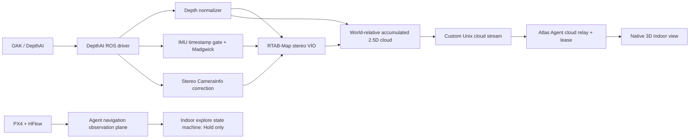
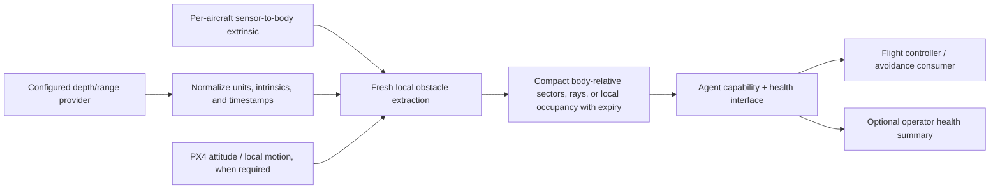

# Indoor Navigation Decommission and Spatial Runtime Simplification Audit

**Status:** decision record and cleanup plan  
**Scope order:** Atlas Spatial Runtime → Atlas Agent → Atlas native app  
**Decision:** retire indoor navigation and the accumulated 2.5D map; retain only the
sensor, timing, health, and calibration capabilities needed to produce fresh
outdoor obstacle observations.

The retention policy was decided after the initial audit:

- `.scratch` retains only its handover reports and handover index;
- `atlas-agent/dist` and `atlas-spatial-runtime/dist` retain only the component
  packages installed on the Pi;
- historical Pi/H-Flow evidence, release manifests, checksums, rollback
  packages, and exported spatial images are not retained;
- Git and the live aircraft configuration are the sources of truth.

This intentionally accepts that old releases and qualification sessions will not
be reproducible. That is preferable to maintaining an artifact/evidence system
the project does not intend to use.

### Implementation status

The indoor feature has now been removed vertically. Spatial is a direct
DepthAI/Python service with source-owned systemd and udev configuration. Its ROS
workspace, container build, IMU/VIO chain, map, and cloud transport are gone.
The Agent package no longer embeds or manages Spatial code. Spatial has its own
Debian package; Agent writes configuration and aggregates the independently
installed service's diagnostics.

## 1. Executive conclusion

The current system is not one oversized feature. It is three different concerns
that were coupled together:

1. **Sensor acquisition:** DepthAI/OAK image, depth, calibration, IMU, and device
   recovery.
2. **Indoor localization and mapping:** stereo RTAB-Map VIO, accumulated 2.5D
   point cloud, transforms, map epochs, and cloud transport.
3. **Indoor product scaffolding:** an Agent mission state machine that only issues
   Hold, plus native UI, leases, commands, protobufs, release gates, and extensive
   documentation around it.

Only the first concern is a sound foundation for outdoor obstacle avoidance. It
should become a provider adapter, not remain the definition of the spatial
runtime. The second and third concerns should be removed rather than generalized.

The target runtime should answer a much smaller question:

> Given a configured range sensor and its body-frame extrinsic, what obstacles
> were observed recently enough to influence flight?

It should not estimate the vehicle pose, retain a world map, command movement, or
stream a complete visualization cloud to the native app.

### Priority findings

| Severity | Finding | Consequence |
|---|---|---|
| High | Release and commissioning records linked to ignored local `.scratch` and `atlas-agent/dist` content. | Historical claims depended on transient files; those claims and links must be removed rather than preserved. |
| High | One commissioning record claimed PX4 evidence was verified, but the referenced local PX4 evidence directory was absent. | The record overstated what could be proven and was deleted under the chosen retention policy. |
| High | Before cleanup, every Agent release was coupled to a rebuilt spatial image and a live ROS testing repository. | Resolved: Agent and native Spatial installs are independent, and Spatial uses the DepthAI Python API directly. |
| High | Runtime liveness couples camera health to RTAB-Map VIO health and can restart the whole provider when VIO is stale. | A localization failure can unnecessarily remove otherwise healthy obstacle sensing. |
| High | The accumulated cloud uses bounded LRU retention without obstacle expiry. | Old surfaces can remain in the map; that is unsuitable as an outdoor collision-avoidance source. |
| High | The “indoor explore” controller is a staged state machine whose only flight action is Hold. | It adds product, test, API, and documentation surface without implementing navigation. |
| Medium | Generic health and navigation contracts require OAK/DepthAI IMU and HFlow signals. | Other aircraft and sensor combinations cannot satisfy the nominally generic interfaces. |
| Medium | Source-text tests inspect Dockerfiles, shell scripts, exact package strings, and deleted filenames. | Refactors fail tests without behavior changing; component boundaries are inverted. |
| Medium | Transform bundle hashing, calibration hashing, artifact hashing, and image digests are treated as one design pattern. | Useful artifact integrity checks are obscured by hashes that have no trusted comparison or runtime decision. |
| Medium | Architecture, release history, qualification evidence, and handovers are duplicated across tracked docs and scratch files. | Current behavior is hard to identify and stale claims are easy to preserve accidentally. |

## 2. Current and target system boundaries

### Former data and control flow

The restart boundary and readiness contract also make color, depth, IMU,
calibration, transforms, and VIO behave as one service. That is stronger coupling
than either indoor visualization or outdoor avoidance requires.

### Target data and control flow

Important invariants for the target:

- Every obstacle observation carries acquisition time, frame, source, and
  validity/expiry.
- No obstacle survives beyond its configured lifetime unless it is observed
  again.
- Sensor health, obstacle-pipeline health, PX4 state, and optional providers are
  independent capabilities, not one all-or-nothing readiness bit.
- The spatial process has no movement authority.
- The native app is not in the flight-critical path.
- Vehicle-specific transforms are data selected by aircraft profile, not source
  code or installer migrations.

## 3. Atlas Spatial Runtime inventory

### Keep

| Capability | Current location | Why it remains |
|---|---|---|
| Depth acquisition | `src/atlas_spatial_runtime/depthai_provider.py` | Outdoor avoidance still needs a physical sensor provider. |
| Native depth units | `provider.py` and `depth_contract.py` | Retain compact `uint16` millimetres and convert only at a consumer edge. |
| Camera intrinsics | DepthAI aligned-frame transformation metadata | Projection is unsafe without intrinsics for the exact output frame. |
| Timestamp/freshness checks | `health_contract.py` and `runtime.py` | Avoidance must fail closed on stale observations. |
| Device isolation and recovery | Independent process, systemd restart, and USB re-enumeration | A wedged USB camera must not wedge the core Agent. |
| Synthetic provider | `synthetic_provider.py` | Deterministic non-hardware testing remains valuable. |
| Projection mathematics | `projection.py` | Depth-to-ray/body-frame projection is retained without world-map accumulation. |

### Refactor

| Current behavior | Refactor |
|---|---|
| OAK optical-frame names were hard-coded in generic nodes. | Completed: the provider supplies a configurable frame ID; the aircraft profile retains the mount extrinsic. |
| Health reported transform and IMU provenance unrelated to depth acquisition. | Completed: health reports depth/calibration plus provider diagnostics; obstacle capability remains false. |
| One readiness result required color, depth, IMU, calibration, transforms, and VIO. | Completed: acquisition readiness now requires only fresh calibrated depth. |
| A stale VIO path could restart the entire provider boundary. | Completed: VIO is gone; only acquisition startup/stall failure restarts Spatial. |
| Transform bundles are a runtime graph with conventions, provenance, canonical serialization, and SHA-256 identity. | Use a small versioned aircraft profile with explicit `sensor_frame -> body_frame` extrinsics, schema validation, and a human-readable profile ID. |
| Depth projection feeds a persistent world-relative cloud. | Produce fresh body-relative rays/sectors or a decaying local occupancy representation. |
| The image installed every DepthAI, RTAB-Map, and IMU package in one layer. | Completed: the native environment installs NumPy and DepthAI only. |

### Remove with indoor navigation

| Capability or file group | Reason |
|---|---|
| `rtabmap_vio.yaml`, RTAB-Map odometry launch, and VIO health/restart policy | PX4 supplies the vehicle state needed by outdoor flight; the runtime should not maintain a competing indoor pose estimator. |
| Stereo CameraInfo correction used only to satisfy RTAB-Map | It has no remaining consumer after VIO removal. |
| Madgwick filter and IMU timestamp gate, unless another named consumer is established | They currently exist to support the VIO chain. Do not retain speculative infrastructure. |
| Accumulated LRU voxel cloud and UUID map epochs | This is the discarded 2.5D indoor map. LRU bounds memory but does not make data temporally safe. |
| `spatial_stream.py` / node and complete-cloud Unix framing | The protocol exists to move the discarded map to Agent/Native. |
| VIO-local/world frames in the public health response | No retained public capability needs them. |
| Ariadne-specific `transforms.v1.json` from the generic runtime tree | Aircraft geometry belongs in deployment/profile data. Preserve it first as calibration evidence. |

### Hash and gate assessment

Hashes are not inherently overengineering. Their value depends on the question
they answer.

| Mechanism | Decision | Reason |
|---|---|---|
| `.deb` / image archive checksum | Use transiently, do not retain | A transfer can be checked when it happens; the project has chosen not to retain historical artifact identities. |
| OCI image digest | Removed | Spatial no longer has an OCI image. |
| Release manifest signatures | Do not add | There is no retained artifact/provenance system for a signature to protect. |
| Separate installed Agent binary checksum | Remove | The `.deb` already identifies the packaged binary; this duplicates the artifact identity. |
| Transform bundle SHA-256 returned in every health response | Remove | The process computes the hash from the same untrusted input and has no independent expected value to compare against. |
| CameraInfo/calibration SHA-256 as a readiness gate | Replace | Validate dimensions, intrinsics, output frame, and selected camera device instead. |
| Canonical JSON machinery used only to make the transform hash stable | Remove with the hash | It adds serialization rules without improving flight safety. |
| Color, IMU, HFlow, range, VIO, and calibration combined into one global gate | Split | A capability should declare the minimal inputs it needs; optional provider loss should not erase unrelated capabilities. |

## 4. Atlas Agent inventory

### Keep and narrow

`internal/navigation` and `telemetry/mavsdk/navigation.go` contain useful PX4
observation plumbing: local position, odometry, estimator state, optical flow,
range, and timestamp normalization. The unused local socket, probe, history,
sampling API, protocol versions, and Native capability advertisement have been
removed. The remaining health calculation is in-process only.

This split is now implemented without a policy framework. Top-level
`status`/`ready` cover the MAVSDK/PX4 connection, local position, odometry, and
estimator. `hflowStatus`/`hflowReady` separately cover optical flow and range.
All component observations and reasons remain available.

### Remove with indoor navigation

| Component | Reason |
|---|---|
| `internal/spatial/source.go` | Reads only the complete accumulated cloud protocol. |
| `internal/groundstation/spatial.go` | Implements indoor-view cloud subscriptions and leases. |
| `internal/vehicle/indoor_explore.go` | Encodes a large “Stage 3” mission state machine but only commands Hold. It is scaffolding, not navigation. |
| Indoor/spatial wiring in `cmd/atlas-agent/main.go` | Its consumers disappear with the components above. |
| Indoor commands and cloud messages in generated Agent protobuf code | Regenerate from the reduced canonical `.proto`; do not hand-edit generated files. |

The Hold-only controller deserves an explicit decision: do not repurpose it for
outdoor avoidance. Avoidance is a continuous safety input to an actual flight
control path, not an indoor mission state machine with renamed stages.

### Installer and packaging coupling

`internal/onboardsetup/install.go` contains an exact legacy transform hash and a
one-aircraft migration from an Ariadne transform seed. This is deployment history
inside a generic installer. Preserve the old and replacement calibration records,
then replace this with one of:

1. explicit profile selection during provisioning; or
2. a separate, idempotent migration command that reads a profile version and
   reports what it changed.

The setup model currently assumes Ubuntu 24.04 ARM64 on Raspberry Pi 5 and
installs Hailo, SIYI, and DepthAI concerns alongside the core Agent. The
`build-deb.sh` previously carried the Agent, MAVSDK, Hailo model/worker, Spatial
build context, systemd unit, and provider configuration. Spatial source,
installation, service, udev rules, and diagnostics are now independently owned:

| Package/artifact | Responsibility |
|---|---|
| `atlas-agent` | Core vehicle Agent, PX4 integration, stable capability protocols. |
| Optional perception adapter | Hailo model and worker. |
| Optional camera/gimbal adapter | SIYI integration. |
| Spatial provider service | OAK/DepthAI acquisition and obstacle extraction, built and exercised on the Pi. |
| Aircraft profile | Device selection, transforms, calibration references, and required capabilities. |

The split does not require separate repositories. It requires independent
artifacts, versions, and qualification triggers.

### Source-test boundary

The cross-component source-text tests and release-image test gate have been
removed. The maintained boundary is:

- run Agent tests directly from the Agent checkout;
- run Spatial Python tests directly from the Spatial checkout;
- the Spatial release command runs that source suite before packaging; it does
  not treat tests against an installed artifact as source validation;
- keep the low-level package builders free of cross-component application-test
  gates;
- test rendered service/configuration output in Agent installer tests;
- test protocol compatibility at the protocol boundary;
- keep behavioral tests for socket bounds, freshness, parsing, and failure
  handling;
- use `atlas-setup doctor` only as the post-install service/hardware smoke check;
- do not test cleanup by asserting that yesterday's filename remains absent.

## 5. Atlas native app inventory

Remove the indoor feature vertically rather than leaving dead protocol and
dependency layers:

- `atlas/src/indoor/` UI, frame decoder, and styling;
- `atlas/src-tauri/src/ground_station/spatial.rs`;
- `atlas/src-tauri/src/ground_station/indoor.rs`;
- indoor snapshot/subscription/start/abort commands and session/server wiring;
- `OpenSpatialStream`, cloud-frame, indoor-command, and indoor-state protobuf
  messages;
- related Rust and TypeScript tests;
- `@react-three/fiber`, `@react-three/drei`, and `three` if no remaining import
  exists after deletion.

Do not build an equivalent live 3D obstacle view as part of the first cleanup.
If operator visibility is required later, expose compact health, freshness, and
nearest-obstacle summaries. The native app must remain observability, not a
dependency of the avoidance loop.

## 6. Release and dependency correction

### Previous problem

`atlas-agent/packaging/release.sh` created a matched Agent/spatial release. It
built the spatial image, inspected exact RTAB-Map/package details, ran image
tests, emitted checksums and a manifest, and transferred the resulting bundle.

This made sense only if Agent source, indoor cloud protocol, spatial
implementation, and hardware dependencies were one indivisible release. They are
not. It also resolves hardware-sensitive packages from the ROS testing channel
during release construction. If older package inventories disappear or change,
rebuilding an otherwise unchanged spatial dependency set can force a new image
and repeat physical qualification.

That behavior has been removed. Agent and Spatial now have independent release
commands and independent Debian packages. Spatial source tests run before its
package is built; the packages can be transferred together and installed in one
`apt` transaction without an aircraft source checkout.

### Pi-native release model

1. **Keep Git as the source of truth.** Software tests and package construction
   run from a development checkout. The Pi runs only post-install hardware
   diagnostics; source changes do not exist only on the aircraft.
2. **Keep only the installed packages locally.** `atlas-agent/dist` and
   `atlas-spatial-runtime/dist` each contain at most the `.deb` matching the
   live Pi. They are convenient reinstall files, not a rollback catalogue.
3. **Completed: stop exporting Spatial image archives.** Spatial has no image
   build or archive.
4. **Completed: remove Docker from Spatial.** The reduced depth provider runs as
   an independently supervised native systemd service.
5. **Declare and package Pi dependencies from source.** The Spatial package
   contains its Linux-arm64 DepthAI/NumPy runtime and declares its OS
   dependencies. Installation does not rely on undocumented manual Pi state or
   PyPI access from the aircraft.
6. **Version protocol compatibility independently.** Agent should accept a
   declared obstacle protocol version/capability range, not require the same
   release number.
7. **Trigger physical requalification only when provider behavior, calibration,
   obstacle semantics, or the hardware-sensitive dependencies change.**
8. **Keep software-only regression tests on every source change.**

`pyproject.toml` pins the native NumPy and DepthAI v3 provider dependencies.
`packaging/release.sh build` tests the source and
`packaging/build-deb.sh` places the compatible ARM64 runtime in the Spatial
`.deb`. If DepthAI changes, update the declaration and re-run the provider bench
test; do not hide the dependency in an archived image.

### Requalification matrix

| Change | Software tests | Bench sensor test | Grounded aircraft test | Flight test |
|---|---:|---:|---:|---:|
| Agent UI/docs only | Yes | No | No | No |
| Compatible Agent protocol implementation | Yes | No | Optional smoke | No |
| Obstacle extraction algorithm/thresholds | Yes | Yes | Yes | Yes |
| DepthAI/USB/provider base | Yes | Yes | Yes | Risk-based |
| Aircraft transform or camera mounting | Yes | Yes | Yes | Yes |
| Reinstall the same Spatial package | Already run | Smoke | No | No |

This matrix prevents both unsafe under-testing and expensive ritual re-testing.

## 7. Documentation and evidence cleanup

### Measured footprint

At audit time:

- tracked Markdown/readme documentation: approximately 10,960 lines, 64,984
  words, and 499 KB;
- ignored `.scratch` Markdown/commissioning/handover material: approximately
  7,954 lines, 59,011 words, and 459 KB;
- `.scratch`: approximately 20 MB across 211 files;
- `atlas-agent/dist`: approximately 5.2 GB, including several local Agent and
  spatial release bundles.

Volume alone is not the defect. The defect is that the same facts are spread
across architecture docs, feature-gap history, installation docs, release
manifests, handovers, commissioning records, and transient evidence paths.

After applying the chosen retention policy, `.scratch` is 440 KB and contains
only 11 handover reports plus `index.md`; `atlas-agent/dist` is 18 MB and
contains only `atlas-agent_0.1.28_arm64.deb`.

### Specific reductions

| Area | Action |
|---|---|
| `docs/feature-gap-assessment.md` | Replace the multi-release implementation diary with a short current gap list. Git already preserves shipped history. |
| `atlas-agent/INSTALLATION.md` | Completed: this is now the canonical Pi networking, install, update, service, and troubleshooting runbook. |
| Root, Agent, and Spatial READMEs | Completed: each describes the native ownership boundary and current workflow. |
| `docs/h-flow-px4-setup-and-verification.md` | Completed: retain the safety, parameters, geometry, live checks, and one current parameter file; remove hashes, evidence bundles, commissioning ledgers, and indoor-flight assumptions. |
| `docs/indoor-ops-plan.md` | Retire after extracting any evidence-retention obligations. It describes a product being removed. |
| `docs/spatial-runtime.md` and spatial README | Rewrite for the obstacle observation contract only after the implementation is reduced. |
| Release history embedded in architecture docs | Replace with changelog/release records. Architecture describes current boundaries and invariants. |
| `.scratch` handovers and handover index | Keep. This is the only intended role of `.scratch`. |
| `.scratch` diagnostics scripts | Delete one-off Pi, cloud, stereo, IMU, rosbag, and movement scripts. A genuinely reusable tool must be promoted into a tracked tools directory. |
| Commissioning evidence | Delete after any configuration still required by the current aircraft is represented in tracked aircraft-profile data. Do not maintain a separate evidence system. |
| Local `dist` releases | Keep only the Agent and Spatial `.deb` files installed on the Pi. Delete prior packages, manifests, checksums, exported images, and redundant build intermediates. |

### Retention decision and completed local cleanup

The live Pi reports Agent `0.1.28`. Local cleanup therefore:

- retained `.scratch/index.md` and all `.scratch/handover-*.md` reports;
- deleted Pi qualification captures, H-Flow/transform commissioning evidence,
  one-off diagnostics, temporary middleware configuration, and scratch
  maintenance notes;
- retained only `atlas-agent_0.1.28_arm64.deb` in `atlas-agent/dist`;
- deleted all older Agent packages, release manifests, checksums, exported
  spatial images, and the redundant standalone ByteTrack worker.

The current OAK-to-body geometry is retained in the tracked Ariadne aircraft
profile. The H-Flow PX4 baseline remains in its concise setup runbook. Outdoor
avoidance needs the small OAK profile; it does not need the old photographs,
hashes, deployment transcripts, or H-Flow evidence.

Tracked documentation must now stop linking to the removed files or describing
them as available rollback/qualification assets. Historical handovers may mention
them as past work, but current architecture and installation instructions must
not depend on them.

## 8. Hardware portability plan

Use a three-layer model:

### Core contracts

Hardware-neutral types and lifecycle:

- timestamped obstacle observation;
- coordinate frame and units;
- freshness/expiry;
- provider/component health;
- PX4 state required by the consumer;
- capability and protocol version.

### Provider adapters

OAK/DepthAI, HFlow, Hailo, and SIYI code lives behind explicit adapters. An
adapter owns device discovery, vendor packages, topic names, diagnostics, and
recovery. Optional adapters do not become global Agent readiness requirements.

### Aircraft profiles

A profile binds adapters to a vehicle:

- aircraft/profile ID and schema version;
- selected devices and stable device identifiers;
- sensor-to-body extrinsics;
- calibration reference/version;
- required and optional capabilities;
- safe thresholds and observation lifetime;
- PX4 connection/configuration expectations.

A profile should be human-reviewable and schema-validated. It does not need a
content hash in every runtime response. The deployed artifact/profile identity
can be captured once in the release and qualification record.

## 9. Estimated removal surface

The two main indoor commits added roughly 14,000 lines while touching spatial,
Agent, native, generated protocol code, tests, release tooling, and docs. That is
not the exact eventual deletion count because later fixes and shared code exist,
but it explains why deleting only the UI or only RTAB-Map will leave a large dead
support structure.

The removal should be vertical:

1. retain only the live aircraft's small current configuration;
2. define the obstacle observation contract and aircraft-profile schema;
3. replace matched Agent/image releases with independently versioned Agent and
   Spatial Debian packages;
4. implement the fresh, expiring obstacle provider using retained acquisition
   utilities;
5. remove Agent indoor controller/cloud relay;
6. remove native indoor UI and protocol;
7. remove VIO, accumulated mapping, transform-graph, and full-cloud code;
8. regenerate protocol bindings and remove unused dependencies;
9. collapse tests to behavior and boundary ownership;
10. rewrite current architecture/runbooks so they describe only the supported
    system.

Trying to delete spatial first without a replacement observation boundary would
leave Agent integration ambiguous. Trying to keep the old cloud as a temporary
avoidance input would preserve its unsafe retention semantics. The contract and
small current aircraft configuration therefore precede code deletion.

## 10. Cleanup acceptance criteria

The cleanup is complete when all of the following are true:

- no runtime, Agent, native, protobuf, package, or test reference to indoor
  navigation, indoor explore, full spatial cloud streaming, or RTAB-Map VIO
  remains;
- the obstacle pipeline uses only fresh observations with explicit expiry;
- loss of an optional OAK IMU, HFlow, visualization client, or native app does
  not disable healthy depth acquisition;
- the Agent and provider can be built and installed independently against a
  declared protocol compatibility range;
- hardware-sensitive dependencies are declared by the Spatial source/package
  path rather than hidden in OCI images or undocumented Pi state;
- Agent tests do not parse spatial component source files;
- aircraft transforms and calibration are profile data, not hard-coded Ariadne
  defaults or installer hash migrations;
- a clean clone can resolve every document link required for current
  installation and operation;
- `.scratch` contains only the handover index and handover reports;
- `atlas-agent/dist` and `atlas-spatial-runtime/dist` each contain at most the
  `.deb` installed on the live Pi;
- one architecture document, one Pi install/update runbook, and tracked current
  aircraft profiles are the canonical documentation set.

## 11. Immediate action list

1. **Completed:** reduce `.scratch` to handovers/index and `dist` to the live
   `0.1.28` Agent package.
2. **Completed:** remove current-doc links to deleted evidence, images,
   checksums, rollback releases, and the retired indoor plan.
3. **Completed:** record the small current OAK-to-body geometry in
   `aircraft-profiles/ariadne.json`.
4. **Completed:** simplify H-Flow documentation, make the Agent README a
   developer entry point, make `atlas-agent/INSTALLATION.md` the canonical Pi
   runbook, and align the root README with the latest-version-only policy.
5. Select the compact obstacle representation and maximum observation lifetime.
6. **Completed:** the retained health contract is independently versioned and
   Spatial has its own test/build/transfer Debian-package path independent from
   Agent.
7. Implement the replacement obstacle boundary.
8. **Completed:** delete the indoor feature vertically across Spatial, Agent,
   Native, protobuf, tests, packages, and current docs.
9. **Completed in source:** remove the Spatial Docker service. On the live Pi,
   remove the old `atlas-spatial-runtime` container/image after the native
   service passes its hardware smoke check.

This order preserves only current configuration and working source while
removing the software, artifact, and process surface the project does not value.
