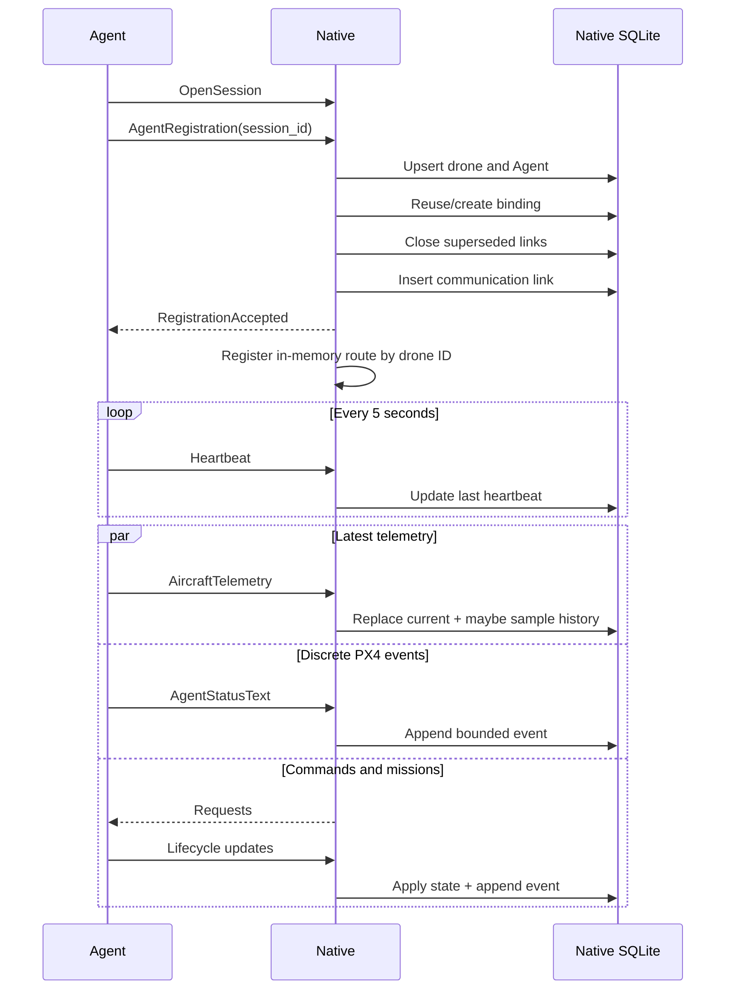
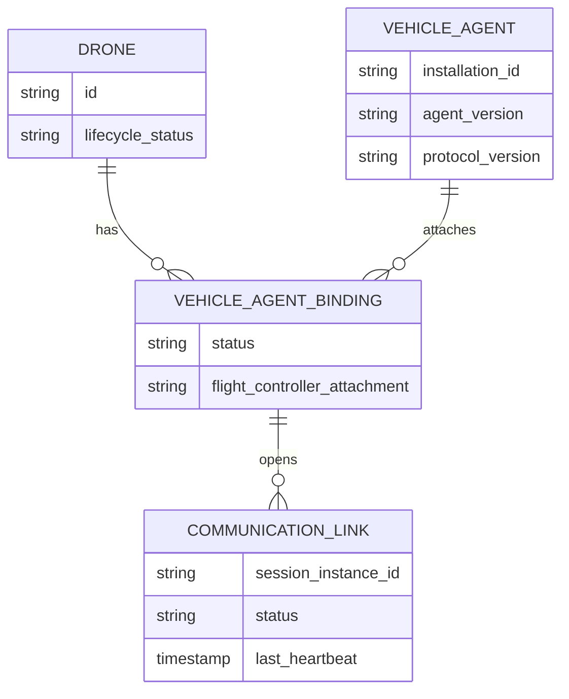
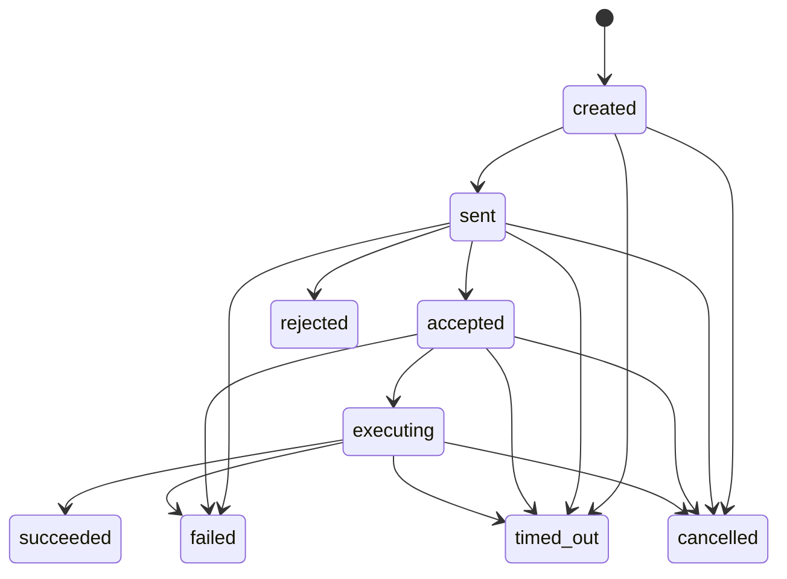
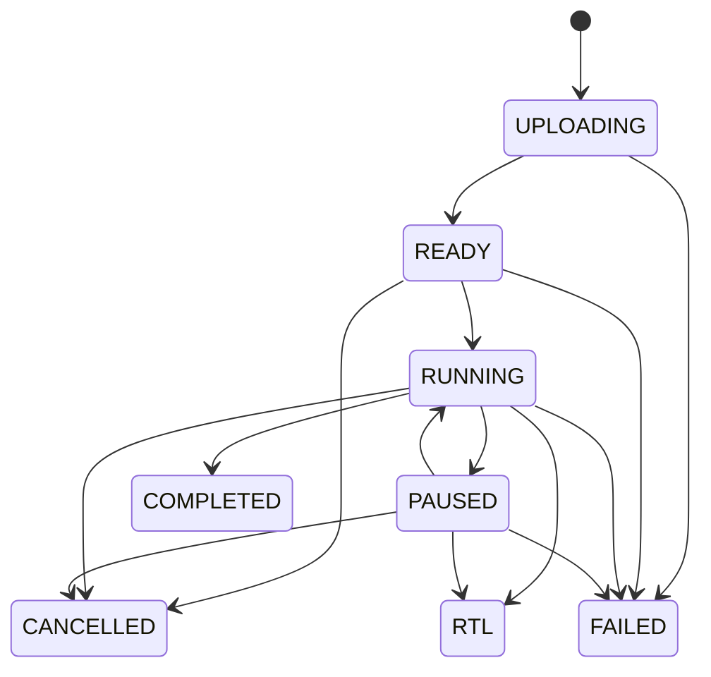

# Native-Agent Protocol

## Contract ownership

[`proto/atlas/ground_station.proto`](../proto/atlas/ground_station.proto) is the
single source of truth for communication between Atlas Native and Atlas Agent.

Native compiles Rust client/server types during the Cargo build through
[`atlas/src-tauri/build.rs`](../atlas/src-tauri/build.rs). Agent's Go types are
generated and committed under
[`atlas-agent/internal/transport/groundstationpb/`](../atlas-agent/internal/transport/groundstationpb/).

The package is `atlas.groundstation.v1`. The registration and perception
messages also carry explicit string protocol versions, currently `"1"`.

## Service shape

```protobuf
service GroundStationService {
  rpc OpenSession(stream AgentToGroundStation)
      returns (stream GroundStationToAgent);

  rpc OpenPerceptionStream(stream AgentPerception)
      returns (stream GroundStationPerception);
}
```

Both streams are initiated by Agent. Native is the server.

| Stream | Agent to Native | Native to Agent |
| --- | --- | --- |
| `OpenSession` | Registration, heartbeat, telemetry, status text, command updates, mission-run updates | Registration acceptance, command requests/cancellations, mission operations |
| `OpenPerceptionStream` | Registration, detection frames, perception health | Stream acceptance, frame-subscription leases |

Perception is separate so a burst of detection metadata cannot head-of-line
block a Hold, Land, mission acknowledgement, or heartbeat.

`MISSION_RUN_UPDATE_TYPE_ACTION_STATE_CHANGED` carries the durable execution
identity, action type, attempt, reviewed failure policy, and one of requested,
running, retrying, succeeded, failed, or policy-applied. Native validates that
identity against the immutable mission plan before appending the event. A final
waypoint progress update therefore cannot independently promote an incident
assignment to `ON_SCENE`; only acknowledged `HOLD_AT_ARRIVAL` success can.

## Main session handshake



### Registration rules

Native rejects the stream when:

- The session, registration request, installation ID, drone ID, or drone name
  is missing.
- Required device, drone, or flight-controller profiles are absent.
- Registration is not the first payload.
- Registration is sent more than once.
- The session ID changes.
- The drone is archived.

Registration is transactional. It:

1. Upserts the durable drone.
2. Upserts the Agent installation.
3. Reuses an existing active matching binding or creates a new one.
4. Ends conflicting current bindings.
5. Closes superseded communication links.
6. Creates the new link.

An archived reconnect is rejected and recorded as a lifecycle event before the
transaction commits.

## Identity model



A reconnect creates a new communication link, not a new drone or Agent. A
changed installation or drone identity changes that association.

## Telemetry and status events

`AircraftTelemetry` uses protobuf `optional` scalar fields so zero can be
distinguished from unknown:

- Zero altitude can be real.
- `armed=false` is meaningful.
- Missing battery or position must remain missing.

Agent builds a latest coherent snapshot from MAVSDK subscriptions. Native
validates and stores it as both the current row and, when due, a historical
sample.

`AgentStatusText` is intentionally separate from telemetry. Status messages are
events; putting one in a latest-value snapshot would discard the previous
warning.

## Vehicle command lifecycle

The supported command types are:

- Hold.
- Return to Launch.
- Land.
- Begin, renew, and end payload control.
- Gimbal angles, rates, centre, and geographic ROI.
- Camera zoom.

The normal lifecycle is:



Native creates a durable command and `created` event, marks it `sent` against a
specific communication link, and gives it a deadline. Agent validates target,
deadline, and type, then sends `accepted` and `executing` before running the
MAVSDK or payload operation.

Every Agent update has a unique event ID. Native ignores a duplicate event and
never moves a terminal command again.

The current Agent rejects cancellation after delivery with
`CANCELLATION_REJECTED`; the cancellation message exists in the protocol for
future cancellable operations.

## Mission operation lifecycle

Mission operations use their own request and update messages because they carry
an immutable plan on upload and produce waypoint progress.



Each operator action receives an `operation_id`. Agent updates include:

- Operation accepted.
- Upload progress and uploaded.
- Arming and armed.
- Started, progress, paused, and resumed.
- Completed, cancelled, or RTL started.
- Operation failed.
- Payload manual-started/restored/restore-failed events.

The update includes the run state separately from the event type. This allows a
failed pause request, for example, to report an error while preserving a still
healthy `RUNNING` run.

## Perception stream

The perception stream is tied to an active main session. Its first payload must
contain:

- Session ID.
- Drone ID.
- New perception stream ID.
- Agent installation ID.
- Perception protocol version.
- Provider and capabilities.

Native verifies that the main Agent session is still active and matches the
installation and drone before accepting the stream.

### Frame demand

Native sends `START_OR_RENEW` or `STOP` for a subscription ID and purpose. The
current supported purpose is `live_view`, with a lease between three and thirty
seconds.

Agent combines:

- All unexpired Native subscription leases.
- Whether a mission is `RUNNING` or `PAUSED`.

Health is always sent. Detection frames are sent only when combined demand is
active.

### Detection contract

The message is accelerator-neutral:

- Source ID and stream epoch.
- Frame ID and timestamps.
- Source presentation timestamp.
- Image dimensions.
- Model name, version, and artifact hash.
- Measured inference latency.
- Normalized bounding boxes, class, confidence, optional track ID, and JSON
  attributes.

Provider-specific tensors or Hailo objects must not cross this boundary.

## Backpressure and channel sizing

Both implementations deliberately bound queues:

- Native session response channel: eight messages.
- Native perception response channel: two messages.
- Agent command and mission request channels: small fixed capacities.
- Agent telemetry and perception source channels: latest-only capacity one.
- Mission updates: bounded channel.

The design favors current safety state over lossless high-rate transport.
Durable command and mission events remain lossless at the application level.

## Compatibility and release rule

Native and Agent currently have no negotiated feature-version matrix beyond
registration protocol strings and advertised capabilities. A stream can connect
while a newer operation is unsupported.

Therefore:

- Treat changes to the protobuf, command parameters, mission-plan JSON, or
  capability semantics as a coordinated Native-Agent release.
- Add fields compatibly where possible.
- Never reuse enum numbers or field numbers.
- Keep generated Go files committed.
- Verify both sides before deploying mixed versions.

To regenerate the Go transport:

```sh
scripts/generate-ground-station-proto-go.sh
```

Rust types regenerate during Cargo build.

MAVSDK's separate protobuf pin is regenerated with:

```sh
scripts/generate-mavsdk-go.sh
```

Its server version, protobuf submodule commit, generated marker, and checksum are
one release contract in
[`atlas-agent/packaging/mavsdk.env`](../atlas-agent/packaging/mavsdk.env).

## Current transport security

The Agent uses `grpc.WithTransportCredentials(insecure.NewCredentials())`, and
Native serves tonic without TLS or client authentication. Registration IDs are
stable identifiers, not credentials.

Current risk reduction comes from:

- Binding Native by default to the dedicated HM30 ground address.
- Keeping the link local and not dependent on internet routing.
- Requiring state, deadline, and telemetry policy checks for commands.

Those checks do not authenticate the peer. Adding authenticated transport will
require a deliberate identity and key-management design; the Backend's future
Ed25519 enrollment model is not wired into this stream today.

## Protocol change checklist

1. Change the source `.proto`.
2. Regenerate Agent Go types.
3. Update Native session/perception validation and routing.
4. Update Agent send/receive mappings.
5. Update durable state and transitions if behavior changes.
6. Update capability advertisement and UI feature checks.
7. Add tests on both sides for validation, deadlines, duplicates, and failure.
8. Deploy Native and Agent as one coordinated release.
