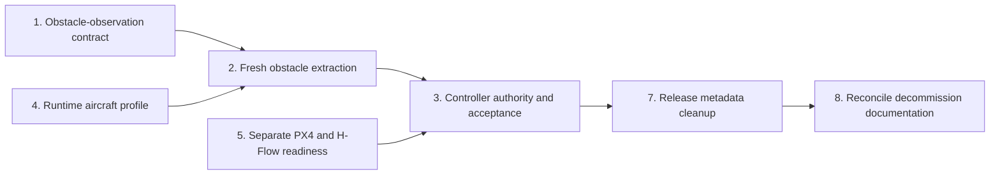

# Atlas  Obstacle Avoidance TODO

**Status:** Supporting cleanup is partly complete. Obstacle observations and
avoidance control remain unimplemented and unauthorized for flight.

**Purpose:** Define the next implementation work after the indoor-navigation
and accumulated-map decommission.


Spatial currently owns fresh calibrated depth and local diagnostics. It
advertises `obstacleObservations=false`. Atlas Agent has no Spatial obstacle
consumer, and no component currently has obstacle-avoidance movement authority.

## Scope and order

The work is grouped into three tracks:

1. **Next implementation:** define obstacle observations, extract them from
   fresh depth, and design the controller authority and acceptance boundary.
2. **Required supporting refactors:** activate aircraft profiles and split
   generic PX4 health from H-Flow-specific readiness.
3. **Final cleanup:** remove dead release metadata and reconcile the
   decommission documentation.




Tasks are numbered to preserve the agreed cleanup discussion. Task 6 is an
explicit non-goal.

## Track A — Next implementation

### 1. Define the obstacle-observation contract

The contract must describe bounded, short-lived evidence of nearby obstacles;
it must not describe a persistent map.

- [ ] Choose compact points, angular sectors, or another bounded
      representation.
- [ ] Define capture time and an explicit expiry time or maximum age.
- [ ] Select the maximum observation lifetime.
- [ ] Define sensor-frame and body-FRD fields and the exact transform boundary.
- [ ] Define distance units, valid range, invalid values, and confidence or
      quality semantics.
- [ ] Define horizontal and vertical partitioning and the clearance envelope.
- [ ] Define provider/component health without introducing one global
      all-hardware readiness bit.
- [ ] Assign an independently versioned protocol and declare the Agent
      compatibility range.
- [ ] Define stale, missing, malformed, and unsupported-version behaviour.
- [ ] Add contract tests for bounds, units, frames, timestamps, expiry, version
      rejection, and malformed observations.

The contract is complete when an Agent consumer can decide whether an
observation is usable without knowing that the current provider is DepthAI or
that the current aircraft is Ariadne.

### 2. Implement fresh obstacle extraction

Implement this data path:

```text
Depth frame
  → sample/project relevant pixels
  → transform into body FRD
  → reduce into bounded observations
  → attach capture time and expiry
  → publish to Agent/controller
```

- [ ] Consume only a fresh calibrated `uint16` millimetre depth frame.
- [ ] Reject invalid calibration, dimensions, depth values, transforms, and
      stale frames.
- [ ] Sample or partition the frame with explicit CPU and memory bounds.
- [ ] Reuse the retained projection mathematics to produce sensor-frame rays or
      points.
- [ ] Load the selected aircraft-profile extrinsic and transform observations
      into body FRD.
- [ ] Reduce projected geometry into the selected compact representation.
- [ ] Attach source, frame, capture time, expiry, range, and protocol identity.
- [ ] Publish through a bounded/latest-value boundary; never queue old
      observations behind new ones.
- [ ] Add an Agent consumer that validates the contract before exposing it to a
      controller.
- [ ] Keep `obstacleObservations=false` until the complete extraction and
      delivery contract passes its tests.
- [ ] Add synthetic tests for clear space, frontal obstacles, invalid pixels,
      range limits, transform direction, expiry, overload, and provider
      restart.

The extractor must not introduce SLAM, VIO, persistent occupancy, accumulated
clouds, map epochs, ROS, Docker, or a Native visualization dependency.

### 3. Design controller authority and perform acceptance

Spatial observes; it never commands movement. Before enabling avoidance,
define:

- [ ] Which Agent component owns avoidance movement requests.
- [ ] How avoidance authority interacts with missions, manual control, and
      aircraft Follow.
- [ ] Whether avoidance modifies setpoints, requests Hold, or uses another
      explicit PX4 integration boundary.
- [ ] Hold/stop behaviour when observations expire, become malformed, or stop.
- [ ] Speed, acceleration, clearance, direction, altitude, and operating
      envelopes.
- [ ] Controller leases, watchdogs, renewal, shutdown, and process-restart
      behaviour.
- [ ] Precedence when mission, Follow, operator, PX4 failsafe, and avoidance
      intents conflict.
- [ ] Audit/status events required for operator understanding without making
      Native part of the control loop.

Acceptance must proceed in this order:

- [ ] Software and simulation tests for expiry, bounds, conflicts, and
      fail-closed transitions.
- [ ] Bench sensor tests using representative obstacles, clear scenes, and
      degraded input.
- [ ] Grounded-aircraft tests for the installed camera, transform, timing,
      restarts, and resource use.
- [ ] HIL tests for controller ownership, PX4 mode interaction, watchdogs, and
      stale-data Hold/stop behaviour.
- [ ] Constrained-flight acceptance with reviewed limits and an independent
      safety operator.

No movement capability may be advertised before all required acceptance gates
for the installed aircraft profile pass.

## Track B — Required supporting refactors

### 4. Make the aircraft profile real runtime configuration

Completed. The selected profile is deliberately a small physical payload
description:

- [x] Validate the profile with small Agent and Spatial validators.
- [x] Select the installed profile explicitly during provisioning.
- [x] Load the selected profile in Agent and Spatial.
- [x] Record the depth-camera stable device identifier.
- [x] Record the depth-camera translation and rotation relative to body FRD.
- [x] Reject a missing profile, mismatched profile id, mismatched camera, or
      invalid mounting offset.
- [x] Remove the Agent package builder's unconditional Ariadne-profile
      assumption.

Avoidance lifetimes, range limits, clearance, speed, authorization,
capabilities, provider details, calibration references, transform graphs, and
hashes are intentionally not aircraft-profile fields. They belong to the
runtime or future controller that owns them.

### 5. Split generic PX4 health from H-Flow readiness

Completed. Agent still records all five observations, but it calculates two
fixed results rather than evaluating configurable policies:

- [x] Preserve every component's independent status, age, and reason.
- [x] Stop treating optical flow and range as universal navigation
      requirements.
- [x] Make top-level `status` and `ready` mean connected PX4 with usable local
      position, odometry, and estimator state.
- [x] Remove the range-dependent HAGL flag and innovation ratio from generic
      estimator readiness.
- [x] Expose `hflowStatus` and `hflowReady` from optical-flow and range health.
- [x] Keep H-Flow diagnostics as optical-flow-plus-range health.
- [x] Ensure H-Flow loss cannot disable healthy depth or unrelated Agent
      capabilities.
- [x] Test in-process readiness for aircraft without H-Flow and for independently
      degraded PX4/H-Flow states.
- [x] Remove the unused navigation socket, probe, sample history, v1/v2 local
      protocol, and Native capability advertisement.

The future obstacle controller must still state which PX4 fields it requires
as part of task 3. No readiness-policy framework is planned.

### 6. Explicit non-goal: Hailo/SIYI package separation

No Hailo or SIYI adapter-package split is planned in this roadmap. Existing
runtime behaviour remains unchanged. This exclusion does not make those
adapters universal requirements for obstacle observations.

## Track C — Final cleanup

### 7. Remove dead release metadata

- [x] Remove the unused `ATLAS_MODEL_SHA256` calculation and packaged metadata.
- [x] Inventory every remaining `release.env` field and retain only fields with
      a real setup, compatibility, or diagnostic consumer.
- [x] Keep build-time checksums that authenticate downloaded third-party
      inputs, including MAVSDK.
- [x] Remove repeated installed-MAVSDK hashing from doctor and its release
      metadata; Debian owns the installed file while package construction
      verifies the downloaded executable.
- [x] Do not add retained checksum bundles, cross-component manifests,
      signatures, OCI identities, or rollback catalogues.

### 8. Reconcile the decommission documentation

- [ ] Mark completed vertical deletion, packaging, documentation, and retention
      work as complete.
- [ ] Move remaining obstacle work to this TODO instead of duplicating it in
      the audit.
- [ ] Remove obsolete measured file/report counts and no-longer-current
      findings.
- [ ] Correct aspirational package/profile statements that are not implemented.
- [ ] Update the feature-gap immediate sequence to link to this roadmap.
- [ ] Keep historical handovers unchanged; they are records, not current
      runbooks.
- [ ] Recheck all current installation and operation links from a clean clone.

The audit should finish as a concise decision record: what was removed, what
was retained, and why. This TODO owns the forward implementation plan.

## Global completion criteria

This roadmap is complete only when:

- observations are bounded, body-relative, versioned, and explicitly expiring;
- no stale observation can influence flight;
- the selected aircraft profile is validated and actively used;
- optional H-Flow loss affects only consumers that require H-Flow;
- Spatial has no movement authority;
- controller conflicts and watchdog failures resolve through documented,
  tested fail-closed behaviour;
- bench, grounded-aircraft, HIL, and constrained-flight acceptance are
  complete before movement is advertised; and
- current documentation distinguishes implemented capability from planned
  work.
