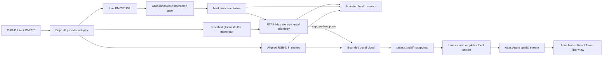

# Spatial Camera Runtime

Atlas Spatial Runtime is the independently supervised OAK RGB-D/BMI270/VIO
process used by Indoor Explore. Camera-vendor details stop at its provider
adapter; Atlas consumers use stable `/atlas/spatial/*` topics.

## System boundary



PX4 continues to stabilize the aircraft using its own estimator and H-Flow
inputs. The spatial runtime does not inject VIO into PX4 and cannot send
movement commands.

## Stable topics

| Topic | Meaning |
| --- | --- |
| `/atlas/spatial/color/image_raw` | Aligned RGB image |
| `/atlas/spatial/color/camera_info` | RGB calibration |
| `/atlas/spatial/aligned_depth/image_rect` | Aligned `32FC1` depth in metres |
| `/atlas/spatial/aligned_depth/camera_info` | Rectified depth projection model |
| `/atlas/spatial/imu/data` | BMI270 acceleration/angular velocity plus filtered orientation |
| `/atlas/spatial/vio/odometry` | Live, non-authoritative stereo-inertial odometry; topic name retained for compatibility |
| `/atlas/spatial/map/points` | Bounded VIO-local `PointCloud2` |

The DepthAI provider normalizes both aligned depth and its `CameraInfo` to the
Atlas-owned `oak_rgb_camera_optical_frame`. The driver also publishes its
calibrated camera/IMU TF tree below `oak_mount` for use inside the external
estimator. That provider-local tree supplies device calibration; the versioned
Atlas bundle remains authoritative for the `body_frd` to `oak_mount` physical
installation.

The live-cloud node waits for a VIO pose near each depth capture, projects
valid depth with the rectified camera model, applies the configured optical to
VIO-child transform, and accumulates 5 cm voxels. It publishes at 2 Hz and caps
the cloud at 100,000 points. When full, least-recently-observed voxels are
evicted so new space can still appear. A VIO timestamp regression, frame
change, or calibration change clears the cloud.

## Complete-cloud transport

The cloud stream Unix socket defaults to
`/run/atlas-agent/spatial-cloud.sock`, separately from the health-probe socket.
Both paths live below a runtime directory shared with independent Agent,
navigation, perception, and adapter processes. The packaged Agent unit
preserves that directory when Agent stops or restarts; otherwise systemd would
unlink live spatial socket paths while leaving their servers bound but
unreachable.
Its binary frame is a bounded JSON header followed by the original tightly
packed little-endian XYZ float32 payload from `PointCloud2`. It sends every
point in the current map, up to 100,000 points; it does not send a 20,000-point
preview or divide one cloud over multiple updates.

The runtime, Agent, and Native each retain only the latest complete snapshot.
When a consumer is slow, the next unsent snapshot replaces the stale one. This
keeps realtime state current without allowing a queue of old 1.2 MB frames to
consume memory or radio time. Agent forwards snapshots over the independent
`OpenSpatialStream` gRPC method only while Native holds a renewable Indoor-view
lease. Native validates the bound, exact 12-byte-per-point length, finite
coordinates, epoch, and sequence before replacing its in-memory snapshot.

## Health contract

The Unix socket defaults to `/run/atlas-agent/spatial.sock`. A client sends:

```json
{"protocolVersion":"1","type":"probe"}
```

The response reports device/provider identity, USB transport, synchronized
RGB-D state, IMU rate and timestamp anomalies, transform identity, and direct
VIO freshness. The authority fields are invariant:

```text
authoritative=false
mappingEnabled=true
px4FusionEnabled=false
movementAuthority=false
```

`mappingEnabled` describes the VIO-local visualization map only. It does not
grant navigation authority. The approximate Ariadne mount therefore reports
VIO as degraded until physically verified even though prototype mapping can
run.

## Standard DepthAI migration

Release `0.1.16` proved that RGB-D, IMU, and VIO could stay live on the actual
Pi/OAK combination, but it did so with a private DepthAI build. The current
normal build instead installs the unmodified `ros-jazzy-depthai-v3` package and
keeps integrated Basalt disabled.

The architecture addresses each historical symptom at its actual boundary:

- The standard DepthAI driver publishes RGB-D, rectified global-shutter mono,
  and raw IMU. RTAB-Map, not the shared camera component, owns odometry.
- Atlas drops duplicate and short-regressing raw IMU stamps before Madgwick
  without changing valid device stamps. A one-second clock regression restarts
  the complete provider boundary rather than mixing estimator clock epochs.
- Madgwick supplies IMU orientation. RTAB-Map then stores the filtered input by
  timestamp and uses it with the synchronized stereo pair.
- Atlas explicitly retains RGB-to-depth alignment and device-side RGB/stereo
  timestamp synchronization, and selects Luxonis's RTAB-Map `DEFAULT` preset
  on the RealSense-compatible `depth` namespace rather than silently retaining
  the driver's sparser implicit `FAST_ACCURACY` profile for cloud geometry.
- RTAB-Map estimates motion from the global-shutter mono pair rather than the
  OAK-D Lite's rolling-shutter RGB sensor. Its latest-frame processing policy
  bounds estimator work without blocking DepthAI image publication.
- The host `/run/udev` database is mounted read-only next to the USB bus so the
  standard Ubuntu libusb path has the host device state available without
  granting a privileged container. The grounded qualification below proves
  this boundary across OAK firmware re-enumeration.

The previous `3.6.1-2noble+atlas2` dependency stages remain in the single
Dockerfile during aircraft qualification, but the final runtime explicitly
inherits `atlas-standard-depthai`; a normal BuildKit build does not compile or
install the patch. The retained `0.1.16` image is the actual operational
rollback. Those stages and patch files require explicit cleanup approval after
the standard path passes.

## Grounded 0.1.25 qualification

The standard-DepthAI runtime passed its disarmed aircraft qualification on
2026-07-24 using package `0.1.25` and immutable image
`sha256:28edec1c5ef969d6ed5eb2e49f972ab318a3f6cbabae158e0f057ff41c313670`.
An instrumented 35.013-second hand carry recorded rectified stereo at
`19.901/19.817 Hz`, 99.4872% pairing, `-0.026918 ms` median skew, a positive
`0.0747062841 m` baseline, and filtered IMU at `223.68 Hz`. Required static TF
and camera calibration were present.

Standard `stereo_odometry` produced 135 valid movement-window samples with
zero lost or zero-inlier samples, 25–652 inliers, `6.424 m` of tracked motion,
65 added keyframes, and local-map growth from 896 to 2,000 features. The ROS
map continued publishing for more than 30 seconds, and the complete-cloud
sequence advanced 28 times with valid poses and no stream error. Both outputs
were already at the 100,000-point bound, so sequence, capture-time, keyframe,
and local-map advancement—not point-count growth—proved freshness.

A manual runtime restart recovered the same image, USB 3 device, synchronized
health, v3 transform hash, and valid odometry. A subsequent Agent restart left
the spatial container running and preserved both spatial socket paths and
their inodes. The battery replacement created a new kernel boot ID and the
standard runtime recovered after that physical cold start.

The initial Native “CLOUD NOT AVAILABLE YET” state was not a ROS or Docker
freeze. The Mac's `192.168.144.50` Ethernet interface was inactive and no
process listened on port 7443. After restoring the HM30 link and starting
Native, Agent registered and an eight-second correlated window produced 13
advancing complete 100,000-point source snapshots while Native acknowledged
4.43 MB of spatial payload. The standard path therefore passes the grounded
runtime and Native delivery gate without a threshold change. The
`configured_unverified` aircraft transform and future mission/navigation gates
still prevent this mapping result from granting flight movement authority.

Evidence is retained under
`.scratch/pi-evidence-0.1.25-replay-movement-20260724T121316Z` and
`.scratch/pi-evidence-0.1.25-lifecycle-qualification-20260724T122443Z`; the
large MCAP remains on the Pi at
`/home/mofe/atlas-0.1.25-replay-movement-20260724T121316Z/rosbag`.

## Installation and failure behavior

`atlas-setup` discovers the OAK, seeds the transform bundle, and manages the
independent `atlas-spatial-runtime.service`. The DepthAI provider shares the
host network namespace so standard libusb can receive the udev/netlink event
when the OAK re-enumerates after firmware upload. The synthetic provider
retains no network. In both cases the container runs read-only without Linux
capabilities; DepthAI receives only the USB character-device class, the host
udev database read-only, and its runtime/state directories.

Sustained RGB-D/IMU loss terminates the container so systemd restarts the whole
camera boundary. The live-cloud builder and complete-cloud stream are also
supervised as essential processes: either process exiting terminates the
launch so systemd cannot report a partially working spatial runtime as active.
Missing or stale VIO prevents new cloud integration; the future Indoor Explore
movement controller must Hold rather than move without fresh depth and local
position. The locally implemented Stage 3 mission contract is hold-only and
advertises `indoor_explore:movement_authority:false`.

RTAB-Map publishes null odometry when tracking is lost and does not silently
reset its coordinate frame. After five seconds of sustained invalid or stale
VIO, the required health node terminates the complete spatial-runtime boundary.
Systemd then restarts odometry, pose buffers, voxel state, and the Native stream
epoch together, preventing points from different estimator epochs from being
combined.

Use:

```sh
sudo atlas-setup doctor
sudo /usr/libexec/atlas-agent/atlas-spatial-runtime-check --json
systemctl status atlas-spatial-runtime.service
journalctl -u atlas-spatial-runtime.service -f
```

The Native/Agent Indoor mission contract is implemented locally but is not in
the installed `0.1.25` release. The next implementation slice is the local
navigation controller described in the
[Indoor Operations Plan](indoor-ops-plan.md); its separate flight gates remain
mandatory before movement authority can be enabled.
