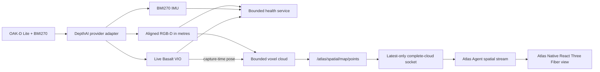

# Spatial Camera Runtime

Atlas Spatial Runtime is the independently supervised OAK RGB-D/BMI270/VIO
process used by Indoor Explore. Camera-vendor details stop at its provider
adapter; Atlas consumers use stable `/atlas/spatial/*` topics.

## System boundary



PX4 continues to stabilize the aircraft using its own estimator and H-Flow
inputs. The spatial runtime does not inject VIO into PX4 and cannot send
movement commands.

## Stable topics

| Topic | Meaning |
| --- | --- |
| `/atlas/spatial/color/image_raw` | Aligned RGB image |
| `/atlas/spatial/color/camera_info` | RGB calibration |
| `/atlas/spatial/aligned_depth/image_rect` | Aligned `32FC1` depth in metres |
| `/atlas/spatial/aligned_depth/camera_info` | Rectified depth projection model |
| `/atlas/spatial/imu/data` | BMI270 acceleration and angular velocity |
| `/atlas/spatial/vio/odometry` | Live, non-authoritative Basalt odometry |
| `/atlas/spatial/map/points` | Bounded VIO-local `PointCloud2` |

The live-cloud node waits for a VIO pose near each depth capture, projects
valid depth with the rectified camera model, applies the configured optical to
VIO-child transform, and accumulates 5 cm voxels. It publishes at 2 Hz and caps
the cloud at 100,000 points. When full, least-recently-observed voxels are
evicted so new space can still appear. A VIO timestamp regression, frame
change, or calibration change clears the cloud.

## Complete-cloud transport

The cloud stream Unix socket defaults to
`/run/atlas-agent/spatial-cloud.sock`, separately from the health-probe socket.
Its binary frame is a bounded JSON header followed by the original tightly
packed little-endian XYZ float32 payload from `PointCloud2`. It sends every
point in the current map, up to 100,000 points; it does not send a 20,000-point
preview or divide one cloud over multiple updates.

The runtime, Agent, and Native each retain only the latest complete snapshot.
When a consumer is slow, the next unsent snapshot replaces the stale one. This
keeps realtime state current without allowing a queue of old 1.2 MB frames to
consume memory or radio time. Agent forwards snapshots over the independent
`OpenSpatialStream` gRPC method only while Native holds a renewable Indoor-view
lease. Native validates the bound, exact 12-byte-per-point length, finite
coordinates, epoch, and sequence before replacing its in-memory snapshot.

## Health contract

The Unix socket defaults to `/run/atlas-agent/spatial.sock`. A client sends:

```json
{"protocolVersion":"1","type":"probe"}
```

The response reports device/provider identity, USB transport, synchronized
RGB-D state, IMU rate and timestamp anomalies, transform identity, and direct
VIO freshness. The authority fields are invariant:

```text
authoritative=false
mappingEnabled=true
px4FusionEnabled=false
movementAuthority=false
```

`mappingEnabled` describes the VIO-local visualization map only. It does not
grant navigation authority. The approximate Ariadne mount therefore reports
VIO as degraded until physically verified even though prototype mapping can
run.

## Why the standard DepthAI package is insufficient

The standard Jazzy packages are API-compatible but did not stay alive on the
actual Pi/OAK combination:

- During firmware upload, the OAK disconnects and re-enumerates. Ubuntu's
  udev-backed libusb can miss the new identity inside Docker, producing
  `X_LINK_DEVICE_NOT_FOUND`. Atlas links the exact DepthAI-pinned libusb commit
  built with the Linux netlink backend.
- Real BMI270 delivery included late and duplicate timestamps. Basalt assumes
  strictly increasing IMU time and asserted, taking down the shared camera
  component. Atlas orders each batch and drops only non-increasing samples.
- The Pi cannot always process visual VIO frames as fast as the driver submits
  them. The stock blocking queue eventually stalled RGB-D for 29–63 seconds.
  Atlas replaces it with a bounded non-blocking latest-frame queue.

The fixes were accepted on aircraft release `0.1.16`: a roughly 7 minute
23 second soak retained fresh RGB-D, about 200 Hz IMU, and live VIO with zero
service restarts. Backpressure was observed and safely handled. The current
source requests 20 Hz VIO visual input to leave compute for the live cloud.

The normal Dockerfile rebuilds the exact DepthAI 3.6.1 source package, checks
its source hash and Debian revision, runs focused C++ tests for both gates, and
checks the resulting library for patch markers. This is why replacing it with
the standard binary package would reintroduce failures already reproduced on
the aircraft.

## Installation and failure behavior

`atlas-setup` discovers the OAK, seeds the transform bundle, and manages the
independent `atlas-spatial-runtime.service`. The container has no network,
runs read-only without Linux capabilities, and receives only the USB bus plus
its runtime/state directories.

Sustained RGB-D/IMU loss terminates the container so systemd restarts the whole
camera boundary. Missing or stale VIO prevents new cloud integration; the
future Indoor Explore controller must Hold rather than move without fresh
depth and local position.

Use:

```sh
sudo atlas-setup doctor
sudo /usr/libexec/atlas-agent/atlas-spatial-runtime-check --json
systemctl status atlas-spatial-runtime.service
journalctl -u atlas-spatial-runtime.service -f
```

The next implementation slice is the Indoor mission contract and local
navigation controller described in the
[Indoor Operations Plan](indoor-ops-plan.md).
