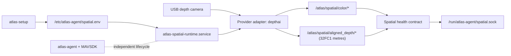

# Spatial Camera Runtime

Atlas Spatial Runtime is the onboard, vendor-neutral boundary for synchronized
color, aligned depth, and calibration. The first implementation supports a USB
DepthAI camera through provider `depthai`, but every Atlas-facing name uses the
logical source `front-depth`. A later RealSense adapter can publish the same
contract without changing setup, mapping, navigation, or Native-facing code.

## First-slice boundary



This slice deliberately does not stream RGB-D data to Atlas Native, build a
point-cloud map, or issue navigation commands. It proves the prerequisite:
repeatable Pi installation, stable RGB-D topics, calibration identity, measured
frame health, and an independently supervised failure boundary.

The H-Flow is also intentionally not fused in this slice. Its velocity/range
observations belong in the later odometry/localization layer; they should not be
hidden inside a camera driver or used for navigation before their frame,
timestamp, covariance, and mounting transform are explicit.

## Stable contract

The runtime publishes:

| Topic | Meaning |
| --- | --- |
| `/atlas/spatial/color/image_raw` | Color image from the logical front depth camera |
| `/atlas/spatial/color/camera_info` | Color intrinsics and distortion |
| `/atlas/spatial/aligned_depth/image_rect` | Depth aligned to color, `32FC1` metres |
| `/atlas/spatial/aligned_depth/camera_info` | Intrinsics for the aligned depth image |

Provider-native topics stay inside
[`launch/providers/`](../atlas-spatial-runtime/ros2_ws/src/atlas_spatial_runtime/launch/providers/).
For DepthAI, the adapter enables its RealSense-compatible RGB-D pipeline,
requests synchronized/aligned frames, and converts its 16-bit millimetre depth
to the Atlas metre representation.

The local probe protocol is versioned independently from ROS. A client sends:

```json
{"protocolVersion":"1","type":"probe"}
```

The response contains provider provenance, logical source ID, stream dimensions
and encodings, measured rates, freshness, synchronization skew, USB transport,
and a calibration hash. `ready=true` means both streams are fresh and
synchronized and calibration has been observed; it does not mean mapping or
navigation is ready.

## One-click Pi setup

The Debian package carries the ROS workspace source, container recipe, USB udev
rule, host probe, launcher, and systemd unit. On the Pi:

```sh
sudo apt install ./atlas-agent_<version>_arm64.deb
sudo atlas-setup
```

`atlas-setup` discovers DepthAI devices by USB vendor ID, records the stable
device ID and current USB transport, asks whether to enable the front spatial
camera, ensures Docker and the release-versioned image are present, writes
the image's immutable `sha256:` ID to `/etc/atlas-agent/spatial.env`, and
enables the service. If no preloaded image
archive is packaged yet, this first implementation builds the bundled context
on the Pi; that first build requires internet access and can take several
minutes. A release pipeline should later publish or preload the same image so
normal field setup only verifies and starts it. The locally built image is
resolved to an immutable ID on each Pi, but byte-identical fleet images are not
guaranteed until CI publishes a digest-pinned artifact.

Use these checks on the Pi:

```sh
sudo atlas-setup doctor
systemctl status atlas-spatial-runtime.service
journalctl -u atlas-spatial-runtime.service -f
sudo /usr/libexec/atlas-agent/atlas-spatial-runtime-check --discover
sudo /usr/libexec/atlas-agent/atlas-spatial-runtime-check
```

USB 2 is accepted for commissioning but reported as a warning because it can
limit RGB-D throughput. An unbooted DepthAI device can initially report 480
Mb/s even on USB 3, so setup labels that state unverified and `doctor` checks it
again while the runtime is active. Use a direct Pi USB 3 port and a USB 3 cable
for the target configuration.

## Failure and replacement model

The spatial service requires Docker, not Atlas Agent or MAVSDK. A camera
disconnect, ROS exception, or container restart therefore cannot stop flight
telemetry or command handling. Systemd retries the camera runtime independently,
and `atlas-setup doctor` reports its degraded health.

To add RealSense later:

1. Add a `realsense.launch.py` provider adapter.
2. Normalize its topics, units, timestamps, and calibration to the stable
   contract above.
3. Add its hardware discovery rule and allow `provider=realsense`.
4. Run the same synthetic contract, host probe, and hardware-in-loop checks.

No consumer should branch on a product name such as OAK-D Lite. Branching on a
provider is confined to discovery, setup validation, and provider launch code.

## Next slices

The stable progression is:

1. Record synchronized RGB-D plus calibration to MCAP and replay it.
2. Add visual-inertial odometry and a versioned pose/TF contract.
3. Build local point clouds and an RTAB-Map map on the Pi.
4. Define a bandwidth-bounded map/point-cloud transport to Atlas Native.
5. Add costmaps and planning, then gate any aircraft motion behind explicit
   localization confidence, obstacle freshness, and operator policy.

Mapping and navigation depend on camera-to-body extrinsics that this slice does
not invent. Those transforms must be measured and commissioned for the actual
mount before navigation work begins.
