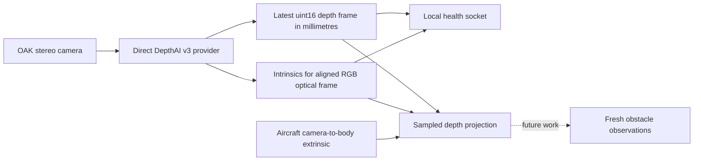

# Spatial Depth Runtime

Atlas Spatial Runtime is the independently supervised depth-camera process. It
owns acquisition, calibration, freshness, direct projection utilities, and its
local diagnostic socket. It does not map, estimate aircraft pose, command
movement, or stream spatial data to Atlas Agent or Native.

## Current boundary


```mermaid
flowchart LR
    OAK["OAK stereo camera"] --> DepthAI["Direct DepthAI v3 provider"]
    DepthAI --> Frame["Latest uint16 depth frame in millimetres"]
    DepthAI --> Calibration["Intrinsics for aligned RGB optical frame"]
    Frame --> Health["Local health socket"]
    Calibration --> Health
    Frame --> Projection["Sampled depth projection"]
    Calibration --> Projection
    Profile["Aircraft camera-to-body extrinsic"] --> Projection
    Projection -. "future work" .-> Obstacles["Fresh obstacle observations"]
```

ROS and Docker are not part of this path. The process runs from a Python
virtual environment under systemd and talks to the camera through the DepthAI
API.

The current OAK-D Lite is a provider detail. A replacement camera must implement
the same provider-neutral frame boundary: native depth values, host-monotonic
capture time, explicit frame ID, calibration for the exact output dimensions,
device diagnostics, and non-blocking latest-frame delivery.

PX4 remains flight-control and state-estimation authority. H-Flow feeds PX4
directly and is not a Spatial prerequisite.

At startup Spatial loads the aircraft profile selected by `atlas-setup`. The
profile supplies the expected depth-camera device id and its direct mounting
offset. Spatial refuses to start if the configured DepthAI device id conflicts
with the selected profile.

## Depth frame contract

| Property | Value |
| --- | --- |
| Storage | Two-dimensional NumPy `uint16` |
| Unit | Millimetres |
| Invalid value | `0` |
| Default size/rate | 640 × 400 at 20 fps |
| Default frame | `oak_rgb_camera_optical_frame` |
| Queueing | Latest frame only |

Keeping native millimetres avoids converting and doubling the size of every
frame before a consumer exists. A metres-based consumer can use
`millimetres_to_metres`; projection can sample the native array and convert only
selected pixels.

DepthAI aligns stereo depth to the RGB optical output. This preserves Ariadne's
verified camera-frame geometry and avoids creating a new mount calibration
merely because middleware was removed. Calibration is taken from the
transformation metadata attached to the actual aligned frame rather than from a
separate topic.

## Local health contract

The Unix socket defaults to `/run/atlas-agent/spatial.sock`. A client sends:

```json
{"protocolVersion":"2","type":"probe"}
```

Readiness requires:

- a fresh depth frame;
- `16UC1` millimetre encoding with a declared `0.001` metre scale;
- a non-empty frame ID and positive dimensions;
- finite, valid intrinsics for the same frame and dimensions; and
- no current acquisition error.

The response includes provider/device diagnostics, frame rate and age,
calibration, and errors. It has no map epoch, transform provenance graph,
calibration digest, pose, colour stream, or movement-authority fields.

`atlas-setup doctor` invokes a private Spatial diagnostic that combines the
socket response with live USB discovery. A waiting OAK can initially enumerate
at 480 Mb/s with a synthetic USB identity; diagnostics reconcile that boot
state with the live device after DepthAI starts it. The lower-level check and
probe executables remain private under `/opt/atlas-spatial-runtime/bin`.

## Geometry

`aircraft-profiles/ariadne.json` stores only the profile id, depth-camera
device id, and Ariadne's direct sensor-optical-to-body-FRD rotation and
translation. `translationM` is metres and `rotationWXYZ` rotates camera-frame
points into body FRD. Projection has two steps:

1. Intrinsics project selected fresh depth pixels into the camera optical
   frame.
2. One normalized quaternion and translation place those points in body FRD.

There is no transform graph. A different aircraft or camera mount must supply
and verify its own direct extrinsic.

## Ownership and failure behavior

- Spatial owns the camera, DepthAI pipeline, udev access, systemd unit, Python
  environment, and local diagnostic tools.
- Atlas Agent owns only Spatial configuration and operator-facing doctor
  aggregation.
- A startup failure or depth stall exits the Spatial process; systemd restarts
  it.
- Spatial failure does not stop Agent, MAVSDK, telemetry, H-Flow, or ordinary
  commands.
- No obstacle-avoidance capability is advertised yet. That requires an
  expiring observation contract and a separately designed flight consumer.

## Development, packaging, and Pi installation

Run source tests:

```sh
cd atlas-spatial-runtime
./scripts/test-source.sh
```

Build and transfer a Spatial package. The build command reruns those source
tests before producing the package:

```sh
./packaging/release.sh build 0.1.0
./packaging/release.sh transfer 0.1.0 mofe@ariadne-robot
```

Install Agent and Spatial together on the landed, disarmed Pi, then perform one
configuration pass:

```sh
cd /tmp
sudo apt install \
  ./atlas-agent_0.1.29_arm64.deb \
  ./atlas-spatial-runtime_0.1.0_arm64.deb
sudo atlas-setup
sudo atlas-setup doctor
```

The Spatial package contains its Linux-arm64 Python/DepthAI dependencies and
does not access PyPI during installation. It replaces the single private
runtime at `/opt/atlas-spatial-runtime`; the Pi does not need a repository
checkout. Agent package builds and updates do not build, embed, test, or replace
Spatial.

See the [decommission audit](indoor-navigation-decommission-audit.md) for the
removed indoor architecture and the remaining outdoor-avoidance work.
