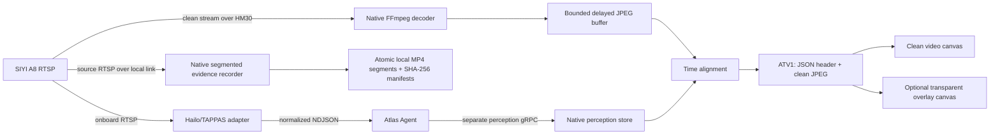

# Video and Perception

## Architectural split

Atlas deliberately keeps clean video and perception metadata as separate paths:



This design preserves source pixels, isolates high-rate metadata from the
command stream, and lets operators hide annotations without switching streams.
This document focuses on transport, media, alignment, and detailed tracker
implementation. For the end-to-end mental model from inference through exact
selection, geolocation, camera follow, and aircraft follow, see
[Inference, tracking, geolocation, and follow](inference-tracking-and-follow.md).

## Clean video path

[`atlas/src-tauri/src/video.rs`](../atlas/src-tauri/src/video.rs) owns the
ground-side video process.

### Decoder

Native starts FFmpeg with:

- Configurable RTSP TCP or UDP transport.
- Low-delay/no-buffer flags.
- One selected video stream and no audio/subtitles/data.
- Frame-rate limiting.
- Aspect-preserving scale and pad.
- MJPEG output through stdout.

Defaults:

| Variable | Default |
| --- | --- |
| `ATLAS_VIDEO_RTSP_URL` | `rtsp://192.168.144.25:8554/main.264` |
| `ATLAS_VIDEO_DECODER_PATH` | `ffmpeg` |
| `ATLAS_VIDEO_RTSP_TRANSPORT` | `tcp` |
| `ATLAS_VIDEO_SOURCE_ID` | `a8-main` |
| `ATLAS_VIDEO_WIDTH` | `1280` |
| `ATLAS_VIDEO_HEIGHT` | `720` |
| `ATLAS_VIDEO_FPS` | `15` |
| `ATLAS_VIDEO_JPEG_QUALITY` | `5` |
| `ATLAS_VIDEO_PLAYOUT_DELAY_MS` | `350` |
| `ATLAS_VIDEO_ALIGNMENT_TOLERANCE_MS` | `180` |
| `ATLAS_VIDEO_OVERLAY_OFFSET_MS` | `0` |

Configuration rejects malformed RTSP URLs, unsupported transport, empty source
IDs, and out-of-range dimensions, rates, quality, delays, or offsets.

## Local evidence recording

[`atlas/src-tauri/src/recording.rs`](../atlas/src-tauri/src/recording.rs) owns a
second FFmpeg process that reads the configured source RTSP directly. It is not
fed from the MJPEG preview, either canvas, or the perception overlay. The
recorder remuxes the selected video stream into independently playable MP4
segments and therefore remains local and internet-independent.

| Variable | Default |
| --- | --- |
| `ATLAS_EVIDENCE_ROOT` | `<Atlas app data>/evidence` |
| `ATLAS_EVIDENCE_SEGMENT_SECONDS` | `30` |
| `ATLAS_EVIDENCE_WARNING_FREE_BYTES` | `5368709120` |
| `ATLAS_EVIDENCE_STOP_FREE_BYTES` | `2147483648` |

The root must be writable and, when explicitly configured, absolute. Objects
and temporary files remain below the same root so finalization uses an atomic
same-filesystem rename:

```text
temporary/<recording-session-id>/<sequence>.partial.mp4
objects/<recording-session-id>/<sequence>.mp4
```

Each closed segment follows `temporary bytes -> SHA-256 -> SQLite FINALIZING
manifest -> atomic rename -> checksum revalidation -> LOCAL_VERIFIED`. SQLite
schema 17 also persists requested/running/succeeded/failed session events,
incident/mission/run/aircraft associations, finalized byte totals, and explicit
evidence-gap events.

The database refuses to mark a session `SUCCEEDED` while any segment remains
`FINALIZING`. Directory or monitor setup failures after the durable `REQUESTED`
insert are recorded as terminal `FAILED` lifecycles, so a failed start cannot
retain the source's one-active-session reservation.

Native confirms `RUNNING` only after a non-empty temporary source segment
exists. On restart, closed segments listed by FFmpeg are recovered and verified;
an open partial remains under `temporary/`, is never returned as valid evidence,
and creates a failed lifecycle plus `RECORDER_RESTART` gap. Low disk space raises
an operational alert, and reaching the configured reserve gracefully stops or
refuses recording with a durable gap.

### Frame parsing and buffering

The frame-reader thread scans stdout for JPEG start/end markers. Frames larger
than 8 MiB are rejected. Native keeps at most 120 decoded frames and increments
a dropped-frame counter as old frames leave the bounded buffer.

Starting a different drone stops the existing child process and resets the
generation. Reader threads ignore output from an old generation, preventing a
stopped decoder from writing into a new stream's state.

### Binary webview packet

`video_stream_frame` returns:

```text
bytes 0..3    "ATV1"
bytes 4..7    little-endian JSON-header length
next bytes    UTF-8 JSON header
remaining     clean JPEG
```

The header includes dimensions, sequence, Native receive time, and an optional
aligned perception frame.

[`atlas/src/video/LiveVideo.tsx`](../atlas/src/video/LiveVideo.tsx) validates
the packet, creates an image bitmap, paints the clean canvas, clears the overlay
canvas, and draws boxes only when the overlay mode is enabled.

## Onboard inference path

Atlas Agent owns the neutral boundary. A provider adapter owns accelerator-
specific work.

### Hailo adapter

[`atlas-agent/scripts/atlas-hailort-adapter.py`](../atlas-agent/scripts/atlas-hailort-adapter.py)
builds this GStreamer pipeline:

```text
A8 RTSP
  -> RTP depay/decode
  -> leaky queues
  -> RGB resize
  -> Hailo HEF inference
  -> TAPPAS postprocessing
  -> metadata extraction
  -> fakesink
```

It does not use `hailooverlay`, encode video, or publish RTSP. Its only output is
normalized metadata.

The adapter process starts with its pipeline in GStreamer `READY`; it does not
consume the RTSP source or run inference until Agent sends an activation
request. Adapter health remains connected while intentionally inactive. Loss of
the Agent runtime socket fails safe by returning the pipeline to `READY`.

The adapter includes:

- Source ID and stream epoch.
- Sequential frame ID.
- Source PTS.
- A pre-inference companion monotonic/Unix timing anchor, plus an optional
  source capture/RTCP Unix timestamp when a provider can supply one.
- Model name, version, and SHA-256 artifact identity.
- Measured time through inference/postprocessing probes.
- Normalized detections and optional upstream track IDs.
- One-second health updates.

Leaky queues and a latest-only publisher prevent an unavailable Agent socket or
slow consumer from building an unbounded video backlog.

### Agent runtime socket

[`atlas-agent/internal/perception/runtime_source.go`](../atlas-agent/internal/perception/runtime_source.go)
listens on a protected Unix socket and accepts versioned NDJSON:

```json
{"protocolVersion":"3","type":"activation_request","requestId":"...","desiredState":"ACTIVE","claimIds":["live_view:..."]}
{"protocolVersion":"3","type":"activation_result","activationResult":{"requestId":"...","state":"ACTIVE","sourceId":"a8-main","observedAt":"..."}}
{"protocolVersion":"3","type":"frame","frame":{"sourcePtsNs":123,"timing":{"sourcePtsPresent":true,"pipelineIngressMonotonicNs":456,"pipelineIngressUnixNs":789}}}
{"protocolVersion":"3","type":"health","health":{...}}
```

The local adapter protocol version is independent of the Agent-to-Native
perception transport version. Activation succeeds only after the adapter
acknowledges `ACTIVE` and Agent observes a fresh frame produced after the
request. An empty detection list is a valid fresh frame.

Protocol v3 requires every live frame to carry a timing anchor sampled at the
pre-inference probe. `observedAt` remains detection-completion wall time for
operator freshness and is not used as image-capture time. Agent correlates PTS
to companion `CLOCK_MONOTONIC`; if `sourceCaptureUnixNs` is absent, the result
is explicitly classified as `PIPELINE_INGRESS_ESTIMATE` with a conservative
uncertainty floor because RTSP/network/decode latency is still unknown. A
provider with an RTCP/NTP or sensor timestamp can populate
`sourceCaptureUnixNs` and obtain `SOURCE_REFERENCE` timing quality.

Validation in
[`atlas-agent/internal/perception/types.go`](../atlas-agent/internal/perception/types.go)
ensures:

- Required source, epoch, frame, model, provider, and timestamps.
- Positive dimensions.
- Finite non-negative rates and latency.
- Confidence and normalized box values from 0 to 1.
- Boxes remain inside the frame.
- Optional attributes contain valid JSON.
- Live v3 frames include positive pre-inference monotonic and Unix anchors and
  distinguish a real zero PTS from an unavailable PTS.

Provider adapters for DeepStream, TensorRT, ONNX, or another runtime should
translate into these same types.

### Atlas tracking stage

Agent now places every normalized frame through an algorithm-neutral tracking
stage before publishing it to Native. The stage owns the meaning of
`track_id`: an incoming provider ID is retained only as internal
`upstreamTrackId` provenance and is never presented as an Atlas association.
When a tracker backend is disabled or degraded, detections continue downstream
with an empty `track_id`.

Plain ByteTrack and ByteTrack CMC implement the same backend contract. The
worker returns local association keys; Agent maps those keys to session-scoped IDs formatted
as `atlas:<session>:<counter>`. These IDs describe temporary visual
associations, not the identity of a person or vehicle.

Agent resets the association session on perception activation, runtime
reconnection, source or stream-epoch change, model or image-dimension change,
timestamp regression, or a timestamp gap above two seconds. Tracker failures
also reset the session and degrade to untracked detections instead of stopping
video or inference. Health reports algorithm, state, session ID, last reset
reason, reset count, and last error.

`byte_track` is the production default. It uses the original
[MIT-licensed FoundationVision implementation](https://github.com/FoundationVision/ByteTrack),
pinned at commit `d1bf0191adff59bc8fcfeaa0b33d3d1642552a99`. Atlas vendors the
upstream C++ deployment tracker core—Kalman state, two-stage score association,
lost-track recovery, and LAPJV assignment—and adapts only its deployment
boundary. A long-lived worker receives pixel-space detections over a versioned
local protocol. It maintains one upstream tracker per detector class, returns
backend-local keys, and is subject to a per-frame deadline.

Camera-motion compensation is measured from the exact RGB buffer immediately
before Hailo inference. The adapter downsamples to a bounded working size,
tracks sparse corners with pyramidal optical flow, rejects implausible affine
estimates, and sends a normalized previous-frame-to-current-frame 3x3 matrix.
`byte_track_cmc` applies estimates above the configured confidence threshold to
predicted track means and covariances before IoU association. Missing or weak
motion evidence falls back to identity and is reported as `DEGRADED`, while
detections and tracking continue. The adapter skips optical-flow computation
entirely when plain `byte_track` is selected.

ReID is structurally disabled: the Agent has no appearance encoder or embedding
association path, and construction rejects a ReID-enabled configuration.

Agent owns session IDs, discontinuity resets, health, and graceful degradation
for both modes. Plain ByteTrack advertises no camera-motion compensation; both
modes advertise no ReID.

Agent also owns a bounded lifecycle for every Atlas association:

```text
TENTATIVE -> ACTIVE -> TEMPORARILY_OCCLUDED -> LOST -> CLOSED
```

Short occlusions expose a bounded linear image-space prediction whose
confidence decays to zero at the configured prediction horizon. The prediction
is clamped to the normalized frame; it never becomes flight-control authority.
Each active track retains at most the configured number of high-frequency
observations onboard. State changes and one-second periodic summaries cross a
dedicated perception-stream payload independently of live-view frame leases.

Native schema 21 persists track sessions, the latest revisioned summary,
append-only lifecycle events, and idempotent important samples. A track summary
contains its session and tracker, state, age, observation count, first and last
observation, latest confirmed box, optional predicted box and confidence, and
terminal closure time and reason. Starting a newer session reconciles an older
unclosed session as `SESSION_SUPERSEDED`, covering a lost final message during
stream reconnection. Native's ten-second frame history remains an ephemeral
video-alignment cache and is not the durable track store.

Configured normalized image-space lines and polygons are revisioned in Native
and sent to Agent as a complete source-specific rule set. Agent evaluates only
confirmed observations, using the latest confirmed box centre: predicted boxes
never create a count. Line direction and polygon entry/exit events, current
visible confirmed tracks, and unique confirmed tracks are scoped to the tracker
session. A gap beyond the prediction horizon reinitializes a rule's per-track
geometry state instead of inferring a crossing through unseen space. Native
also maps confirmed tracks into the current mission run, so mission-unique and
session-unique totals remain separate.

An operator selection is an exact `(track_session_id, track_id)` reference, not
a bare tracker ID. Selection follows the same track through a bounded
`TEMPORARILY_OCCLUDED` interval and becomes an explicit `LOST` or `CLOSED`
result. Terminal selection metadata is frozen, so a later backend association
using the same local key cannot silently revive the operator's selection.
Native stores append-only selection events, notes, evidence markers tied to an
active recording, and bounded periodic or significant track samples. The live
video surface exposes count-rule drawing, current/session/mission totals,
selection state, recent samples, clear, note, and evidence-marker actions.

For a visible `ACTIVE` selection, the same surface can request a centred-
boresight coordinate without asking the operator for geodesy inputs. Native
samples the configured DEM at the aircraft position or uses the explicitly
labelled autopilot home-plane fallback, attaches bounded uncertainty and the
MVP target-centre assumption, and authorizes the full
selection/session/track/source tuple. Agent uses that
track's retained frame timing with measured pose/gimbal histories, and Native
stores either the coordinate/error radius or the explicit rejection code and
reason. No result is silently transferred to another track ID.

After the initial coordinate is durable, the UI samples the configured DEM at
that coordinate and repeats until the intersection moves by at most 0.75 m or
six samples have been recorded. Native independently recomputes every step
from the original evidence ray before accepting schema-22 refinement. Only the
finalized coordinate enters the world-space motion filter, so terrain
iterations from one observation cannot masquerade as target speed. The
operations map renders the latest coordinate per track, its uncertainty
footprint, a velocity vector when motion exceeds uncertainty, and a popup tied
to lifecycle, observation time, selection, and evidence counts.

Recorded-video testing is available through
`scripts/atlas-sample-video-detections.py` and
`cmd/atlas-tracker-replay`. The generator uses OpenCV's built-in HOG person
detector plus the same sparse-optical-flow CMC shape as the Hailo adapter; the
replay command feeds its NDJSON into either mode of the supervised ByteTrack
worker. This is a repeatable real-motion smoke test, not detector-accuracy acceptance.

### Supervision

In process mode,
[`hailort_adapter.go`](../atlas-agent/internal/perception/hailort_adapter.go)
starts the adapter without a shell and restarts it with bounded backoff.

In container mode, `atlas-hailo-adapter.service` supervises the adapter
container, while Agent still owns the protected runtime socket.

## Perception gRPC stream

After main-session registration, Agent opens the separate perception stream and
registers it against:

- Main session ID.
- Drone ID.
- Installation ID.
- New perception stream ID.
- Provider and capabilities.

Native validates that the main session is active and belongs to the same Agent
and drone.

Health always crosses the stream. Frames cross only on demand. `INACTIVE` is a
healthy runtime state rather than an availability fault.

## Explicit activation claims and frame-demand leases

Opening the live view starts only clean video. When the operator explicitly
chooses **Start perception**, Native:

1. Creates a random subscription ID.
2. Requests a 12-second `live_view` perception activation and frame lease.
3. Renews it every five seconds.
4. Stops the subscription on operator request or view unmount.

Native accepts leases from 3 to 30 seconds. Agent tracks independent
subscription IDs, so one consumer stopping cannot cancel another consumer. The
overlay show/hide control is presentation-only and never starts inference.

Mission plans with configured detection classes create durable
`START_PERCEPTION` and `STOP_PERCEPTION` actions. Start is acknowledged before
arming; pause preserves the same claim; normal completion, cancel, and RTL
release it. Therefore, closing the live UI does not suppress mission-required
detections, and stopping a mission claim does not stop a still-leased live view.
Requested class profiles filter normalized detections after inference; multiple
claims use the union, while an unfiltered live-view claim receives all classes.

## Native perception store

[`atlas/src-tauri/src/ground_station/perception.rs`](../atlas/src-tauri/src/ground_station/perception.rs)
stores one stream per drone and one state object per source ID:

- Latest frame.
- Latest health.
- Recent frame deque.
- Connection timestamps.

Validation limits a frame to 1,000 detections and each detection's attributes to
64 KiB. Recent history is capped at 240 frames and ten seconds.

The source ID must match between Native video configuration and onboard
perception configuration. The default is `a8-main`.

## Alignment algorithm

The ground and aircraft clocks do not need to be synchronized.

For each recent perception frame, Native estimates camera capture time in the
ground clock domain:

```text
estimated capture time
    = perception received time
    - measured inference latency
    + configured overlay offset
```

It compares that estimate with the clean video's Native receive time and selects
the smallest absolute delta within the configured tolerance.

The playout delay gives metadata time to arrive before the clean frame is
released to the webview. The overlay offset compensates for asymmetric RTSP and
gRPC transport latency observed during calibration.

This is receive-time alignment, not a guarantee of frame-perfect hardware
timestamp correlation. `source_pts_ns` is retained for future stronger
correlation.

## Backpressure model

Every stage prefers freshness:

| Stage | Strategy |
| --- | --- |
| Hailo GStreamer pipeline | Leaky downstream queues |
| Adapter publisher | One pending frame; replacement increments dropped count |
| Agent runtime source | Channel capacity one with latest replacement |
| Agent-to-Native frames | Sent only when demand exists |
| Native perception store | Ten-second/240-frame bounded history |
| Native video | 120-frame bounded buffer |
| Webview | Requests only sequences newer than the last rendered frame |

This makes the system appropriate for live operation. It is not a lossless
recording or forensic evidence pipeline.

## Health interpretation

Perception health distinguishes:

- Activation state: `ACTIVE`, `INACTIVE`, or `FAILED`.
- Camera/input connected.
- Inference ready.
- Output publishing to Agent.
- Input and inference FPS.
- Dropped frames.
- Last frame and detection time.
- Model identity.
- Last error.
- Tracking algorithm/state, temporary session, resets, and tracker error.

Native also exposes stream connected/stale/disconnected independently. An
inference runtime is healthy while intentionally inactive: the control process
and health path remain available even though the RTSP inference pipeline is not
running.

## Current limitations

- No persistent frame-level detection history; durable track storage retains
  bounded lifecycle samples rather than every detector box.
- Native stores clean-frame stills and verified-segment event clips with
  thumbnails, exact track/marker relationships, review history, and retention
  state. Export packaging and verified remote replication remain deferred.
- FoundationVision ByteTrack and the Atlas CMC extension still require
  annotated representative aerial footage and target companion-computer acceptance.
- Recorded-video HOG smoke tests do not validate Hailo/YOLO inference quality.
- Selected-track centred-boresight geolocation, iterative target-area terrain
  refinement, operational map markers, and filtered world motion are
  implemented. Arbitrary-pixel projection, measured range, physical boresight
  commissioning, and surveyed accuracy acceptance remain.
- The Hailo path can consume reconstructed RTCP/NTP reference metadata when
  available, but this has not been verified against the target camera; pipeline
  ingress therefore remains the compatible explicitly uncertain fallback.
- One configured Native RTSP source is used at a time.
- Detection boxes are operator aids, not flight-control authority.

Future concepts in
[`feature-gap-assessment.md`](feature-gap-assessment.md) must preserve the
current separation between observable perception evidence and authorized
aircraft behavior.

## Where to modify behavior

| Change | Owning code |
| --- | --- |
| Native decoder or buffer | [`atlas/src-tauri/src/video.rs`](../atlas/src-tauri/src/video.rs) |
| Webview packet/rendering | [`atlas/src/video/LiveVideo.tsx`](../atlas/src/video/LiveVideo.tsx) |
| Native alignment and frame leases | [`atlas/src-tauri/src/ground_station/perception.rs`](../atlas/src-tauri/src/ground_station/perception.rs) |
| Neutral onboard types | [`atlas-agent/internal/perception/types.go`](../atlas-agent/internal/perception/types.go) |
| Runtime socket and activation claims | [`atlas-agent/internal/perception/runtime_source.go`](../atlas-agent/internal/perception/runtime_source.go), [`atlas-agent/internal/perception/control.go`](../atlas-agent/internal/perception/control.go) |
| Tracking contract and continuity resets | [`atlas-agent/internal/perception/tracker.go`](../atlas-agent/internal/perception/tracker.go) |
| FoundationVision ByteTrack and CMC adapter | [`atlas-agent/internal/perception/bytetrack.go`](../atlas-agent/internal/perception/bytetrack.go) |
| Vendored ByteTrack core and license | [`atlas-agent/third_party/bytetrack`](../atlas-agent/third_party/bytetrack) |
| Recorded-video tracker replay | [`atlas-agent/cmd/atlas-tracker-replay`](../atlas-agent/cmd/atlas-tracker-replay), [`atlas-agent/scripts/atlas-sample-video-detections.py`](../atlas-agent/scripts/atlas-sample-video-detections.py) |
| Frame-demand policy | [`atlas-agent/internal/transport/groundstation/frame_demand.go`](../atlas-agent/internal/transport/groundstation/frame_demand.go) |
| Hailo GStreamer/TAPPAS adapter | [`atlas-agent/scripts/atlas-hailort-adapter.py`](../atlas-agent/scripts/atlas-hailort-adapter.py) |
| Wire message | [`proto/atlas/ground_station.proto`](../proto/atlas/ground_station.proto) |
