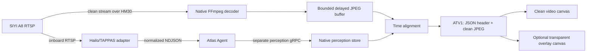

# Video and Perception

## Architectural split

Atlas deliberately keeps clean video and perception metadata as separate paths:



This design preserves source pixels, isolates high-rate metadata from the
command stream, and lets operators hide annotations without switching streams.

## Clean video path

[`atlas/src-tauri/src/video.rs`](../atlas/src-tauri/src/video.rs) owns the
ground-side video process.

### Decoder

Native starts FFmpeg with:

- Configurable RTSP TCP or UDP transport.
- Low-delay/no-buffer flags.
- One selected video stream and no audio/subtitles/data.
- Frame-rate limiting.
- Aspect-preserving scale and pad.
- MJPEG output through stdout.

Defaults:

| Variable | Default |
| --- | --- |
| `ATLAS_VIDEO_RTSP_URL` | `rtsp://192.168.144.25:8554/main.264` |
| `ATLAS_VIDEO_DECODER_PATH` | `ffmpeg` |
| `ATLAS_VIDEO_RTSP_TRANSPORT` | `tcp` |
| `ATLAS_VIDEO_SOURCE_ID` | `a8-main` |
| `ATLAS_VIDEO_WIDTH` | `1280` |
| `ATLAS_VIDEO_HEIGHT` | `720` |
| `ATLAS_VIDEO_FPS` | `15` |
| `ATLAS_VIDEO_JPEG_QUALITY` | `5` |
| `ATLAS_VIDEO_PLAYOUT_DELAY_MS` | `350` |
| `ATLAS_VIDEO_ALIGNMENT_TOLERANCE_MS` | `180` |
| `ATLAS_VIDEO_OVERLAY_OFFSET_MS` | `0` |

Configuration rejects malformed RTSP URLs, unsupported transport, empty source
IDs, and out-of-range dimensions, rates, quality, delays, or offsets.

### Frame parsing and buffering

The frame-reader thread scans stdout for JPEG start/end markers. Frames larger
than 8 MiB are rejected. Native keeps at most 120 decoded frames and increments
a dropped-frame counter as old frames leave the bounded buffer.

Starting a different drone stops the existing child process and resets the
generation. Reader threads ignore output from an old generation, preventing a
stopped decoder from writing into a new stream's state.

### Binary webview packet

`video_stream_frame` returns:

```text
bytes 0..3    "ATV1"
bytes 4..7    little-endian JSON-header length
next bytes    UTF-8 JSON header
remaining     clean JPEG
```

The header includes dimensions, sequence, Native receive time, and an optional
aligned perception frame.

[`atlas/src/video/LiveVideo.tsx`](../atlas/src/video/LiveVideo.tsx) validates
the packet, creates an image bitmap, paints the clean canvas, clears the overlay
canvas, and draws boxes only when the overlay mode is enabled.

## Onboard inference path

Atlas Agent owns the neutral boundary. A provider adapter owns accelerator-
specific work.

### Hailo adapter

[`atlas-agent/scripts/atlas-hailort-adapter.py`](../atlas-agent/scripts/atlas-hailort-adapter.py)
builds this GStreamer pipeline:

```text
A8 RTSP
  -> RTP depay/decode
  -> leaky queues
  -> RGB resize
  -> Hailo HEF inference
  -> TAPPAS postprocessing
  -> metadata extraction
  -> fakesink
```

It does not use `hailooverlay`, encode video, or publish RTSP. Its only output is
normalized metadata.

The adapter includes:

- Source ID and stream epoch.
- Sequential frame ID.
- Source PTS.
- Model name, version, and SHA-256 artifact identity.
- Measured time through inference/postprocessing probes.
- Normalized detections and optional upstream track IDs.
- One-second health updates.

Leaky queues and a latest-only publisher prevent an unavailable Agent socket or
slow consumer from building an unbounded video backlog.

### Agent runtime socket

[`atlas-agent/internal/perception/runtime_source.go`](../atlas-agent/internal/perception/runtime_source.go)
listens on a protected Unix socket and accepts versioned NDJSON:

```json
{"protocolVersion":"1","type":"frame","frame":{...}}
{"protocolVersion":"1","type":"health","health":{...}}
```

Validation in
[`atlas-agent/internal/perception/types.go`](../atlas-agent/internal/perception/types.go)
ensures:

- Required source, epoch, frame, model, provider, and timestamps.
- Positive dimensions.
- Finite non-negative rates and latency.
- Confidence and normalized box values from 0 to 1.
- Boxes remain inside the frame.
- Optional attributes contain valid JSON.

Provider adapters for DeepStream, TensorRT, ONNX, or another runtime should
translate into these same types.

### Supervision

In process mode,
[`hailort_adapter.go`](../atlas-agent/internal/perception/hailort_adapter.go)
starts the adapter without a shell and restarts it with bounded backoff.

In container mode, `atlas-hailo-adapter.service` supervises the adapter
container, while Agent still owns the protected runtime socket.

## Perception gRPC stream

After main-session registration, Agent opens the separate perception stream and
registers it against:

- Main session ID.
- Drone ID.
- Installation ID.
- New perception stream ID.
- Provider and capabilities.

Native validates that the main session is active and belongs to the same Agent
and drone.

Health always crosses the stream. Frames cross only on demand.

## Frame-demand leases

Opening the live view:

1. Starts the Native video decoder.
2. Creates a random subscription ID.
3. Requests a 12-second `live_view` perception lease.
4. Renews it every five seconds.
5. Stops the subscription and decoder on unmount.

Native accepts leases from 3 to 30 seconds. Agent tracks independent
subscription IDs, so one consumer stopping cannot cancel another consumer.

Agent also treats a `RUNNING` or `PAUSED` mission as frame demand. Therefore,
closing the live UI does not suppress mission-required detections.

## Native perception store

[`atlas/src-tauri/src/ground_station/perception.rs`](../atlas/src-tauri/src/ground_station/perception.rs)
stores one stream per drone and one state object per source ID:

- Latest frame.
- Latest health.
- Recent frame deque.
- Connection timestamps.

Validation limits a frame to 1,000 detections and each detection's attributes to
64 KiB. Recent history is capped at 240 frames and ten seconds.

The source ID must match between Native video configuration and onboard
perception configuration. The default is `a8-main`.

## Alignment algorithm

The ground and aircraft clocks do not need to be synchronized.

For each recent perception frame, Native estimates camera capture time in the
ground clock domain:

```text
estimated capture time
    = perception received time
    - measured inference latency
    + configured overlay offset
```

It compares that estimate with the clean video's Native receive time and selects
the smallest absolute delta within the configured tolerance.

The playout delay gives metadata time to arrive before the clean frame is
released to the webview. The overlay offset compensates for asymmetric RTSP and
gRPC transport latency observed during calibration.

This is receive-time alignment, not a guarantee of frame-perfect hardware
timestamp correlation. `source_pts_ns` is retained for future stronger
correlation.

## Backpressure model

Every stage prefers freshness:

| Stage | Strategy |
| --- | --- |
| Hailo GStreamer pipeline | Leaky downstream queues |
| Adapter publisher | One pending frame; replacement increments dropped count |
| Agent runtime source | Channel capacity one with latest replacement |
| Agent-to-Native frames | Sent only when demand exists |
| Native perception store | Ten-second/240-frame bounded history |
| Native video | 120-frame bounded buffer |
| Webview | Requests only sequences newer than the last rendered frame |

This makes the system appropriate for live operation. It is not a lossless
recording or forensic evidence pipeline.

## Health interpretation

Perception health distinguishes:

- Camera/input connected.
- Inference ready.
- Output publishing to Agent.
- Input and inference FPS.
- Dropped frames.
- Last frame and detection time.
- Model identity.
- Last error.

Native also exposes stream connected/stale/disconnected independently. An
inference runtime can be healthy while no viewer requests frames, because health
continues even when frame transport is suppressed.

## Current limitations

- No persistent detection or track history.
- No media recording or still-image evidence store.
- Optional `track_id` is accepted, but Atlas does not yet own a selected tracker
  lifecycle.
- No pose/gimbal/camera-calibration correlation for detection geolocation.
- Alignment uses receive time and measured inference latency, not synchronized
  hardware capture timestamps.
- One configured Native RTSP source is used at a time.
- Detection boxes are operator aids, not flight-control authority.

Future concepts in
[`feature-gap-assessment.md`](feature-gap-assessment.md) must preserve the
current separation between observable perception evidence and authorized
aircraft behavior.

## Where to modify behavior

| Change | Owning code |
| --- | --- |
| Native decoder or buffer | [`atlas/src-tauri/src/video.rs`](../atlas/src-tauri/src/video.rs) |
| Webview packet/rendering | [`atlas/src/video/LiveVideo.tsx`](../atlas/src/video/LiveVideo.tsx) |
| Native alignment and frame leases | [`atlas/src-tauri/src/ground_station/perception.rs`](../atlas/src-tauri/src/ground_station/perception.rs) |
| Neutral onboard types | [`atlas-agent/internal/perception/types.go`](../atlas-agent/internal/perception/types.go) |
| Runtime socket | [`atlas-agent/internal/perception/runtime_source.go`](../atlas-agent/internal/perception/runtime_source.go) |
| Frame-demand policy | [`atlas-agent/internal/transport/groundstation/frame_demand.go`](../atlas-agent/internal/transport/groundstation/frame_demand.go) |
| Hailo GStreamer/TAPPAS adapter | [`atlas-agent/scripts/atlas-hailort-adapter.py`](../atlas-agent/scripts/atlas-hailort-adapter.py) |
| Wire message | [`proto/atlas/ground_station.proto`](../proto/atlas/ground_station.proto) |

